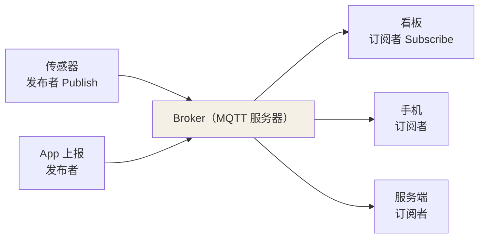
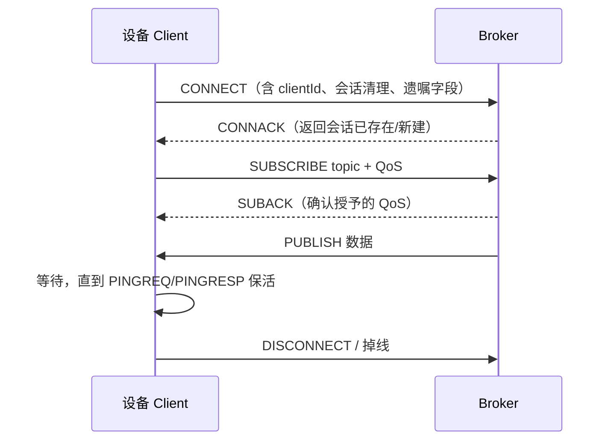

## 它解决什么问题

物联场景的典型约束：**带宽小、设备掉线频繁、设备功耗敏感**。HTTP 的
"请求-响应 + 长连接保活"太重。MQTT 换了个思路——**发布订阅**：设备
A 不用知道设备 B 的地址，只要双方约定一个"主题（Topic）"，中间靠
**Broker** 转发。



核心特性：**极轻量**（固定头最小 2 字节）、**双向**（可订阅可发布）、
**基于主题解耦**、支持 **QoS** 保证与 **遗嘱/保留** 机制。

## 主题与通配符

主题是分层结构（`/` 分隔），不预先创建，订阅时按模式匹配：

| 通配符 | 含义 | 例子 |
|---|---|---|
| `+` | 单层通配 | `sensors/+/temp` 匹配 `sensors/1/temp` |
| `#` | 多层通配（只能结尾） | `sensors/#` 匹配 `sensors/1/temp`、`sensors/2` |

注意：MQTT 的 `#` 与 HTTP 的"URL 路径"语义不同——**主题是逻辑路由
约定，不是目录**，谁的订阅匹配到谁就收。

## 报文：固定头 + 可变头 + 载荷

每次通信是一个报文，核心是**固定头**：

| 字段 | 位数 | 作用 |
|---|---|---|
| 报文类型 + 标志 | 8 bit | 4 bit 类型（CONNECT/PUBLISH/SUBSCRIBE…）+ 4 bit 标志 |
| 剩余长度 | 1–4 B | 可变头 + 载荷的总字节数（变长编码，省字节） |

一个 PUBLISH 报文固定头只需 **2 字节** 起步——这就是"极轻量"的来处。

## 连接生命周期



关键设计：**clientId 唯一标识一个客户端**，Broker 依据它复用/重建会话，
遗嘱在异常掉线时由 Broker 代发。这点在与会话机制连着看时才完整。

## 变长编码的剩余长度：省字节的来处（深入）

"固定头最小 2 字节"不是口号，是靠**剩余长度的变长编码**实现的——把"要传
多长"这件事按需给 1~4 字节，而不是一律 4 字节。演算给你看：

**编码规则**：低 7 位是值、最高位是"还有后续字节"的续位。取剩余长度 `N`，
反复 `N % 128` 取出一个字节：

```text
N=127        → [0x7F]                     （1 字节，续位=0）
N=128        → [0x80, 0x01]               （0x80：值0+续位1；0x01：值1）
N=16383      → [0xFF, 0x7F]               （2 字节上限）
```

**用字节数换流量**：物联消息普遍很小（几十字节），绝大多是 1 字节就能
装下"长度"——这是 MQTT 对带宽的极致抠门，也是它和 HTTP 头动不动几百
字节的本质差距。

**一次真实 CONNECT 的逐段拆解**（感受协议组成）：

```text
0x10                          ← 报文类型=CONNECT(1)，标志 0000
0x0E (14)                     ← 剩余长度：可变头+载荷共 14 字节（1 字节）
0x00 0x04 "MQTT" 0x04         ← 协议名 MQTT + 协议级别 4 (v3.1.1)
0x02 (cleanSession=1)         ← 连接标志
0x00 0x3C (60s)               ← keepalive = 60s
0x00 0x05 "dev-1"             ← clientId = "dev-1"
总长：1 + 1 + 14 = 16 字节
```

**读出这段血缘本**，你就不会再奇怪"为什么设备动不动用 MQTT 而不用 HTTP"：
一条 16 字节的 CONNECT 就能完成一个客户端接入，带宽与功耗都极度节省。

## 小结

- MQTT 是面向物联的极轻量发布订阅协议，Broker 居中转发。
- 主题是分层路由约定，`+`/`#` 做模式匹配；报文靠剩余长度变长编码省字节。
- 连接四元组（clientId、cleanSession、遗嘱、保活）是后续会话与 QoS 的地基。

## 延伸阅读

- [MQTT 深入——物联网基础传输协议（今日头条）](https://www.toutiao.com/a6721528056801919499/)——协议全景式串讲，覆盖本篇报文格式之外的特性族谱