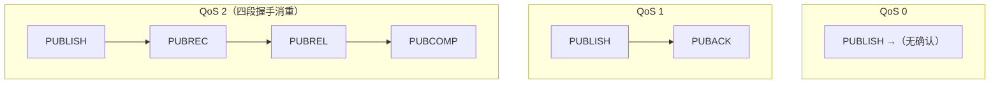
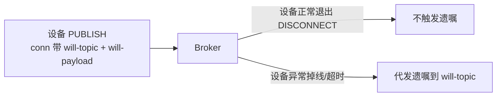

## QoS：三层送达保证

消息"丢一次还是丢多次"可控，代价是更多的确认往返：

| QoS | 语义 | 报文交互 | 代价 |
|---|---|---|---|
| 0（最多一次） | 尽力发，丢了不管 | 仅 PUBLISH | 最快，可能丢 |
| 1（至少一次） | 至少到一次，可能**重复** | PUBLISH → PUBACK | 快，重复需幂等 |
| 2（恰好一次） | 各种投递场景只到一次 | PUBLISH → PUBREC → PUBREL → PUBCOMP | 慢，开销大 |

工程选择：**默认 QoS 1**，下游消费做幂等（唯一键/去重表）兜掉重复；
遥测高频但可丢的用 QoS 0；只有强一致且带宽充裕才用 QoS 2。

## 会话：区分"连接"与"会话"

- **清除会话（cleanSession=true）**：连接断开即删状态，离线收不到消息。
- **持久会话（cleanSession=false）**：Broker 为 clientId 保留：
  - 未确认的 QoS 1/2 消息（**重投队列**）
  - 订阅关系
  - 离线期间的转发（Broker 缓存，直到策略上限）

设备频繁重连且关注离线补偿时用持久会话；但注意 **Broker 内存/磁盘有上限**，
大量持久会话需要配额与过期策略。

## 遗嘱与保留消息

| 机制 | 触发时机 | 用途 |
|---|---|---|
| **遗嘱 Will** | 连接**异常**断开（不是正常 DISCONNECT） | 通知"设备挂了"，转发到 `will-topic` |
| **保留消息 Retained** | PUBLISH 带 retained=1 | Broker 存最新值，新订阅者立即可收到 |

保留消息的意义：**新订阅的客户端立刻得到"上一条状态"**而不是等下一次
上报——功耗受限的设备可以"只在上报时发，订阅者也能拿到最新值"。

## 小结

- QoS 从 0 到 2，可靠性升高、开销也升高；默认用 QoS 1 + 幂等消费。
- 会话与连接分离：cleanSession 决定离线状态是否保留。
- 遗嘱=异常掉线的主动通知，保留消息=给新订阅者补发最新状态。