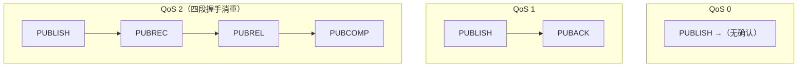
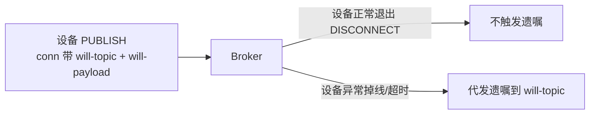

## QoS：三层送达保证

消息"丢一次还是丢多次"可控，代价是更多的确认往返：

| QoS | 语义 | 报文交互 | 代价 |
|---|---|---|---|
| 0（最多一次） | 尽力发，丢了不管 | 仅 PUBLISH | 最快，可能丢 |
| 1（至少一次） | 至少到一次，可能**重复** | PUBLISH → PUBACK | 快，重复需幂等 |
| 2（恰好一次） | 各种投递场景只到一次 | PUBLISH → PUBREC → PUBREL → PUBCOMP | 慢，开销大 |



工程选择：**默认 QoS 1**，下游消费做幂等（唯一键/去重表）兜掉重复；
遥测高频但可丢的用 QoS 0；只有强一致且带宽充裕才用 QoS 2。

## 会话：区分"连接"与"会话"

- **清除会话（cleanSession=true）**：连接断开即删状态，离线收不到消息。
- **持久会话（cleanSession=false）**：Broker 为 clientId 保留：
  - 未确认的 QoS 1/2 消息（**重投队列**）
  - 订阅关系
  - 离线期间的转发（Broker 缓存，直到策略上限）

设备频繁重连且关注离线补偿时用持久会话；但注意 **Broker 内存/磁盘有上限**，
大量持久会话需要配额与过期策略。

## 遗嘱与保留消息

| 机制 | 触发时机 | 用途 |
|---|---|---|
| **遗嘱 Will** | 连接**异常**断开（不是正常 DISCONNECT） | 通知"设备挂了"，转发到 `will-topic` |
| **保留消息 Retained** | PUBLISH 带 retained=1 | Broker 存最新值，新订阅者立即可收到 |



保留消息的意义：**新订阅的客户端立刻得到"上一条状态"**而不是等下一次
上报——功耗受限的设备可以"只在上报时发，订阅者也能拿到最新值"。

## QoS 2 的四段握手为什么能"恰好一次"（深入）

QoS 2 的目标是不重复也不丢，代价是 4 段报文（PUBLISH→PUBREC→PUBREL→
PUBCOMP）。很多人背流程但不理解它靠什么消重，关键在于**中间态记账**：

```text
发送方发出 PUBLISH
  → 收到 PUBREC = 接收方"已收到且已登记"（还没有投出去）
  → 发送方【存下这个包的 message id】，等待 PUBREL 确认
  → 若没收到 PUBCOMP，发送方会重发 PUBREL（不是重发 PUBLISH！）
```

**消重的真相**：接收方**一旦 PUBREC 过某个 message id，就记住了**；后续
重复的 PUBLISH/PUBREL 都不再重复投递给应用层，只回 ACK。所以"恰好一次"
= 接收方按 message id 去重 + 发送方只重发确认而非重发数据。

| 特性 | QoS 1 | QoS 2 |
|---|---|---|
| 保证 | 至少一次（可能重复） | 恰好一次（不重不丢） |
| 报文数 | 2（PUBLISH→PUBACK） | 4（双向确认到 PUBCOMP） |
| 去重 | 需业务自行幂等 | Broker/接收方按 id 内建去重 |
| 开销 | 低 | 高（少用） |

工程建议仍是：**默认 QoS 1 + 业务幂等**，QoS 2 只有在"带宽富余且无法幂等"
的场景才值得。

## 会话重投：持久会话怎么把消息递到"隔了很久"的客户端（深入）

持久会话的核心价值是"离线补偿"，机制是一个**逐条确认的发送窗口**：

```text
设备 A 用持久会话（cleanSession=false）
Broker 在 A 离线期间把 QoS>0 消息存在会话队列
A 重连后：
   → Broker 从队列按序重投 QoS>=1 的消息
   → 收到 A 的 ACK 才从队列删除（等同于没投完的继续投）
```

两点必须拎清：

1. **只对 QoS 1/2 生效**：QoS 0 的消息就没有确认、也不入会话队列，离线
   直接丢——想要"离线补偿"就得用 QoS≥1。
2. **有缓冲上限**：Broker 对消息队列长度有配额，超了会丢弃最旧或拒绝新的。
   所以持久会话不是无限的"邮局"，长时间失联再回来，可能丢一部分。

**一句话记牢**：持久会话帮你"记"，但记得是**有上限的**；极长时间离线，
回来大概率要配合"保留消息/全量同步"二次对齐。

## 小结

- QoS 从 0 到 2，可靠性升高、开销也升高；默认用 QoS 1 + 幂等消费。
- 会话与连接分离：cleanSession 决定离线状态是否保留。
- 遗嘱=异常掉线的主动通知，保留消息=给新订阅者补发最新状态。

## 延伸阅读

- [MQTT 学习笔记五：QoS、保留消息、清理会话解析（基于 mosquitto）（CSDN）](https://blog.csdn.net/zhuo_lee_new/article/details/90416644)——三大概念与 mosquitto 实测验证
- [org.eclipse.paho.client.mqttv3 源码解析（二）接收（阿里云社区）](https://www.aliyun.com/jiaocheng/25334.html)——客户端视角的消息接收与 QoS 应答实现