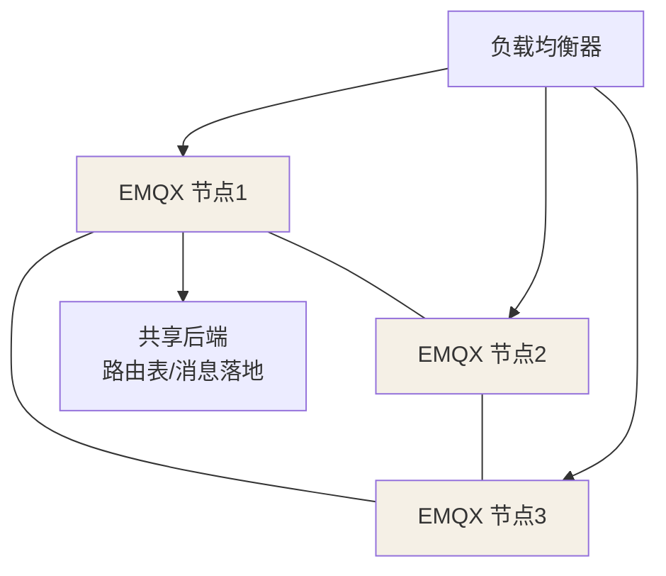

## Broker 该选谁

MQTT 服务器（Broker）决定了能扛多少连接、多少吞吐、有没有集群能力：

| 方案 | 定位 | 强项 | 弱项 |
|---|---|---|---|
| **Mosquitto** | 轻量单机 | 安装即用、内存极小、物联端友好 | 无内置集群，高可用弱 |
| **EMQX** | 大规模分布式 | 百万连接、集群/规则引擎/认证插件齐全 | 重、资源占用高 |
| HiveMQ / VerneMQ | 企业级 | 企业特性完整 | 授权/运维成本高 |

选型口径：**验证/小规模用 Mosquitto，生产规模化直接上 EMQX 集群**。

## EMQX 的集群架构



集群内**每个节点都知道全部订阅关系**（路由表同步），任意设备连任意节点
都能正确路由——不需要客户端粘滞到某台。挂掉一台，其余照常服务。

## 权限与安全三板斧

1. **认证（Authentication）**：连接前校验，常见 `username/password` 或
   客户端证书（TLS）。
2. **授权（Authorization / ACL）**：按 `clientId`/`username` 限制能订阅
   哪些主题，杜绝任意主题越权。
3. **传输加密（TLS）**：生产必开 `8883`（TLS），数据不再明文裸奔。

物联端侧常因为"功耗和算力"想省 TLS，但**认证 + 传输加密至少保留一个**，
并配合设备证书做离线吊销。

## 部署要点

- 用 Docker 起 EMQX：`docker run -p 1883:1883 -p 8083:8083 emqx/emqx`
  （1883 = MQTT，8083/8084 = WebSocket 的 ws/wss，供浏览器 JS 客户端）。
- Dashboard 默认 18083 端口，管理连接/主题/ACL。
- 集群节点之间用 `gen_rpc` 通信，需放通节点间端口。

## 一次真实的 ACL 与认证配置（深入）

安全三板斧里，**授权（ACL）**最容易"配了等于没配"。用 EMQX 内置规则
（基于 clientId / username 前缀）给你一套能照抄的最小 ACL，权限模型是
**默认拒绝 + 显式放行**：

```text
# EMQX ACL 规则（按顺序匹配，命中即停）
allow {username: "dev-order-*"}  subscribe  "orders/#"       # 订单设备可订订单主题
allow {username: "dev-order-*"}  publish    "orders/{username_local}/status"
deny  all                        all        "admin/#"        # 管理主题一律禁止
deny  all                        all        "#"              # 兜底：其余全拒
```

**要点：**

1. **默认拒绝才是安全**——ACL 的兜底必须是 `deny all`，缺了它等于没设。
2. **精细化到"自己能上报、只能看自己"**：用 `username` 片段拼进主题
   （`orders/{username_local}/status`），设备 A 就不能冒充设备 B。
3. ACL 判断发生在**订阅与发布时**，所以别等"出了越权才查"——规则先于
   业务逻辑拦截掉不合规的 topic。

**认证（连接前）**与 **授权（收发时）**是两关卡：认证过不了直接 401 断开；
认证过但授权不足，进得来却发不了指定主题。两关都要配，别只配其一。

## MQTT 5.0：哪些新东西值得接入（深入）

项目如果还在纠结协议版本，顺带看 5.0 的几个关键增量——**不一定立刻升级，
但要能评估**：

| 特性 | 解决什么 | 何时用 |
|---|---|---|
| **原因码（Reason Codes）** | ACK 带错误语义，不再只有"成功/失败" | 排障友好 |
| **主题别名（Topic Alias）** | 长主题只传一次，后续用短 id | 主题名很长的省流量 |
| **用户属性（User Properties）** | 像 HTTP Header 一样带自定义元数据 | 透传 trace 信息 |
| **消息过期（Message Expiry）** | 过期未消费自动丢弃 | 弱实时数据 |
| **Request/Response** | 原生支持"请求-应答"模式 | 设备需要回执 |

5.0 与 v3.1.1 协议不兼容（但多数 Broker/客户端两者都支持）。**多数物联
场景 v3.1.1 够用**；要排障语义、长主题压缩、需要回执时才考虑 5.0。

## 小结

- 选型靠规模：单机 Mosquitto、规模化 EMQX；集群让连接随便挂任意节点。
- 安全三件套：认证 + 授权(ACL) + TLS，最少守住前两样。
- 部署时一次想清楚 1883/WebSocket/Dashboard 的端口与服务范围。