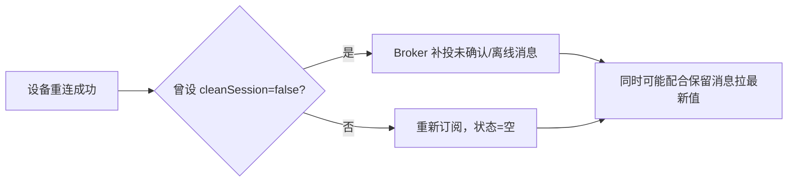

## 保活：心跳不是越多越好

客户端在 CONNECT 里声明 `keepalive`（如 30s）：**该时间里没发任何报文，
Broker 就发 PINGREQ 探活**，失败则判定掉线并触发遗嘱。

常见坑：把 keepalive 设很小（如 3s）以为更快察觉掉线——结果造成无谓的
盆底网络流量、加剧功耗，还容易撞上**网络层的空闲超时**。经验值是
**keepalive ≥ 30s**，若要准实时感知掉线，用应用层自定义心跳主题更可控。

## 断线重连：指数退避 + 抖动

```text
重连间隔每次翻倍，上限封顶，并加随机抖动
1s → 2s → 4s → 8s → … → 上限 60s ± jitter
```

- **退避（backoff）**：避免躲开高峰期机群同时重启、同时回连压垮 Broker。
- **抖动（jitter）**：打破重连请求的同步性，防止"惊群"。

出现"连上就断"的反复横跳时，多半是 Broker 侧 `max_*` 超限（连接数、
`inflight window` 满载），先查日志而不是继续调 keepalive。

## 重连后状态怎么对齐



- 持久会话的**离线消息**能补上缺口，但 Broker 有缓存上限，别全指望它。
- **保留消息**给"新订阅/重订阅"的客户端立刻推送最新状态——把"当前值"
  这类低频但重要的状态存成 retained，比堆 QoS 2 更省。

## 保留消息的典型组合打法

设备只在上报时 PUBLISH 且 `retained=true`：请求方订阅后立刻拿到**最近的
一次采样值**，再等下一次上报更新。功耗设备因此不必为兼容"新订阅者拿当前值"
而持续广播。

## 端侧/Web 端接入：协议与连接的最后一公里（深入）

MQTT 不只跑在设备上，业务前端（浏览器/App/后台）常通过 **WebSocket** 接
MQTT，或服务端直接用客户端库。列出最易踩的三个落地坑：

**① 浏览器侧 WebSocket 到 MQTT**

```text
浏览器（浏览器只懂 WS，不懂原生 MQTT 的 1883 端口）
  → wss://broker:8084/mqtt（EMQX 暴露的 ws/wss 桥接）
  → 用 mqtt.js 以 ws 协议连接，其余收发照常
```

坑：**域名 + 证书**要配好（wss 需要 TLS），否则浏览器因混合内容直接拒绝；
`path`（/mqtt）要与 Broker 配置一致，拼错连不上。

**② 服务端消费的订阅阻塞**

设备上报是"push"，消费方订阅后就等消息。最容易的误用是**在订阅回调里做
同步长阻塞**（查库/调用），会把单线程的消费循环卡死 → 表现为"攒一堆消息
却处理不完"。要用**线程池/异步**消费。

**③ keepalive 与网络代理/浏览器后台**

浏览器切后台或长空闲时，连接可能被**网络层静默回收**而不报错——表现为
"看起来连着、实际已死"。对策：客户端定时主动发 PING / 应用层心跳，并让
Broker/连接方按保活超时判定断线（配合遗嘱告知他人）。

### 一次"连一会儿就断"的完整排障顺序

| # | 检查 | 动作 |
|---|---|---|
| 1 | 看 Broker 日志的连接断开 reason | 是 `client closed` 还是 `timeout` |
| 2 | `timeout` → 心跳不达标 | 核对 keepalive 与网络层空闲超时是否冲突 |
| 3 | `client closed` → 客户端主动断 | 看是不是 Subscription 回调阻塞触发重连逻辑 |
| 4 | 反复横跳 | 查 `max_connections` / `inflight window` 是否打满 |
| 5 | wss 连不上 | 查证书、域名、`/mqtt` path |

## 小结

- keepalive 别调太小，重连用指数退避 + 抖动。
- 反复断连先查 Broker 的 max_* 限制与 inflight。
- 持久会话补离线、保留消息补"当前值"，两者配合把可靠性做足又省资源。