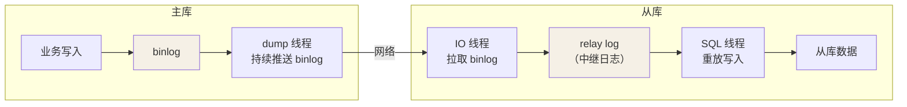
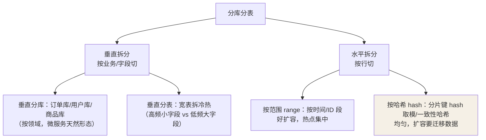

## 主从复制



三个线程各司其职：主库 dump 推送、从库 IO 接收写 relay、SQL 线程重放。
断线重连时靠 **GTID / 位点（offset）** 续传，不重复不丢失。

同步模式：

| 模式 | 行为 | 代价 |
|---|---|---|
| 异步（默认） | 主库提交即返回，不等从库 | 主库宕机可能丢最新数据 |
| 半同步 | 至少 1 个从库**收到** binlog 才返回 | 吞吐下降，但复制不丢 |
| 全同步 | 所有从库**执行完**才返回 | 延迟叠加，很少用 |

## 复制延迟

SQL 线程是单线程重放——主库并发写、从库串行回放，大事务一来就堆积：

```sql
show slave status\G    -- Seconds_Behind_Master 观测延迟
```

对策分层：

- **减少源头**：拆大事务（一条 delete 百万行 → 分批）、避免主库夜间批量
  任务高峰。
- **缓解**：并行复制（按库/按事务组并行重放）、半同步兜底不丢数据。
- **绕开**：**写后读走主库**（强制路由），延迟敏感查询打主库标签。

## 读写分离

写走主库、读走从库，主从承压比 1 : N。中间件（ShardingSphere/JDBC
内嵌）或 Proxy 层（ProxySQL/MyCat）做路由；核心决策点就是上面那句
"哪些读必须走主库"。

## 分库分表：先想清楚要不要

顺序永远是：**索引和 SQL 优化 → 读写分离 → 缓存 → 归档历史表 →
最后才是分库分表**。它解决的是单机存储与连接数瓶颈，代价巨大：

- 跨库 join 没了（冗余字段 / 应用层组装 / 宽表）。
- 分布式事务（Seata / 最终一致性 / 本地消息表）。
- 二级索引跨片失效（一般只保证分片键维度查询）。

触发参考：单表行数持续逼近千万级且仍在增长、单实例磁盘吃紧、
QPS 把连接池打满。

## 拆分方式



**分片键是灵魂**：它决定每条数据的归属。选型原则——**最高频的查询
维度**：订单系统选 user_id（买家维度查订单最多），代价是商家维度查询
要扫全部分片（走异构索引表 / ES 二级索引解决）。

```java
// 按 user_id 哈希路由的示例
int shard = Math.floorMod(userId.hashCode(), 4);
// 4 个库：db_order_0 ~ db_order_3，同一用户的订单永远在同一库
```

## 分库后的新问题

| 问题 | 方案 |
|---|---|
| 跨库分页 | 各分片取 topN 归并（代价高）/ 禁止深翻页（游标） |
| 分布式 ID | **雪花算法**（时间戳+机器+序列，趋势递增利于 B+ 树）替代自增主键 |
| 跨库事务 | 尽量同分片；跨分片用 Seata AT / 消息最终一致 |
| 扩容 | 一致性哈希减半迁移；或提前倍增规划（4 → 8 库翻倍迁移） |

## 小结

- 复制 = dump 推送 + IO 接收 + SQL 重放；延迟本质是单线程重放大事务。
- 读写分离先想清楚"写后读"路由；分库分表是最后手段。
- 分片键选最高频查询维度，用冗余与异构索引补跨维度查询的债。

## 延伸阅读

- [Apache ShardingSphere（官网）](https://shardingsphere.apache.org/index_zh.html)——开源分布式数据库中间件：分片、读写分离、数据加密一站式，Java 生态分库分表默认选项之一。
- [海量数据分库分表方案（一）算法方案（博客园）](https://www.cnblogs.com/kelvin-cai/p/12793361.html)——range/hash/一致性哈希/基因法等分片算法的取舍推演，衔接本篇"分片键怎么选"。
