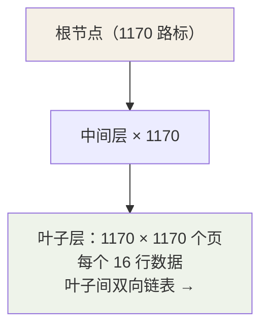

## 索引的本质

**索引 = 有序的数据结构 + 存储位置信息**，把全表扫描 O(n) 变成树查找
O(log n)。InnoDB 的答案是 B+ 树。

## 为什么偏偏是 B+ 树

逐个排除：

| 候选 | 被淘汰的原因 |
|---|---|
| 哈希表 | 等值快，**不支持范围查询与排序** |
| 二叉/红黑树 | 二叉意味着树高，磁盘 IO 次数 = 树高（数据量大时几十层不可接受） |
| B 树 | 非叶子节点也存整行数据 → 单页能放的键少 → 树更高；且范围查询要中序回溯 |

B+ 树的设计直击磁盘 IO 的成本模型：

- **非叶子节点只存键 + 指针**：单页（16KB）挤出上千个路标，树被压得很扁。
- **数据全部在叶子节点**，且叶子间是**双向链表**：范围查询 = 定位起点
  之后顺着链表扫，天然适配 `where id > 100 order by id`。
- **树高即 IO 次数**（根常驻 Buffer Pool，实际更少）。

## 三层树存两千万行的推导

```
页大小 16KB，键 bigint 8B + 页指针 6B ≈ 14B
非叶子页可放：16384 / 14 ≈ 1170 个索引项
叶子页按每行 1KB 算：16 行/页

三层 B+ 树容量 = 1170 × 1170 × 16 ≈ 2189 万行
```



一次主键查询最多 **3 次页 IO**——这就是"单表建议不超过 2000 万行"经验
值的来历：再高一层，每次查询多一次 IO。

## 聚簇索引 vs 二级索引

| | 聚簇索引（主键） | 二级索引（普通索引） |
|---|---|---|
| 叶子存什么 | **整行数据** | 索引列 + **主键值** |
| 数量 | 一张表只有一个 | 可以有多个 |
| 查主键 | 一次树查找 | — |
| 查非主键 | — | 先查到主键 → **回表**再查聚簇索引 |

```sql
select * from users where name = 'tom';
-- name 索引树找到 name='tom' 的主键 id=7
-- 再去主键树查 id=7 的整行  ← 这一步叫回表（两次树查找）
```

**为什么二级索引存主键而不是行地址**：行地址会随页分裂、行迁移变化，
维护成本高；主键稳定且聚簇索引本身就是"按主键找行"的服务。

## 覆盖索引：消灭回表

```sql
select id, name from users where name = 'tom';
-- 查询要的字段 name 索引树里全有（name + id）→ 无需回表
-- explain 的 Extra 出现 Using index 即覆盖索引
```

高频查询可以**把 select 的列设计进联合索引**，直接省掉回表——性能
优化第一梯队手段。

## 联合索引：最左前缀

```sql
index(a, b, c) 相当于建了 (a)、(a,b)、(a,b,c) 三套索引
where a=1 and b=2 and c=3   -- ✅ 全命中
where b=2 and c=3            -- ❌ 不走（跳过了 a）
where a=1 and c=3            -- ⚠️ 只用到 a（c 无法在树里连续定位）
where a=1 and b>2 and c=3    -- ⚠️ a、b 用上，b 是范围后 c 失效
```

排序同理：`order by b, c` 只有在 `where a=1` 前提下才能免 filesort。
**等值列放前、范围列放后**是联合索引的设计口诀。

## 索引下推（ICP，5.6+）

```sql
select * from users where name like '张%' and age = 18;
-- 无 ICP：按 name 找到所有"张"，逐个回表后再过滤 age
-- 有 ICP：在 name 索引树里先用 age 过滤，剩下的才回表
-- Extra 出现 Using index condition
```

过滤动作从 Server 层**下推**到引擎层，减少回表次数。

## 索引失效清单

```sql
where YEAR(create_time) = 2026        -- ① 对索引列用函数/运算：破坏有序性
where phone = 13800001234             -- ② 隐式类型转换（phone 是 varchar，数字比较 = CAST(phone AS ...)）
where name like '%三'                  -- ③ 前导通配：树不知道从哪开始找
where a = 1 or d = 2                   -- ④ or 连接了无索引列
where name != 'tom'                    -- ⑤ 否定条件选择性差，优化器弃用
```

本质只有一条：**条件必须能翻译成"B+ 树上连续的一段"**，函数、隐式
转换、前导 % 都让条件失去了"连续定位"的能力。

## 小结

- B+ 树赢在：矮（非叶子只存路标）+ 叶子链表（范围查询）。
- 三层 ≈ 2000 万行；二级索引叶子存主键，查整行要回表。
- 覆盖索引、最左前缀、索引下推是使用层三件套；失效的根因是"定位不连续"。

## 延伸阅读

- [B-tree/B+tree 原理以及聚簇索引和非聚簇索引（CSDN）](https://blog.csdn.net/u010727189/article/details/79399384)——B 树与 B+ 树结构对比、聚簇/非聚簇索引的叶子差异，配本篇食用。
