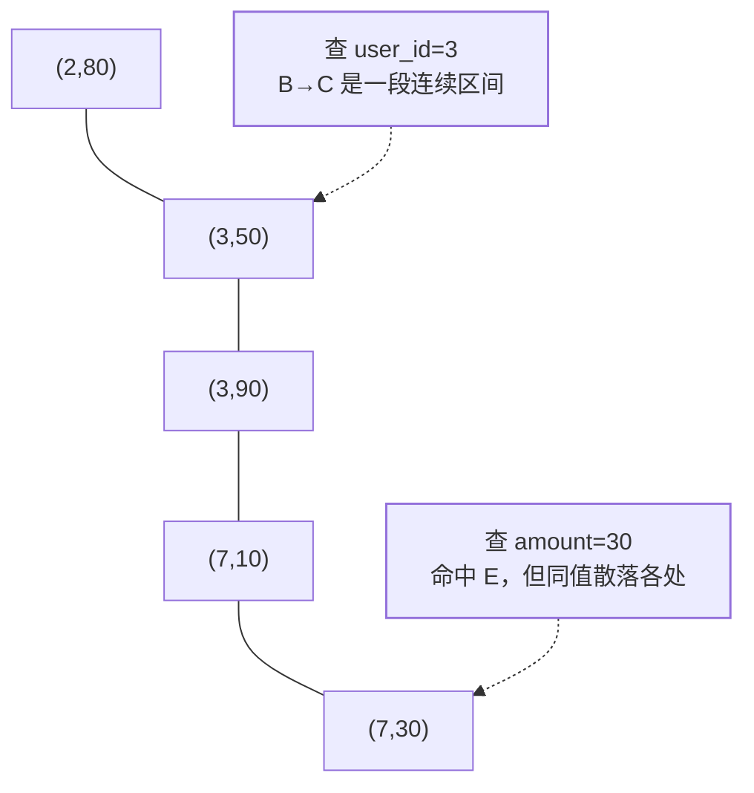
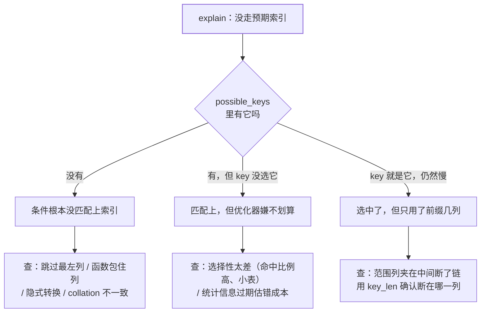

「为什么选 B+ 树」考的是结构，**「最左前缀」考的是你会不会用**。这一篇把
[索引与 B+ 树](/mysql/basic/core/02-index-btree/) 里那几行口诀推到机制层：
一棵树怎么排、区间怎么推进、失效到底破坏了什么、怎么用 `explain` 证明。

## 一棵树，不是三套索引

`index(a, b, c)` 只建了**一棵** B+ 树，排序键是元组 `(a, b, c, 主键)`。
官方口径是「多列索引的**任意最左前缀**都能被优化器用来查行」，于是常见的转述
就成了「相当于建了 (a)、(a,b)、(a,b,c) 三套索引」。口诀好记，但它会让人以为
树上有三套各自的序——**`(a)`、`(a,b)` 能用是元组字典序的推论，不是三棵树**。

把顺序摊开看，为什么跳过 `a` 就没法定位，一眼就清楚：

```
数据 (user_id, amount)：(3,50) (3,90) (7,10) (7,30) (2,80)
索引叶子顺序（先比 user_id，相等再比 amount）：
    (2,80)  (3,50)  (3,90)  (7,10)  (7,30)

where user_id = 3            → (3,50)(3,90) 紧挨着，连续一段   ✅ 定位
where user_id = 3
  and amount > 60            → 从 (3,60,-inf) 起顺着链表扫      ✅ 定位
where amount = 30            → 只有 (7,30)；同为 30 的值散落在
                               每个 user_id 之下，彼此不相邻     ❌ 只能扫全树
```



「最左前缀」四个字常被读成「索引最左边那几列」，其实它是**元组比较的前缀**：
要定位一段，必须把前面的列都钉成确定值，后面的列才在这段内部有序。

## 范围条件一到，后面的列就断链

区间推进的规则只有一条：**只有 `=`、`<=>`、`IS NULL` 能让优化器继续收缩到
下一个 key part**。一旦出现范围算子（`>`、`<`、`BETWEEN`、`!=`、无前导通配的
`LIKE`），区间就确定到那里为止，**再往后的 key part 不参与定位**。

```sql
-- index(a, b, c)
select * from t where a = 'foo' and b >= 10 and c > 10;
-- 实际区间：('foo', 10, -inf) ~ ('foo', +inf, +inf)
-- c 根本没进区间：('foo', 11, 0) 也落在区间里，但它不满足 c > 10
```

这里要精确化「c 失效」这句话——**不参与定位 ≠ 白写**。c 仍然是过滤条件，
区别只在由谁过滤、要不要先回表：

| 谁来过滤 c | 过程 | EXPLAIN |
|---|---|---|
| Server 层 | 索引找主键 → **逐行回表** → 再判 `c > 10` | `Using where` |
| 引擎层（ICP） | 直接在索引项上判 `c > 10`，不成立就不回表 | `Using index condition` |

**索引下推（ICP）** 就是把断链后剩下的那部分条件压回引擎层。三条边界值得记住：
InnoDB 上它**只对二级索引生效**（聚簇索引的叶子本来就有整行，省不了 IO），
适用 `range` / `ref` / `eq_ref` / `ref_or_null` 几种访问方式，而且**覆盖索引
用不上它**——覆盖索引根本不回表，`Extra` 里只会是 `Using index`。

所以设计口诀仍然成立：**等值列放前面，范围列放最后**，让每个等值列都能参与
定位；把范围列夹在中间，等于亲手砍断了后面所有列的定位能力。

## 排序吃的是同一份有序性

`order by` / `group by` 能不能免掉额外排序，看的还是「排序列是否构成可用索引的
一个最左前缀」。官方口径：所有 key part 都跟 `DESC` 时可以**反向扫描**索引；
若是**降序索引**则可以正向扫描。

```sql
-- index(a, b, c)
where a = 1 order by b, c      -- ✅ (1, b, c) 在树上本就有序
where a = 1 order by c         -- ❌ b 未定值，c 在全表散着 → filesort
order by b, c                  -- ❌ 跳过 a，整棵树按 a 优先排
where a = 1 order by b
  and select a, b              -- ✅ 排序 + 覆盖，一次回表都不要
```

反向扫描在 `EXPLAIN` 里写作 `Extra: Backward index scan`。**混合方向**
（`order by a asc, b desc`）在 8.0 之前只能 filesort，8.0 的降序索引才让
优化器直接正向扫过索引。

## 失效场景：一条根因，四类破坏

根因只有一句：**条件必须能翻译成「B+ 树上连续的一段」**。所谓失效，都是
条件失去了连续定位的能力。剩下的区别是——**哪些是硬规则，哪些只是成本判断**
（把后者背成规则，是这题最常见的翻车点）。

| 写法 | 破坏了什么 | 一定不走索引吗 |
|---|---|---|
| `where year(dt) = 2026` | 树按 `dt` 有序，不按 `year(dt)` 有序 | 是 |
| `where phone = 13800001234`<br/>（phone 是 varchar） | 转换发生在**列**上 | 是 |
| `where id = '7'`（id 是 int） | 转换发生在**常量**上 | 否，照走 |
| `on a.name = b.name`<br/>（字符集或 collation 不同） | 两侧的比较规则不同，用不了同一棵树的序 | 是 |
| `where name like '%三'` | 不知道该从哪个位置开始找 | 是（`'张%'` 可以） |
| `where b = 2`（index(a,b)） | 跳过了最左列 | 是 |
| `where a = 1 or d = 2`（d 无索引） | or 的右侧无法用树定位，只能全表 | 是；但**两侧都有索引走 index merge**（`Using union(...)` / `intersect` / `sort_union`），「有 or 必失效」是误传 |
| `where status != 1` | 什么都没破坏 | **否**，这是成本判断 |

最后两行值得展开。

**隐式类型转换为什么只坑字符串侧**：官方给的理由是，数字 `1` 可能等于任意多个
字符串值——`'1'`、`' 1'`、`'00001'`、`'01.e1'`，所以「这就排除了对字符串列使用
任何索引」。反过来 int 列去比字符串常量，转换落在常量侧（`'7'` → 7），列上的序
没被破坏。**所以修法是给字符串加引号，而不是删索引。**

**`!=` / `not in` / `is null` 不是规则，是账**。官方的说法是：多个索引可选时，
MySQL 通常选**能找出最少行的那个（most selective）**。条件命中全表的比例一高，
「索引定位 + 逐行回表」就比顺序全表扫更贵，弃用是正确答案；小表同理。
DBA 圈常引用 20%~30% 这个回表比例作为经验阈值——**注意这是经验值，官方没有
任何阈值**。判断方法：看 `explain` 的 `rows` 与 `filtered`，而不是背清单。

## 用 key_len 判断索引用满了几列

`key_len` 是「MySQL 决定使用的键长度」，官方明确它**能告诉你多列索引实际用了
几个部分**。存储格式上，可空列比 `NOT NULL` 列多占 1 字节。折算规则：定长列按
类型字节宽，字符串按字符集的**最大**字节数（utf8mb4 每字符记 4 字节），变长列
再加存放实际长度的字节。

```sql
-- index(a int not null, b varchar(20) not null, c char(1) null)
-- utf8mb4 字符集
--   只用到 a     key_len = 4
--   用到 a, b    key_len = 4 + (20 * 4 + 2)   = 86
--   用到 a, b, c key_len = 86 + (1 * 4 + 1)   = 91
```

`key_len = 86` 就说明 c 没参与定位，回到「断链」那节找原因；`key_len` 比预期小
很多，通常是条件里跳过了某一列。

把三件事串起来，「加了索引还是不走」只有三种诊断：



## 8.0 给四条死路开了口子

| 能力 | 干什么 | 别拿它当免罪符 |
|---|---|---|
| 函数索引 | `create index i on t ((year(dt)))`，让对列的函数有树可走（表达式外层的双括号是语法要求） | 索引记住的是**表达式结果**的序，不认原始列上的 `dt > x` 这类范围 |
| 降序索引 | `index(a asc, b desc)` 真正生效——此前 `DESC` 被解析但直接忽略 | 8.0 之前的文章照抄会踩空 |
| 不可见索引 | `alter table t alter index i invisible`，优化器看不见它，但索引照常维护 | 它是「删索引前先试删」的安全阀，不是禁用开关 |
| Skip Scan | 为最左列的每个不同值各做一次子区间扫描，偶尔救回 `where b = 2` | 成本随最左列**不同值个数**线性增长；且要求查询只引用索引内的列、无 `GROUP BY` / `DISTINCT`。由 `optimizer_switch` 的 `skip_scan` 控制（默认开），`Extra: Using index for skip scan`。该建 `(b)` 就建 `(b)` |

## 面试怎么答

一句话：**联合索引是一棵按元组 `(a, b, c, 主键)` 排序的树，能用上的是它的
最左前缀；范围条件一到就停止推进后续 key part，排序吃的是同一份有序性；
所谓失效，本质是条件再也翻不出「树上连续的一段」。**

追问链，每一层都要能落到机制：

1. 为什么 `(a)`、`(a,b)` 也能用？→ 元组字典序的推论，不是三棵树。
2. `a=1 and c=3` 为什么 c 用不上？→ 区间只能推进到 b，c 进不了区间。
3. 那 c 白建了？→ 没白建，它还能当过滤条件；ICP 让这个过滤发生在引擎层、省掉回表。
4. `order by b desc, c asc` 怎么办？→ 8.0 建降序索引，否则 filesort。
5. 索引失效的清单里哪些其实是误传？→ `!=`、`or`（两侧有索引可 index merge）、
   int 列比字符串常量——这三个都是成本判断或有反例，不是规则。
6. 怎么证明你的判断？→ `explain` 的 `key`（选没选）、`key_len`（用满没）、
   `rows` 与 `filtered`（划算不划算）、`Extra`（有没有回表、有没有排序）。

## 小结

- 一棵树，排序键是元组；「三套索引」是记忆口诀，不是存储结构。
- 只有等值（`=`、`<=>`、`IS NULL`）能推进区间；范围一到，后面的列只剩过滤。
- 硬失效只有四类破坏：函数/转换包住列、跳过最左列、前导通配、字符集与 collation
  不一致；`!=`、`or`、小表那几个是**成本判断**，不是规则。
- `key_len` 是「用满几列」的仪表盘；8.0 的四个新能力是补救手段，不是设计依据。

## 延伸阅读

- [MySQL 8.0 Reference Manual：Use of Indexes](https://dev.mysql.com/doc/refman/8.0/en/mysql-indexes.html)——最左前缀、覆盖索引、selective 选索引的官方原话。
- [MySQL 8.0 Reference Manual：Range Optimization](https://dev.mysql.com/doc/refman/8.0/en/range-optimization.html)——区间推进到范围算子即停、Skip Scan 的形式化前提。
- [MySQL 8.0 Reference Manual：Index Condition Pushdown](https://dev.mysql.com/doc/refman/8.0/en/index-condition-pushdown-optimization.html)——ICP 的适用引擎、访问方式与限制。
- [MySQL 8.0 Reference Manual：Descending Indexes](https://dev.mysql.com/doc/refman/8.0/en/descending-indexes.html)——降序索引与 `Backward index scan`。
- [MySQL 8.0 Reference Manual：EXPLAIN Output](https://dev.mysql.com/doc/refman/8.0/en/explain-output.html)——`key_len` 与 `Extra` 各取值的官方定义。
- 站内：[索引与 B+ 树](/mysql/basic/core/02-index-btree/)（结构层：为什么是 B+ 树、聚簇与二级索引、回表）
- 站内：[SQL 优化与执行计划](/mysql/advanced/performance-ha/01-optimization/)（慢日志定位与 explain 各列）
- 站内：[分布式 ID 生成](/distributed/intermediate/transaction/02-distributed-id/)（主键选型如何影响 B+ 树的页分裂）
