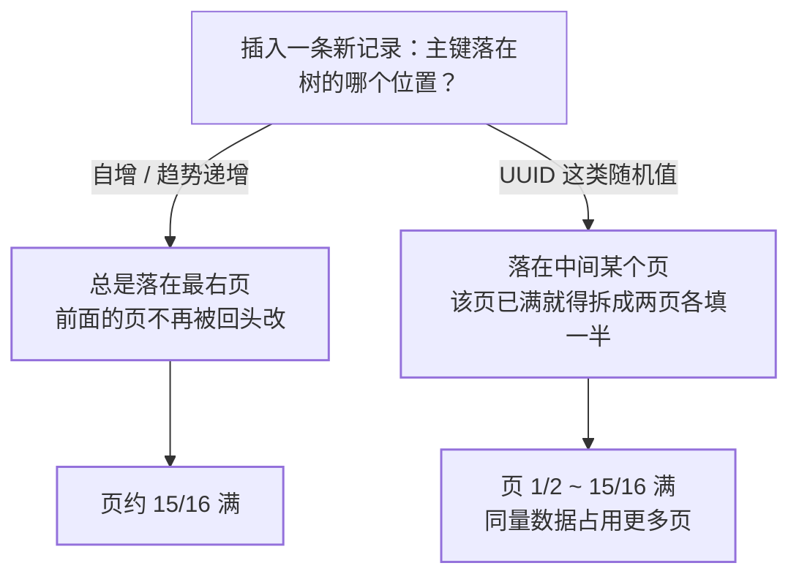
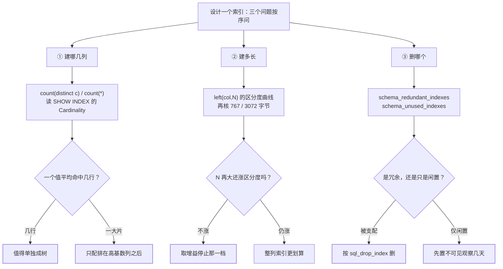

上一篇把「最左前缀」推到机制层，回答的是**已有索引怎么被用**。这一篇回答另一半
问题，也是面试里更贴近真实工作的那一半：**索引该不该建、建多长、留哪个、删哪个**。
[索引与 B+ 树](/mysql/basic/core/02-index-btree/) 给了结构，
[联合索引与最左前缀](/mysql/basic/core/03-index-leftmost/) 给了用法，本篇给判据——
每条判据都配一个可以当场跑出来的数字。

官方对这件事的成本有一句总账，它是一切取舍的前提：索引让 `SELECT` 变快，但
「不必要的索引浪费空间、浪费 MySQL 判断该用哪个索引的时间，并且增加
insert、update、delete 的代价，因为每个索引都必须被更新」。
**索引不是越多越好，这是一道预算题。**

## 建哪个：区分度是唯一的量化判据

同一个 `where`，两列的差别在哪，用数字摆出来：

```
表 orders 共 100 万行
  user_id : 20 万个不同值 → 一个值平均命中 5 行     → 回表 5 次
  status  :      5 个不同值 → 一个值平均命中 20 万行 → 不如全表扫
```

官方把这件事讲成"值组"（value group， key 前缀值相同的行集合）：
`SHOW INDEX` 里的 `Cardinality` 就是**值组的个数**，计算式是 `N / S`
（N 为总行数，S 为平均值组大小），并且直接给出结论——
「**每个索引值指向的行数越少越好**；某个索引值命中大量行时，这个索引
用处不大，MySQL 也不太会去用它」。

日常说的「区分度」「选择性」是同一个意思换了归一化口径：

| 说法 | 算式 | 量纲 | 回答什么 |
|---|---|---|---|
| Cardinality（基数） | 不同值个数（`N/S`） | 绝对值 | 这一列/这个索引有多少个值组 |
| 区分度 / 选择性 | 不同值数 ÷ 总行数 | 0~1，越大越好 | 归一后的分布，跨表可比 |
| 命中率 | 条件命中行数 ÷ 总行数 | 0~1，越小越好 | **这次查询**过滤得掉多少行 |

前两行是**列级平均**，第三行是**条件级**。这三列不是一回事，是「区分度高的列
为什么有时仍然不走索引」的全部原因，见下面误传表。

## 区分度不是一个数，是逐列递增的曲线

`n_diff` 最实用的地方，是能按**索引前缀**逐层给出不同值个数。InnoDB 把统计值
存在 `mysql.innodb_index_stats` 里，`stat_name` 为 `n_diff_pfx01`、
`n_diff_pfx02`…… 官方定义得很清楚：`n_diff_pfx01` 是**第一列**的不同值数，
`n_diff_pfx02` 是**前两列**的不同值数，以此类推。

```sql
-- 索引 index(user_id, status, create_time) 的逐前缀区分度
select stat_name, stat_value, stat_description
  from mysql.innodb_index_stats
 where table_name = 'orders' and index_name = 'idx_u_s_c'
   and stat_name like 'n_diff_pfx%';
-- n_diff_pfx01  200000   user_id
-- n_diff_pfx02  200000   user_id,status     ← 加了 status，值组一个没多
-- n_diff_pfx03  980000   user_id,status,create_time
```

于是「联合索引里哪一列是白占位」不再靠争论：`pfx02` 与 `pfx01` 相等，说明
在 `user_id` 已经确定的前提下 `status` **不再切分任何区间**，它对这个索引的定位
能力贡献为零（还能不能当过滤条件是另一回事，见上一篇的断链与 ICP）。
这条曲线也正是下一篇要讲的 `key_len` 之外的第二个仪表盘——
`key_len` 量「用满了几列」，`n_diff_pfx` 量「每列值不值」。

自己现算也可以，代价是它要扫全表：

```sql
-- 单列：count(distinct) / count(*) 越大越值得单独建索引
select count(distinct status) / count(*) as sel from orders;
```

> 大表别在生产高峰期跑这条。`count(distinct)` 是全表聚合，而
> `mysql.innodb_index_stats` 里的 `n_diff_pfx` 只是读一行统计值——
> 这就是把上面那段 SQL 放进「离线核对」而不是「线上排查」的理由。

## 前缀索引：省的是空间，赔进去的是有序性

长字符串列直接整列建索引，树里塞的是完整值。官方给了截断写法，并说明它换来什么：

```sql
create table test (content text, index(content(10)));
-- 官方：只索引前 N 个字符，能让索引文件小得多
```

前缀取多长同样有判据，就是上一节的区分度反过来用——**取到「几乎不损失
区分度」的最小 N**：

```sql
-- 前缀区分度随长度的变化曲线：找到边际增益突然变小的那一档
select count(distinct left(email, 5))  / count(*) as p5,
       count(distinct left(email, 8))  / count(*) as p8,
       count(distinct left(email, 12)) / count(*) as p12,
       count(distinct email)           / count(*) as full
  from users;
-- p12 已经贴近 full，就取 12；再往上是花空间买重复值
```

三条边界必须一起记住，否则省下的空间会以别的形式还回去：

| 约束 | 官方口径 |
|---|---|
| `TEXT` / `BLOB` **必须**给前缀长度 | "Prefixes must be specified for BLOB and TEXT key parts"，且这两类列只有 InnoDB / MyISAM / BLACKHOLE 可索引 |
| 字节上限按行格式分档 | REDUNDANT / COMPACT 行格式前缀最长 **767 字节**；DYNAMIC / COMPRESSED 最长 **3072 字节**（MyISAM 1000 字节） |
| 数字到底是字符数还是字节数 | 建索引时写的 `N`，对非二进制字符串（`CHAR`/`VARCHAR`/`TEXT`）按**字符**解释，对二进制类型按**字节**解释 |

第三条是最容易踩的：`utf8mb4` 下 `varchar(255)` 的整列索引要按最大字节数折算
（255 × 4 = 1020 字节），配 DYNAMIC 行格式（默认）尚可通过，但这正是
「同样声明长度的两列，索引体积差几倍」的来历——与上一篇 `key_len` 的折算口径是
同一件事，一个是树里存了多少，一个是查询里用掉多少。

搜索词超过前缀长度时官方也写明了退路：「索引仍用于排除不匹配的行，剩下的行要
再逐行检查」。至于两条常被引用的限制——**前缀索引不能当覆盖索引、也不能用于排序**——
我在 8.0 与 8.4 的 `CREATE INDEX` / `Column Indexes` 页都没有找到原文，
所以不按「官方规定」写，只按定义推：覆盖索引的定义是
「包含查询**检索**的全部列的索引」，而索引项里只有该列的前 N 个字符，
完整值压根不在树上；排序吃的是树上那一份序，前缀的序不等于整列的序。
**要拿这两条当结论用，就顺手 `explain` 验一次。**

## 主键宽度：一根乘数，乘在所有树上

聚簇索引就是主键本身，叶子存整行；而官方对二级索引的定义是——
「InnoDB 中二级索引的每条记录都包含该行的**主键列**，以及为该二级索引
指定的列」。把两条拼起来就是一句设计判据：

> **主键多宽，每棵二级索引树就跟着宽一截。**
> 一张 8 列的表上建 5 个二级索引，主键从 `int`(4B) 换成
> `char(32)`(utf8mb4 → 128B)，这 124 字节要复制 5 份，加上聚簇索引自己是 6 份。

这也是 `char` 类型主键最贵的原因：它既进聚簇索引的排序键，又是每棵二级索引
叶子上的回表指针。官方给的另一条相关事实也常被忽略：没有显式主键时，InnoDB
会用一个**单调递增的 6 字节 row ID** 来聚簇，「因此按 row ID 排序的行在物理上
就是插入顺序」——换句话说，**不加主键不等于没有代价，只是代价换了个形态**。

树的体积不用猜，官方统计里直接有两列（单位都是页）：
`mysql.innodb_table_stats` 的 `clustered_index_size`（主索引）与
`sum_of_other_index_sizes`（其余索引之和）。换主键前后各读一次这两列，
「主键宽度是乘数」这句话就有数字支撑。

## 插入顺序：同一棵树，页能填到多满差三倍

顺序写与随机写的差别，官方在《The Physical Structure of an InnoDB Index》里
给了一个非常干净的说法：

```
InnoDB 往聚簇索引插新记录时，会尽量给每页留 1/16 的空闲：
  按顺序（升/降）插入 → 得到的页约 15/16 满
  随机顺序插入         → 页只有 1/2 ~ 15/16 满
```



「页从 15/16 掉到 1/2」就是俗称的**页分裂**造成的结果：新行的主键要落在树中间，
目标页已满，就得拆成两页、各填一半，父层路标同步加一条。**代价不在写这一行本身，
而在同量数据要多维护近一倍的页。**

于是单表主键选型的口诀可以讲成一句因果而非结论：**能用自增 `bigint` 就用自增**，
因为插入永远落在最右页、不分裂；要全局 ID 就用**趋势递增**的（雪花这类
时间戳在高位），而不是随机分布的 UUID v4。UUID 为什么伤索引、分布式 ID 具体怎么
生成与时钟回拨怎么处理，站内
[分布式 ID 生成](/distributed/intermediate/transaction/02-distributed-id/)
是专篇，本篇只管到「它在 InnoDB 树上留下什么」。

## 删哪个：冗余、重复、与没人用

「冗余索引」和「重复索引」经常被混用，按定义分开：

| | 形态 | 判据 |
|---|---|---|
| 重复索引（duplicate） | `index(a)` 与 `index(a)`，列与顺序完全相同 | 纯浪费，直接删 |
| 冗余索引（redundant） | 已有 `index(a,b,c)`，又建了 `index(a)` 或 `index(a,b)` | 被更长的索引「支配」，多数情况下不必要 |

冗余这一档不需要新知识点，它就是最左前缀的直接推论：一棵 `(a,b,c)` 树本身
就能回答 `(a)` 和 `(a,b)` 的定位，再建一棵只是多维护一棵树。官方把这层关系
写进了 sys 库，`sys.schema_redundant_indexes` 的定义是「显示**复制了其他索引
或被其他索引变得冗余**的索引」，列名比文字更直白：
`redundant_index_name` / `dominant_index_name`（支配它的那个）/
`subpart_exists`，而且**直接给出可用的 `sql_drop_index` 语句**。

```sql
-- 谁被谁冗余、删它的 SQL 都备好了
select table_name, redundant_index_name, dominant_index_name, sql_drop_index
  from sys.schema_redundant_indexes
 where table_schema = database();

-- 但"冗余"是结构判断，"没人用"才是运行期判断
select object_schema, object_name, index_name
  from sys.schema_unused_indexes;
```

两个视图口径不同，别互相替换：前者看的是**树和树的关系**，重启前后都在；
后者看的是**有没有被优化器用过**，数据来自 performance schema，重启清零，
官方也提醒「只在服务器已经跑了足够久、负载有代表性时才有意义」。

删之前还有一道安全阀，就是上一篇讲过的**不可见索引**：
`alter table t alter index i invisible` 让优化器看不见它但照常维护，
观察几天没有慢查询冒出来，再真删。

把三问串起来，每一步都有可跑的度量，不需要靠感觉：



## 四句误传

| 误传 | 实情 |
|---|---|
| 区分度高的列一定走索引 | 优化器按成本选，「MySQL 通常在多个索引之间用**找出行数最少**的那个（most selective）」说的是候选之间比价；命中比例高、表小，弃用是正确答案 |
| 值组少 = 一定吃亏 | 倾斜分布下同一列的不同值命中行数差几个量级，列级平均值看不到；只有条件级命中率看得到 |
| `Cardinality` 是精确值 | 它是**估算**：`ANALYZE TABLE` 对 InnoDB「在每个索引树上做随机下潜（random dives）」更新基数估计，因为不扫全表所以快，也因此「重复执行可能给出不同数字」 |
| 低基数列不该进联合索引 | 它不该**单独**成树，但放在高基数列之后当过滤/排序的一部分常常值得——`n_diff_pfx` 增益为 0 才是真白占位 |

统计相关的两个变量值得知道存在：`innodb_stats_persistent` **默认开启**（统计存
在 `mysql.innodb_*_stats` 里，跨重启有效），配套的
`innodb_stats_persistent_sample_pages` 是「采样页数 ↔ 精度 ↔ `ANALYZE TABLE`
耗时」的旋钮。官方明确要求：**大量改动索引列数据后要手动
`ANALYZE TABLE`**，因为持久统计不会周期性重算。批量导入、清理历史数据之后
计划突然变差，第一嫌疑就是这里。

> 采样的默认页数是多少？不同 MySQL 官方页面给的数字对不上，因此本篇**不引用这个
> 默认值**。要调整它，用 `select @@innodb_stats_persistent_sample_pages;`
> 读自己实例的真值，别背文章里的数。

## 面试怎么答

一句话：**建不建看区分度，建多长看前缀增益，留哪个看 `n_diff_pfx`，删哪个看
sys 视图；主键宽度是乘数、插入顺序决定页填充率，这两条管的是树的体积和写成本。**

追问链，每层都要能报出一个可查的数字：

1. 怎么判断一列值不值得单独建索引？→ `count(distinct c)/count(*)`，
   或读 `SHOW INDEX` 的 `Cardinality`（官方：每个索引值指向行数越少越好）。
2. 联合索引里怎么判断某一列白占了位？→ `n_diff_pfx01` 与 `n_diff_pfx02` 相等
   → 第二列没带来新值组。
3. 前缀索引取多长？→ 跑 `left(col,N)` 的区分度曲线，取边际增益变小那一档；
   再核对 767 / 3072 字节上限与字符集折算。
4. 为什么不建议 UUID 做主键？→ 官方：随机顺序插入时页只有 1/2~15/16 满，
   顺序插入约 15/16 满；且主键宽度会复制到每棵二级索引叶子上。
5. `(a)` 和 `(a,b,c)` 都在，删哪个？→ 删 `(a)`，它是最左前缀推论下的冗余索引；
   `sys.schema_redundant_indexes` 会给出 `sql_drop_index`。
6. 怎么确认一个索引真的没人用？→ `sys.schema_unused_indexes`，但要跑够长的
   代表性时间、且重启清零；删除前先置为不可见索引观察。

## 小结

- **建**：区分度是唯一量化判据，官方口径是「每个索引值指向的行数越少越好」。
- **多长**：前缀索引拿 `left()` 的区分度曲线定档，别忘了 767 / 3072 字节与字符集折算。
- **留**：`n_diff_pfxNN` 逐前缀看增益，增益为 0 的列在重新设计索引时可以让位。
- **删**：冗余看 `schema_redundant_indexes`，闲置看 `schema_unused_indexes`，
  动手前用不可见索引试删。
- **主键**：宽度是乘在所有树上的乘数；插入顺序决定页能填到多满——这两条
  在设计阶段定，事后很难改。

## 延伸阅读

- [MySQL 8.0 Reference Manual：Optimization and Indexes](https://dev.mysql.com/doc/refman/8.0/en/optimization-indexes.html)——「不必要的索引浪费空间并增加写代价」的官方总账。
- [MySQL 8.0 Reference Manual：Use of Indexes](https://dev.mysql.com/doc/refman/8.0/en/mysql-indexes.html)——most selective 的原文语境。
- [MySQL 8.0 Reference Manual：Column Indexes](https://dev.mysql.com/doc/refman/8.0/en/column-indexes.html)——前缀写法、BLOB/TEXT 必须给前缀、767 / 3072 字节、字符与字节的解释口径。
- [MySQL 8.0 Reference Manual：Index Statistics](https://dev.mysql.com/doc/refman/8.0/en/index-statistics.html)——值组、`Cardinality = N/S`、「每个索引值命中大量行则索引用处不大」。
- [MySQL 8.0 Reference Manual：ANALYZE TABLE](https://dev.mysql.com/doc/refman/8.0/en/analyze-table.html)——random dives、估算不精确、持久统计需手动重算。
- [MySQL 8.0 Reference Manual：Persistent Optimizer Statistics](https://dev.mysql.com/doc/refman/8.0/en/innodb-persistent-stats.html)——`n_diff_pfxNN` 定义、`clustered_index_size` 与 `sum_of_other_index_sizes`。
- [MySQL 8.0 Reference Manual：Clustered Indexes & Secondary Indexes](https://dev.mysql.com/doc/refman/8.0/en/innodb-index-types.html)——二级索引记录含主键列、无主键时的 6 字节单调 row ID。
- [MySQL 8.0 Reference Manual：The Physical Structure of an InnoDB Index](https://dev.mysql.com/doc/refman/8.0/en/innodb-physical-structure.html)——15/16 与 1/2~15/16 的页填充率、`innodb_fill_factor`。
- [MySQL 8.0 Reference Manual：sys.schema_redundant_indexes](https://dev.mysql.com/doc/refman/8.0/en/sys-schema-redundant-indexes.html)——冗余/重复索引判据与 `sql_drop_index`。
- [MySQL 8.0 Reference Manual：sys.schema_unused_indexes](https://dev.mysql.com/doc/refman/8.0/en/sys-schema-unused-indexes.html)——闲置索引视图的列名与「负载有代表性」的前提。
- 站内：[联合索引与最左前缀](/mysql/basic/core/03-index-leftmost/)（用法层：区间推进、断链、`key_len`、8.0 四个新能力）
- 站内：[索引与 B+ 树](/mysql/basic/core/02-index-btree/)（结构层：三层树存两千万行的推导、聚簇与二级索引、回表）
- 站内：[分布式 ID 生成](/distributed/intermediate/transaction/02-distributed-id/)（UUID 之伤与雪花算法本体的专篇）
