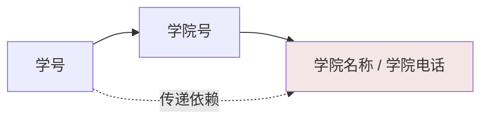

## 为什么需要范式

一张"什么都存"的大表，省了 join，但会撞上四类异常：

| 异常 | 场景（员工表直接存部门名称/地点） |
|---|---|
| **冗余** | 同一部门 100 个员工，部门地点重复存 100 遍 |
| **更新异常** | 部门搬家要改 100 行，漏改一行数据就自相矛盾 |
| **插入异常** | 新部门还没员工 → 部门信息无处可存（主键为空） |
| **删除异常** | 删掉某部门最后一个员工 → 部门信息跟着消失 |

范式就是逐级消灭这些异常的表设计规则。关系数据库有六种范式，**工程上
满足 3NF（或 BCNF）即可**——更高的 4NF/5NF 处理多值依赖与连接依赖，
业务系统几乎碰不到。

## 先把键分清楚：超键 → 候选键 → 主键

以学生表 `学生(学号, 身份证号, 姓名, 电话)` 为例：

| 概念 | 定义 | 例子 |
|---|---|---|
| **超键** | 能**唯一标识**一行的属性组（可以含多余属性） | {学号}、{学号,姓名}、{身份证号} |
| **候选键** | **最小的**超键——去掉任一属性就不再唯一 | {学号}、{身份证号} |
| **主键** | 从候选键里**选一个**当正式标识 | 选 {学号} |
| 外键 | 本表属性组，引用另一张表的主键 | 选课表.学号 → 学生表.学号 |

记忆链：超键（唯一就行）⊂ 候选键（唯一且最小）⊂ 主键（候选键选一个）。

## 函数依赖：范式的度量衡

记 `X → Y`：X 确定 Y 就随之确定（学号 → 姓名）。三种要会认：

- **完全依赖**：`（学号, 课程号）→ 成绩`——成绩依赖整个组合键，缺一不可；
- **部分依赖**：`（学号, 课程号）→ 姓名`——姓名只依赖学号，组合键的
  **一部分**就能决定它（2NF 要消除的）；
- **传递依赖**：`学号 → 学院 → 学院电话`——学院电话通过学院**传递**
  依赖于学号（3NF 要消除的）。

## 逐级升范式

### 1NF：字段不可再分

每一列都是不可分割的原子值——不能出现"电话1、电话2"挤一列或一行存
多个值。现代 DBMS 的列类型天然约束了这一点，**1NF 在实际建表时几乎
自动满足**；真正常见的是 JSON 列里塞数组绕过 1NF，查询无法下推索引，
慎用。

### 2NF：消除非主属性对组合键的部分依赖

反例：选课表 `（学号, 课程号）→ 成绩, 学分`

```text
（学号, 课程号）→ 成绩   ✅ 完全依赖
（学号, 课程号）→ 学分   ❌ 部分依赖（学分只依赖课程号）
```

学分重复存储 → 课程改学分要改所有选课记录。**拆表**：

```text
选课(学号, 课程号, 成绩)          主键：(学号, 课程号)
课程(课程号, 课程名, 学分)        主键：课程号
```

注意：**单列主键的表天然满足 2NF**（没有组合键就没有部分依赖）——这是
"无脑用自增 id 当主键"的一个隐藏好处。

### 3NF：消除非主属性对主键的传递依赖

反例：学生表 `学号 → 学院号 → (学院名称, 学院电话)`



学院电话依赖的是学院而非学生，却跟着学号冗余存储。**拆出学院表**：

```text
学生(学号, 姓名, 学院号)          学院(学院号, 学院名称, 学院电话)
```

口诀：**1NF 字段原子、2NF 非主属性完全依赖主键、3NF 非主属性不依赖
其它非主属性**（"属性依赖键，整键，且只依赖键"）。

### BCNF：主属性也别例外

3NF 只约束"非主属性"；当候选键之间互相决定时，3NF 仍会冗余。
经典反例：仓库表 `(仓库ID, 物品ID, 管理员ID, 数量)`

- 管理员只管理一个仓库：`管理员ID → 仓库ID`（管理员ID 是候选键
  的一部分，却决定另一个键的组成部分）；
- 数量完全依赖 `(仓库ID, 物品ID)`，满足 3NF，但"管理员-仓库"关系
  随物品数冗余。

BCNF 要求**所有函数依赖的决定因素都必须是候选键**——把"管理员→仓库"
拆成独立的 `(管理员ID, 仓库ID)` 映射表即达。业务表碰到的概率不高，
但面试爱考。

## 反范式：范式是原则不是信仰

范式消除冗余的代价是**join 变多**。高并发读场景常主动冗余：

| 手法 | 例子 | 代价 |
|---|---|---|
| 冗余列 | 订单表冗余 `user_name`，列表页免 join 用户表 | 改名要同步刷 |
| 汇总列 | 商品表存 `sales_count`，而非实时 count 明细 | 增减要维护计数 |
| 1:N 合并 | 近期地址 JSON 存进用户表 | 无法索引/约束 |

前提是**冗余数据的更新频率远低于读取频率**（用户名几乎不改、销量靠
异步聚合）。先按 3NF 设计，拿着明确的慢查询证据再降级——而不是把
"以后可能慢"当借口。

## 小结

- 键的层级：超键 ⊃ 候选键（最小）→ 主键（选一个）。
- 三级范式各消一种依赖：1NF 原子性、2NF 消部分依赖、3NF 消传递依赖；
  BCNF 连主属性间的依赖也不放过。
- 范式换来"无异常"，代价是 join；反范式是读多写少场景的主动权衡，
  要拿慢查询证据说话。

## 延伸阅读

- [数据库原理知识梳理（知乎）](https://zhuanlan.zhihu.com/p/37435149)——范式实例剖析的母本，含 BCNF 反例展开
- [数据库设计三大范式（博客园）](https://www.cnblogs.com/linjiqin/archive/2012/04/01/2428695.html)
- [超键、候选键和主键（CSDN）](https://blog.csdn.net/cjr15233661143/article/details/12970323)
- [完全依赖、部分依赖、传递依赖关系（CSDN）](https://blog.csdn.net/linkunpeng_/article/details/107783446)
