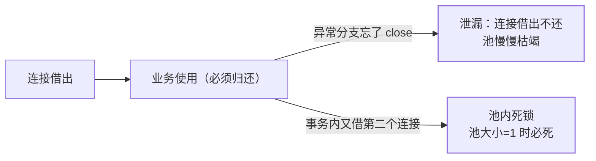

"数据库连接池设多大？"——回答"越大越好"直接暴露没理解连接的本质。
连接池是**复用昂贵资源**的经典案例，池大小的计算背后是数据库的并发
处理模型。

## 为什么需要连接池：连接的成本账

一次新建 MySQL 连接 = TCP 三次握手 + TLS 握手（如启用）+ 认证 +
会话初始化——**毫秒到几十毫秒级**，而一次简单查询只要 1ms。每个连接
在服务端还占线程/内存（max_connections 上限）。连接池把连接建好
**复用**：借出→使用→归还，成本摊薄到几乎为零。

## 池大小：不是越大越好（核心考点）

HikariCP 官方给的起点公式：**连接数 ≈ 核数 × 2 + 有效磁盘数**（SSD
算 1）——一台 4 核 DB 大约 9~10 个活跃连接就吃满处理能力。

为什么不是越大越好：

- MySQL 每个连接是一个线程，连接多了 CPU 上下文切换与锁竞争
  反而让**吞吐下降**；
- 1000 个并发请求打向 10 个真实可并行的 DB 工作线程——999 个在排队，
  池再大只是把队列搬了个位置；
- **池是限流阀不是加速器**：池大小应该匹配 DB 的处理能力，应用侧
  排队等待（队列）比 DB 端混乱竞争更可控。

## 泄漏与死锁：池的两大事故

- **泄漏**：借了不还（异常路径漏 close）——`leakDetectionThreshold`
  打印借出超时堆栈定位；事务框架托管生命周期是根治；
- **池内死锁**：一个线程的事务先拿连接 A，内部又向池借连接 B（如
  嵌套调用各自开连接），池空时 A 等 B 归还、B 等 A 释放——池大小 1
  + 嵌套借连接必死。纪律：**一个事务只用一个连接**。

## HikariCP 为什么快

- **字节码级优化**：手写 javassist 字节码替代反射，代理方法调用
  零开销；
- **ConcurrentBag**：无锁的连接容器（ThreadLocal 优先 + CopyOnWrite
  列表），借还连接几乎无竞争；
- **FastList** 替代 ArrayList（去掉范围检查，匹配 JDBC 的逆序 close
  习惯）；
- 面试句式："HikariCP 快在把 JDBC 调用路径上的每一分抽象开销都抠掉
  了——无锁容器 + 字节码 + 精简数据结构。"

## 高频追问速答

- **连接池参数先调哪个？** 最大池大小（按公式）→ 连接超时 → 泄漏
  检测阈值；先保证不泄漏，再谈大小。
- **微服务每个实例一个池，总连接数怎么算？** 实例数 × 池大小 ≤ DB
  的 max_connections × 安全系数（如 80%）——横向扩容时连接数线性
  涨，DB 侧会被打满。
- **连接用前校验（testOnBorrow）要开吗？** 网络闪断后借到死连接的
  问题——HikariCP 用空闲超时 + 心跳保活（idleTimeout/
  keepaliveTime）替代逐次校验（逐次校验多一次往返）。

## 小结

- 连接池复用昂贵连接；**池大小 ≈ 核数×2+盘数**——池是限流阀不是
  加速器。
- 两大事故：泄漏（leakDetection 抓）与池内死锁（一事务一连接纪律）。
- HikariCP 快在零开销路径：无锁 ConcurrentBag + 字节码 + FastList。
