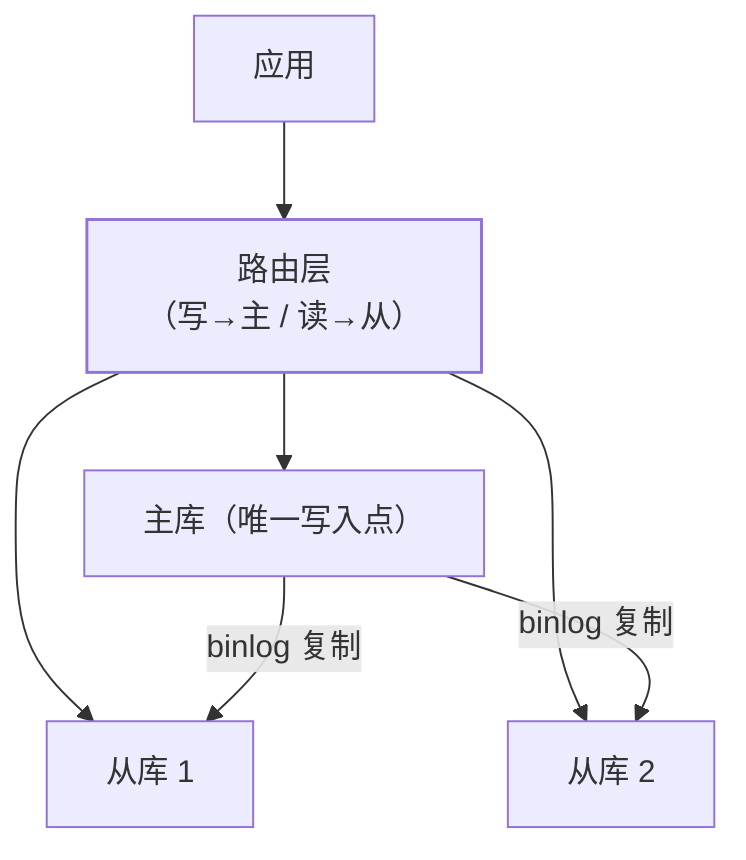

主从复制篇讲了复制怎么工作，本篇讲它的**第一应用**：读写分离——写走
主库、读走从库，用多台从库扛住读流量。架构简单，坑全在细节：
**路由怎么实现**、**主从延迟导致的"写后读不到"怎么解决**。

## 架构：写主读从的两层数据源

- 读流量通常是写的 5~10 倍——从库横向加机器即可扩读能力；
- **事务与写必须走主库**（从库只读），事务中途切换数据源会破坏事务
  语义——路由层要识别事务边界。

## 路由实现：SDK 层 vs 中间件层

| | SDK 层（ShardingSphere-JDBC/动态数据源） | 中间件层（ProxySQL/MyCat） |
| --- | --- | --- |
| 形态 | 应用内依赖，连接直连 DB | 独立代理进程，应用连 Proxy |
| 路由依据 | ThreadLocal 路由键 + SQL 解析 | SQL 解析/注释提示 |
| 性能 | 无中间跳转，低延迟 | 多一跳 |
| 运维 | 每个应用集成（升级要发版） | **集中管控**，应用零侵入 |
| 适用 | 中小规模、团队自控 | 多应用统一接入、大规模 |

- SDK 层的典型实现：`@ReadWrite("slave")` 注解或 SQL 解析自动判断
  （SELECT 走从/INSERT UPDATE 走主），路由键放 ThreadLocal——
  **异步/线程池场景 ThreadLocal 会丢**（跨线程要传递，经典坑）；
- 中间件层的透明性最好，但多一跳延迟与 Proxy 自身的高可用问题。

## 主从延迟：写后立读的坑

复制是异步的（主库提交即返回，binlog 再传从库）——**写完立刻读，
从库可能还没同步**：改完昵称刷新页面还是旧昵称。解决分级：

| 方案 | 做法 | 代价 |
| --- | --- | --- |
| 强制走主 | 关键读（改完后的立即回显）打标记路由主库 | 主库压力上升 |
| 会话内标记 | 同一用户写后 N 秒内读走主 | 简单，时间窗拍脑袋 |
| 等位点 | 写时记录 binlog 位点，读时等从库追到位点 | 精确，实现复杂 |
| 业务容忍 | 非关键读接受旧数据（最终一致） | 免费，多数场景够用 |

- **默认容忍 + 关键读走主**是最实用的组合——不是所有读都值得追求
  强一致（幂等篇的"按业务容忍"同一思想）。

## 高频追问速答

- **主从延迟怎么监测？** `SHOW SLAVE STATUS` 的
  `Seconds_Behind_Master`——但它只比对 binlog 时间戳，主库没写入时
  恒为 0（假 0）；更可靠是打时间戳心跳表对比。
- **延迟大的常见原因？** 从库单线程回放（老版本）追不上主库并发写、
  大事务（一条 binlog 回放很久）、从库机器差——按序排查。
- **读写分离和分库分表什么关系？** 正交的两个扩展维度：读写分离扩
  **读能力**（副本），分库分表扩**数据容量**（拆数据）——大系统
  两者都要（sharding 篇）。

## 小结

- 写主读从扩读能力；路由实现 SDK（低延迟、侵入）vs Proxy（透明、
  多一跳）按规模选。
- 事务与写强制走主；**异步/线程池场景 ThreadLocal 路由键会丢**是
  SDK 层的头号坑。
- 主从延迟分级解决：默认容忍 + 关键读强制走主 + 位点等待是精确方案
  ——按读的业务重要性选，不必全量强一致。
