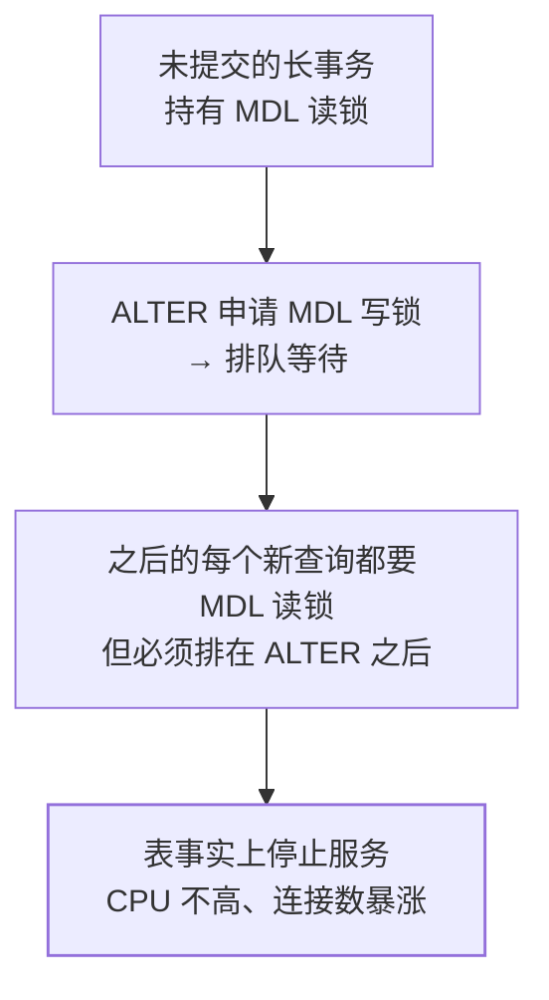

## 问题：接口集体超时，但你不知道谁堵了谁

[锁机制与死锁](/mysql/intermediate/transaction-lock/02-locks/)讲的是
**锁的语义**：行锁/间隙锁/Next-Key 规则、AB-BA 怎么形成死锁。
本篇不讲语义，只回答事故现场的三个问题：

1. 现在**谁在等谁**？
2. 这是行锁等待、**MDL 等待**还是死锁？（三种的处置完全不同）
3. 要不要 kill？kill 的**代价**是什么？

主线场景：`orders` 表一条 `UPDATE` 卡了 40 秒，后面 200 个请求排队，
CPU 不高，错误日志里开始出现 `Lock wait timeout exceeded`。

## 一、先分三类等待

| 等待类型 | 超时由谁管 | 典型值 | processlist 状态词 |
|---|---|---|---|
| InnoDB 行锁等待 | `innodb_lock_wait_timeout` | 默认 **50 秒** | `updating` / `Sending data` |
| 元数据锁 MDL 等待 | server 层 `lock_wait_timeout` | 默认**一年** | `Waiting for table metadata lock` |
| 死锁 | InnoDB 自动检测，回滚代价小的一方 | 即时 | 报错 1213 `Deadlock found` |

**第二行是新手最容易误判的**：MDL 等待不受 `innodb_lock_wait_timeout`
约束，默认等一年——所以"一个 DDL 卡住 → 全表所有查询无限堆积"是
最常见的雪崩形状，而不是 50 秒就自动散。

## 二、起手式：先看有没有长事务

```sql
SELECT trx_mysql_thread_id AS pid, trx_state,
       trx_started,
       TIMESTAMPDIFF(SECOND, trx_started, NOW()) AS run_s,
       trx_rows_locked, trx_rows_modified,
       LEFT(trx_query, 60) AS q
FROM information_schema.INNODB_TRX
ORDER BY trx_started;
```

`trx_query` **为 NULL 但 `run_s` 很大**，是最坑的一种：**空闲事务**——
事务开着、语句都执行完了、没人 commit（常见于连接池归还时没回滚、
或应用异常路径漏了 `commit/rollback`）。它不产生慢查询日志、
不占 CPU，但**它持有的行锁和 MDL 会把全世界挡住**。

## 三、谁堵了谁：8.0 换表了

| 版本 | 锁与等待关系表 |
|---|---|
| 5.7 | `information_schema.INNODB_LOCKS` + `INNODB_LOCK_WAITS` |
| **8.0** | `performance_schema.data_locks` + `data_lock_waits`（前者两张表已移除） |

自己拼 join 容易漏列，**优先用 sys schema 的现成视图**：

```sql
SELECT * FROM sys.innodb_lock_waits
ORDER BY wait_started LIMIT 10;
```

它已经把等待方/阻塞方拼在一行，并且**直接给出可用的 KILL 语句列**
（`sql_kill_blocking_query` 一族）。列名以
`SELECT *` 先看一眼为准——不同小版本列有增减，别背。

手工版（8.0，视图不可用时）：

```sql
SELECT r.trx_mysql_thread_id AS waiting_pid,
       LEFT(r.trx_query, 40)  AS waiting_q,
       b.trx_mysql_thread_id AS blocking_pid,
       LEFT(b.trx_query, 40)  AS blocking_q,
       b.trx_started           AS blocking_started
FROM performance_schema.data_lock_waits w
JOIN information_schema.INNODB_TRX r
  ON r.trx_id = w.REQUESTING_ENGINE_TRANSACTION_ID
JOIN information_schema.INNODB_TRX b
  ON b.trx_id = w.BLOCKING_ENGINE_TRANSACTION_ID;
```

想看清"锁在哪一行、什么模式"，查 `data_locks`
（`LOCK_TYPE` / `LOCK_MODE` / `LOCK_TABLE` / `LOCK_INDEX` /
`LOCK_DATA` 是行锁的**主键值**——这一列最能说明锁的是哪条记录）。

## 四、MDL：一个没提交的事务能让整张表停服

在线 DDL 那篇讲过算法选择，这里讲它的**排队语义**。MDL 是
**写者优先**的：



写者优先是为了**不让 DDL 被源源不断的新查询饿死**，代价就是一旦 DDL
进队，后面的读也全部堵住。取证：

```sql
-- MDL 明细（该 instrument 可能默认未开，先查 setup_instruments 再开）
SELECT object_name, lock_type, lock_status,
       owner_thread_id
FROM performance_schema.metadata_locks
WHERE object_type = 'TABLE' AND object_name = 'orders';

-- 或者直接问 sys：谁挡住了 DDL
SELECT * FROM sys.schema_table_lock_waits\G
```

处置原则：**kill 那个原始长事务（持锁者），而不是 kill 正在等待的 DDL**。
杀 DDL 只是把队列里的下一个放开，让它继续撞上同一个持有者。

## 五、死锁：现场只有一份，先保住它

```sql
SHOW ENGINE INNODB STATUS\G      -- 看 LATEST DETECTED DEADLOCK 段
```

它**只保留最近一次**死锁。所以生产上要提前打开：

```ini
innodb_print_all_deadlocks = ON   # 每次死锁都写错误日志，否则等于没发生
```

读那一段的顺序：两个事务各自**持有**什么锁、**等待**什么锁、
谁被回滚（`WE ROLLBACK TRANSACTION N`）。为什么形成环、间隙锁在
RR 下如何参战，是[锁机制那篇](/mysql/intermediate/transaction-lock/02-locks/)
的内容；这里只补两条现场经验：

- 死锁**频繁出现**通常不是运气问题，而是同一批行的访问顺序不一致
  （多步更新请统一顺序，或缩小事务范围）；
- `innodb_deadlock_detect=ON` 是默认，检测本身有成本，且成本随
  **同一行的等待者数量**上升。热点行场景（秒杀库存、账户余额）下，
  有人选择关掉检测、改用较短的 `innodb_lock_wait_timeout` 兜底——
  这是拿"单次等待变长"换"检测不再吃 CPU"，属于业务侧改造
  （拆分/合并扣减/排队缓冲）之外的第二顺位手段，别当首选。
  热点行的业务解法见
  [库存扣减](/distributed/intermediate/case-studies/16-stock-deduction/)与
  [Seata 的热点行结论](/seata/basic/core/02-seata-deep-dive/)。

## 六、能不能 kill：先估回滚代价

kill 一个未提交事务不等于"立刻结束"——它要**回滚**，回滚量由
`trx_rows_modified` 决定。回滚一个改了 5000 万行的事务，
比等它自己跑完更久，而且期间锁**仍然持有**：

```sql
SELECT trx_mysql_thread_id AS pid, trx_rows_modified,
       TIMESTAMPDIFF(SECOND, trx_started, NOW()) AS run_s
FROM information_schema.INNODB_TRX
ORDER BY trx_rows_modified DESC LIMIT 5;
```

**kill 之前必须先留证据**，否则复盘时只剩"当时很奇怪"：

```sql
SHOW ENGINE INNODB STATUS\G                     -- 锁与等待全景
SELECT * FROM information_schema.INNODB_TRX;    -- 事务快照
SELECT * FROM sys.innodb_lock_waits;            -- 等待链
SHOW FULL PROCESSLIST;                           -- 状态词与连接来源
```

批量生成 KILL 语句（**先只查不杀**，人工过一遍再执行）：

```sql
SELECT CONCAT('KILL ', trx_mysql_thread_id, ';') AS kill_stmt
FROM information_schema.INNODB_TRX
WHERE trx_state = 'RUNNING'
  AND trx_started < NOW() - INTERVAL 60 SECOND;
```

## 七、五分钟现场 SOP

1. `SHOW FULL PROCESSLIST` **读状态词**：
   `Waiting for table metadata lock` → 第四节；`updating` → 第三节；
   一片 `Sleep` 但 `INNODB_TRX` 里有活跃事务 → 空闲事务，第二节。
2. `SELECT * FROM sys.innodb_lock_waits` 拿阻塞方 `blocking_pid`；
   没有 sys schema 就用 `data_lock_waits` 手工 join。
3. 查阻塞方的 `trx_rows_modified`：小 → 直接 kill；
   大（百万级）→ 先算回滚时间，可能"等它跑完"才是快的那个。
4. 若出现 `Deadlock found`：立刻 `SHOW ENGINE INNODB STATUS`，
   并确认 `innodb_print_all_deadlocks` 是否已开。
5. 事后：把持锁 SQL、事务边界、代码路径写进复盘——
   锁等待的根因**几乎总在事务边界**（该提交没提交、把 RPC 圈进了事务），
   不在锁本身。对照[事务与 MVCC](/mysql/intermediate/transaction-lock/01-transaction-mvcc/)
   确认隔离级别与提交时机。

## 小结

- 三类等待各有各的超时：**行锁** `innodb_lock_wait_timeout`（默认 50s）、
  **MDL** server 层 `lock_wait_timeout`（默认一年）、**死锁**由 InnoDB
  自动检测回滚。误判类型比查不到更危险。
- 8.0 起锁与等待关系表迁到 `performance_schema.data_locks` /
  `data_lock_waits`，5.7 的 `INNODB_LOCKS` 已移除；日常直接用
  `sys.innodb_lock_waits`，它连 KILL 语句都给你拼好。
- `trx_query` 为 NULL 的**空闲长事务**是最难发现的持锁者。
- MDL **写者优先**：一个 DDL 排队就能让该表所有新查询无限堆积；
  处置是杀原始长事务，不是杀 DDL。
- `SHOW ENGINE INNODB STATUS` 只留最近一次死锁 → 生产开
  `innodb_print_all_deadlocks`。
- kill 前先看 `trx_rows_modified`：回滚可能比等待更久；
  **证据永远先于动作**。

## 延伸阅读

- [InnoDB Locking（官方：锁类型、死锁处理与 `SHOW ENGINE INNODB STATUS` 语义）](https://docs.oracle.com/cd/E17952_01/mysql-8.4-en/innodb-locking.html)
- [InnoDB Startup Options：`innodb_lock_wait_timeout` 与 `innodb_print_all_deadlocks`](https://docs.oracle.com/cd/E17952_01/mysql-8.4-en/innodb-parameters.html)
- 站内配套：[锁机制与死锁形成](/mysql/intermediate/transaction-lock/02-locks/)、
  [在线 DDL 与 MDL](/mysql/advanced/performance-ha/03-online-ddl/)
