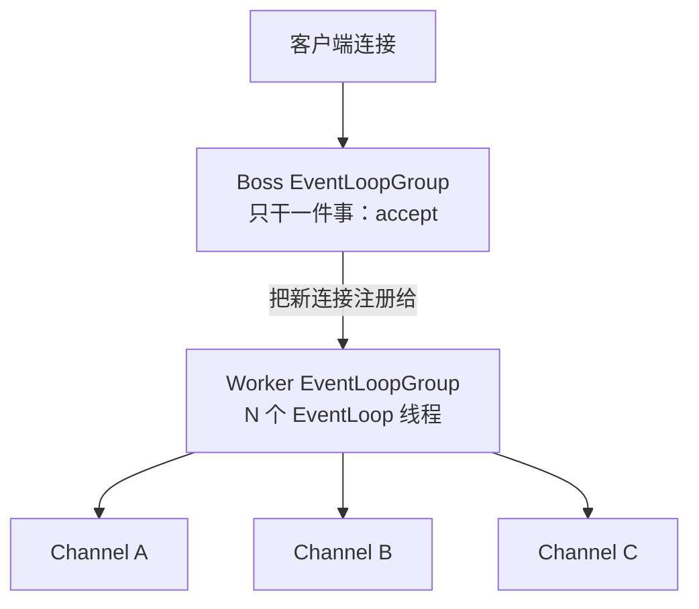

## 前置：从 IO 模型到 Reactor

BIO 一连接一线程扛不住万级连接；NIO 用多路复用让一个线程监视
一堆连接，但裸 NIO 的 Selector 编程繁琐易错。**Reactor 是 NIO 的
工程化骨架**（概念见
[IO 模型](/java/basic/io/01-io-model/)），Netty 是它最成熟的生产级
实现，并把骨架精化成**主从 Reactor** 两级：



- **Boss 组**：监听端口，只负责接受连接，然后把新 Channel 注册到
  Worker 组的某个 EventLoop 上
- **Worker 组**：每个 EventLoop 是一个线程 + 一个 Selector，盯着
  分给自己的那一批 Channel 的读写事件
- 之后这条连接的所有 IO 事件，**永远由同一个线程处理**

## EventLoop 铁律：一条连接一个线程

Channel 在生命周期内绑定唯一的 EventLoop，这带来两个工程性质：

| 性质         | 推论                                            |
| ---------- | --------------------------------------------- |
| 事件串行       | 同一连接的读写事件天然排队执行，Handler 里**不需要加锁** |
| 线程安全反转     | 反过来，Handler 绝不能阻塞（长计算、同步 IO），否则这条线程上所有连接一起卡死 |

```java
EventLoopGroup boss = new NioEventLoopGroup(1);
EventLoopGroup worker = new NioEventLoopGroup();
ServerBootstrap b = new ServerBootstrap();
b.group(boss, worker)
 .channel(NioServerSocketChannel.class)
 .childHandler(new ChannelInitializer<SocketChannel>() {
     protected void initChannel(SocketChannel ch) {
         ch.pipeline().addLast(new BizHandler());
     }
 });
```

把耗时任务丢回业务线程池执行，是 Netty 编程的第一纪律；
`EventLoop.execute()` / `schedule()` 则用于把结果安全地送回
原线程继续操作 Channel。

## 要点备忘

- 主从分工：Boss 管 accept，Worker 管已连接套接字的读写
- Channel 与 EventLoop 终身绑定：串行无锁是性能来源，阻塞是头号大忌
- Handler 里做不了快事就外抛线程池，结果再回 EventLoop 收尾
- EventLoop 本质 = 线程 + Selector + 任务队列三合一

## 延伸阅读

- [Netty 官方 · User guide](https://netty.io/wiki/user-guide-for-4.x.html)
