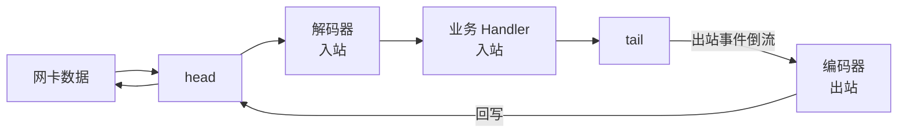

import AlgorithmVizIsland from '../../../../../components/viz/AlgorithmVizIsland.astro';

## Pipeline：Handler 的双向责任链

每条 Channel 建立时都携带一条 **ChannelPipeline**——Handler 组成的
双向链表。事件沿链流动，但**方向由事件类型决定**：



- **入站事件**（数据到达、连接建立、异常）从 head 向 tail 流，
  依次穿过入站 Handler
- **出站事件**（write、connect、close）从 tail 向 head 流——
  出站要「逆流而上」最终从 head 写回网络
- 一个 Handler 可以同时声明处理入站与出站（编解码一体）

一次「请求-响应」在链上的完整流动：

<AlgorithmVizIsland demo="netty-pipeline" />

## 传播控制：fire 与 write

```java
public class BizHandler extends SimpleChannelInboundHandler<Msg> {
    protected void channelRead0(ChannelHandlerContext ctx, Msg m) {
        ctx.writeAndFlush(response);   // 从当前位置直接流向 head
        // ctx.fireChannelRead(msg);   // 手动把入站事件传给下一个
    }
}
```

- `ctx.fireChannelRead(...)`：把入站事件继续往后传——不调用就
  「截断」了责任链
- `ctx.write(...)` 从**当前 Handler 位置**向 head 流；
  `channel.write(...)` 则从 **tail** 出发——起点不同，中间路过的
  出站 Handler 也不同，这是顺序事故的高发区
- `SimpleChannelInboundHandler` 读完自动 release 消息，省掉手动
  释放（ByteBuf 所有权见 [ByteBuf](/netty/basic/core/03-bytebuf/)）

## 顺序：addLast 的语义

```java
ch.pipeline().addLast(new Decoder());    // 入站：先执行
ch.pipeline().addLast(new Encoder());    // 出站：逆流时命中
ch.pipeline().addLast(new BizHandler());
```

入站事件按 addLast 顺序流过（Decoder → Biz）；出站事件从 tail 逆流
（Biz 调 write 后 → Encoder → head）。**画一条双向箭头链再排列
add 顺序**，是理清 Pipeline 的固定动作。

粘包拆包的四类解码器与参数推导见
[TCP 粘包拆包与 Netty 解码](/java/basic/io/03-tcp-sticky-packets/)，
此处不重复。

## 要点备忘

- 入站 head→tail、出站 tail→head：方向决定执行顺序
- ctx.write 与 channel.write 起点不同，选错会跳过出站 Handler
- 不 fireChannelRead 就是截断链路——有意的截断也要写注释
- 事件在哪个线程执行？处理该 Channel 的那个 EventLoop——切线程
  要显式借助 EventLoop 的任务队列

## 延伸阅读

- [Netty 官方 · ChannelPipeline](https://netty.io/4.1/api/io/netty/channel/ChannelPipeline.html)
