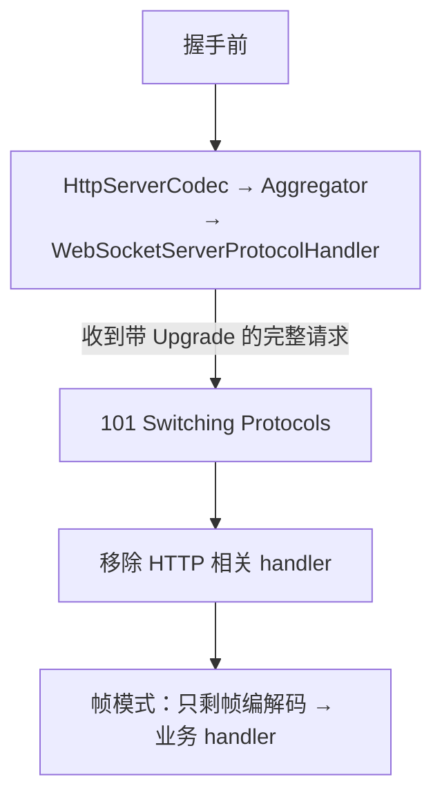

[心跳与空闲检测](/netty/intermediate/core/01-heartbeat-idle/)篇管连接
活性，这篇管连接上跑什么：用 Netty 做 WebSocket 服务的标准姿势。高频
追问集中在三处——handler 链为什么要那几个「套件」、握手之后 pipeline
发生了什么、心跳该用协议层还是应用层。

## WebSocket 的两段式：握手 + 帧通信

WebSocket 借 HTTP 完成握手：一个带 `Upgrade: websocket` 的 HTTP GET，
服务器 101 换协议，之后这条 TCP 连接上跑的就是 WebSocket 帧协议——
**握手是 HTTP，通信不是**。所以 Netty 的 handler 链里要先有 HTTP 的
编解码、再有 WebSocket 的升级处理器，最后才轮到业务 handler：

```java
ChannelPipeline p = ch.pipeline();
p.addLast(new HttpServerCodec());                        // HTTP 编解码
p.addLast(new HttpObjectAggregator(65536));              // 聚合完整请求
p.addLast(new WebSocketServerProtocolHandler("/ws"));    // 升级 + 帧编解码
p.addLast(new MyFrameHandler());                         // 业务：只见帧
```

四件套各司一职，缺一不可的追问点有两个：

- **`HttpObjectAggregator` 为什么必须有**：HTTP 请求可能分多个消息段
  到达，而握手处理器要求拿到**完整的** FullHttpRequest 才能做 101 响应
  ——聚合器把碎片拼成整体。
- **`WebSocketServerProtocolHandler` 做了什么**：拦截升级请求、完成
  101 握手、**然后把 pipeline 里的 HTTP handler 移除**，后续只做 WebSocket
  帧的编解码。

## 握手前后：pipeline 换道



理解「换道」就理解了业务 handler 的两个约束：握手前它收不到 HTTP 请求
（被升级处理器拦了，需要握手完成事件可监听
`WebSocketServerProtocolHandler.HandshakeComplete`）；握手后它收到的
只有 `WebSocketFrame` 的各种子类型，不再有 HttpRequest。

## 帧类型清单与聚合帧

WebSocket 帧不是只有「文本/二进制」两种，业务要按类型分流：

| 帧 | 语义 | 典型处理 |
| --- | --- | --- |
| `TextWebSocketFrame` | 文本（JSON 消息为主） | 业务主通道 |
| `BinaryWebSocketFrame` | 二进制 | 文件/自定义协议 |
| `PingWebSocketFrame` / `PongWebSocketFrame` | 协议层心跳 | 升级处理器自动回 Pong |
| `CloseWebSocketFrame` | 关闭握手 | 响应后关闭连接 |
| `ContinuationWebSocketFrame` | 长消息的后续分片 | 聚合后处理 |

最后的分片是隐藏考点：一条超过阈值的长文本会被发送端拆成「首帧 +
若干 Continuation 帧」，业务 handler 拿到半条消息没法直接用——挂一个
**`WebSocketFrameAggregator`**（在协议处理器之后）把分片重组成完整
帧，业务永远只见整条消息。和 [ByteBuf](/netty/basic/core/03-bytebuf/)
篇的「读指针语义」对照着看：协议层的拆分拼接都发生在 handler 链里，
业务层拿到的已是语义完整的对象。

## 高频追问：心跳用协议层还是应用层

两层心跳都在，职责不同：

- **协议层 Ping/Pong**：WebSocket 协议内置，`WebSocketServerProtocol-
  Handler` 自动回 Pong——它只证明「TCP 连接和协议栈还活着」。
- **应用层心跳**（心跳消息 + [IdleStateHandler](/netty/intermediate/core/01-heartbeat-idle/)）：证明「**业务还跑得动**」——进程假死、
  线程池打满时 Pong 可能照样回，业务心跳却发不出来。

生产上的经典分工：连接活性交给协议层 Ping/Pong（省应用流量），业务
健康判定交给应用层心跳（判死了主动 Close 重连）。只用协议层心跳的
服务，出过「连接活着但处理线程全卡死」的事故后再补应用层心跳的，就是
这道题的现实出处。

## 小结

- WebSocket = HTTP 握手 + 帧协议；Netty 四件套：HttpServerCodec →
  HttpObjectAggregator → WebSocketServerProtocolHandler → 业务 handler。
- 聚合器拼完整请求才能握手；升级处理器握手后移除 HTTP handler 完成
  「换道」。
- 帧六类型要分流处理；长消息分片靠 WebSocketFrameAggregator 重组。
- 协议层 Ping/Pong 证连接活性（自动回），应用层心跳证业务健康——
  两层分工，缺一个都可能误判。

## 延伸阅读

- [Netty 官方示例：WebSocket 服务端](https://netty.io/4.1/xref/io/netty/example/http/websocketx/server/package-summary.html)
- [RFC 6455：The WebSocket Protocol](https://datatracker.ietf.org/doc/html/rfc6455)
- [MDN：WebSocket API](https://developer.mozilla.org/zh-CN/docs/Web/API/WebSocket)
