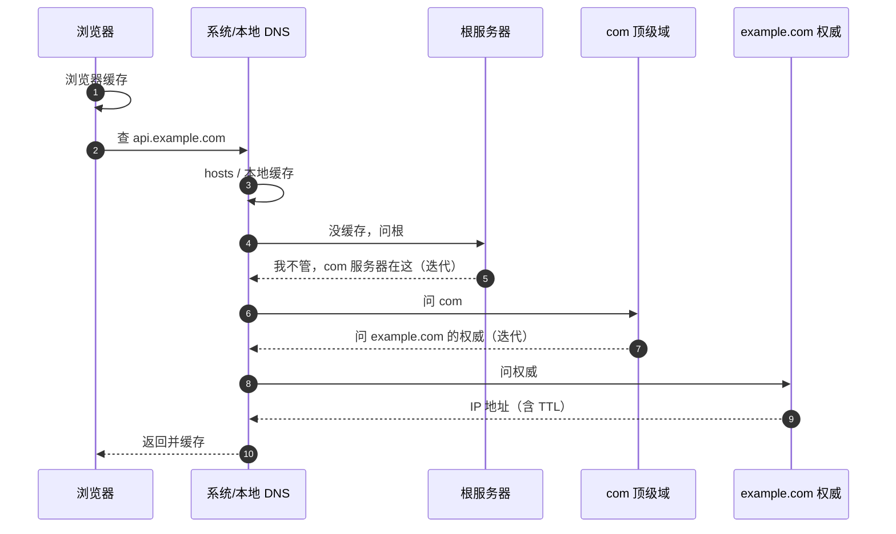

import AlgorithmVizIsland from '../../../../../components/viz/AlgorithmVizIsland.astro';

## 域名是一棵树

`api.example.com` 从右往左读层级：`com` 顶级域 → `example` 权威域
（谁注册谁管）→ `api` 子域。对应的 DNS 服务器体系也是这棵树的镜像：
**根服务器（.）→ 顶级域服务器（com）→ 权威服务器（example.com）**，
每级只回答"下一级在哪"。

## 解析全流程：八步缓存链

递归 + 迭代的两段式问路按帧走一遍：

<AlgorithmVizIsland demo="dns-lookup" />

- **递归 vs 迭代**：客户端 → 本地 DNS 是**递归**（你必须给我最终
  答案）；本地 DNS → 根/顶级/权威是**迭代**（一级级问路，你自己
  去下一站）。
- **缓存无处不在**（浏览器/系统/本地 DNS），按记录的 **TTL** 过期——
  这就是"换 IP 要提前调小 TTL"的原因。

## 记录类型速查

| 记录 | 含义 | 典型用途 |
|---|---|---|
| A / AAAA | 域名 → IPv4 / IPv6 | 最基础 |
| CNAME | 域名 → 另一个域名 | 接 CDN：`www → xxx.cdn.com` |
| NS | 域的权威服务器是谁 | 换 DNS 服务商 |
| MX | 邮件交换服务器 | 发邮件找谁 |
| TXT | 任意文本 | 域名所有权验证、SPF 反垃圾 |

## 为什么走 UDP 53

查询报文小、一问一答、重传代价低——**UDP 足够且省去握手**。TCP
用于**区域传送**（主从同步）与响应超过 512B（EDNS 之前）的场景。
"DNS 用 UDP"的完整表述是：**常规查询 UDP，同步与超大响应用 TCP**。

## 实战视角

- **CDN 调度的本质是 DNS**：权威服务器按来源返回就近 CDN 节点的
  CNAME/A 记录（调度细节见[Nginx 的 CDN 篇](/nginx/intermediate/proxy/04-cdn/)）。
- **HTTPDNS**：App 绕过运营商 Local DNS 直接 HTTP 问厂商——因为
  Local DNS 有**劫持**（插广告）与**调度不准**（转发导致拿错就近
  节点）两大顽疾。
- **排查工具**：`dig +trace api.example.com` 看完整迭代链路，
  `nslookup` 快速验证；`ping` 通域名但业务不通时先 `dig` 看 IP 是
  不是预期的。

## 小结

- 域名是树、DNS 服务器体系是树的镜像；解析 = 客户端递归 + 本地
  DNS 迭代，沿途多层 TTL 缓存。
- A/CNAME/MX/TXT 覆盖 90% 面试题；查询走 UDP 53，区域传送才 TCP。
- 生产关注点：TTL 提前调小再切流量、劫持与调度不准催生 HTTPDNS。
