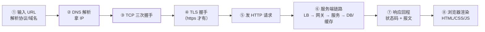

## 为什么这道题经久不衰

它是**网络八股的总纲**：单独背三次握手、DNS、HTTP 都容易，这道题
逼你把它们串成因果链，任何一步卡壳都藏不住。同时它是排障地图——
线上"页面打不开"，就是沿着这条链逐段验尸。

## 全链路八步

| 步 | 发生了什么 | 深入去哪 |
|---|---|---|
| ① URL 解析 | 拆协议/域名/路径；HSTS 决定是否强制 https | — |
| ② DNS | 浏览器缓存 → 本地 DNS → 根/顶级/权威 | [DNS 解析全过程](/network/basic/foundation/02-dns/) |
| ③ TCP 建连 | SYN/ACK 三次握手，拿到的可能还有 CDN 边缘 IP | [三次握手与四次挥手](/network/basic/tcp/01-three-way-handshake/) |
| ④ TLS | 证书验证 + 密钥协商（1 个 RTT） | [HTTPS 与 TLS](/network/basic/http/02-https-tls/) |
| ⑤ 请求 | 构造请求行/头/体；可能带上 Cookie | [HTTP 基础](/network/basic/http/01-http-basics/) |
| ⑥ 服务端 | 负载均衡 → 网关鉴权限流 → 业务 → 缓存/DB | [Spring MVC 流程](/java/intermediate/spring-mvc/01-springmvc-flow/) |
| ⑦ 响应 | 状态码语义、Content-Type、长连接复用 | 同上 |
| ⑧ 渲染 | 解析 HTML 建 DOM/CSSOM → 渲染树 → 排版绘制；JS 阻塞解析 | （前端领域） |

## 三个高频追问

1. **哪里最耗时？** 首次访问：DNS + 握手 + TLS 的 RTT 累计（跨洋
   100ms+ 一跳）；所以有 CDN（DNS 就近）、长连接（握手只付一次）、
   HTTP/2 多路复用（并发请求不排队）这些优化——**优化史就是这条链
   的减 RTT 史**（见[HTTP 演进](/network/basic/http/03-http-evolution/)）。
2. **服务端那一步最常见故障？** 网关 502/504（上游挂/超时）、慢 SQL、
   线程池打满——服务端视角的展开见
   [线上故障排查](/java/advanced/jvm/08-troubleshooting/)。
3. **连接什么时候断？** `keep-alive` 下请求完不断，复用到超时；看
   `Connection` 头。四次挥手发生在空闲超时或主动关闭时。

## 排障即此链的倒放

页面打不开的排查顺序就是**倒着二分这条链**：curl 直接打后端 IP
（绕过 DNS/CDN）→ 通则是 DNS/CDN 问题；通到网关但 5xx → 服务端；
全通但浏览器慢 → 渲染/前端资源。与[分层排障](/network/basic/foundation/01-osi-tcpip/)
同一思想：沿链定位，逐段收缩。

## 小结

- 八步链：URL → DNS → TCP → TLS → 请求 → 服务端 → 响应 → 渲染，
  每步都是一篇独立八股的入口。
- 性能优化的主线是砍 RTT（CDN/长连接/多路复用/0-RTT）。
- 排障 = 链条倒放 + 逐段二分；本篇是网络方向的总纲索引。
