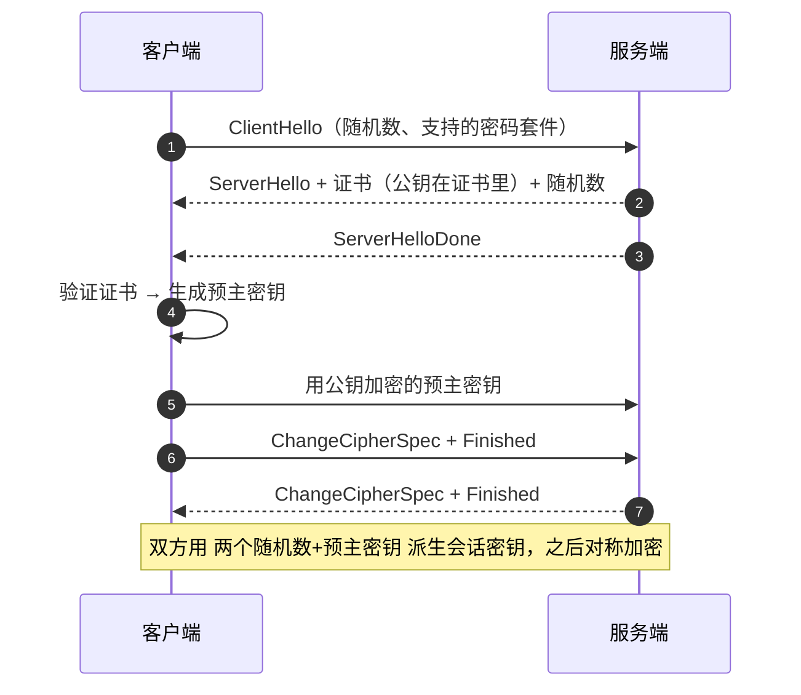

import AlgorithmVizIsland from '../../../../../components/viz/AlgorithmVizIsland.astro';

## HTTPS = HTTP + TLS 层干什么

明文 HTTP 有三宗罪：**窃听**（链路上看得到全部内容）、**篡改**
（运营商插广告）、**冒充**（假网站你认不出）。TLS 在 TCP 之上、
HTTP 之下补三件事：**加密**（防窃听）、**完整性**（防篡改）、
**身份认证**（证书防冒充）。

## 加密设计：为什么必须"混合"

- **对称加密**（AES）：快，但**密钥怎么安全送达对方**是死结——
  明文传密钥等于没加密。
- **非对称加密**（RSA/ECDHE）：公钥加密只有私钥能解，解决密钥
  交换；但慢，不适合搬大流量。

**混合方案**：握手期用非对称协商出**会话密钥**，之后的应用数据全部
用对称加密——安全与性能各取所长。

## TLS 1.2 握手全流程

握手报文逐帧走一遍（公钥只在第 5 步出场一次，之后全是对称加密）：

<AlgorithmVizIsland demo="tls-handshake" />

考点三连：

1. **证书验证验什么**：域名匹配、有效期、**签发链能追到本机信任的
   根 CA**（浏览器/系统内置根证书库）。
2. **为什么中间人偷不走会话密钥**：预主密钥用服务器公钥加密，没有
   私钥解不开——非对称只在握手搬一次"种子"。
3. ** Finished 是干嘛的**：对之前全部握手报文做签名校验，防握手
   本身被篡改。

## 证书链与中间人（MITM）

信任模型是**链式背书**：根 CA 签中间 CA、中间 CA 签站点证书，验证
沿链上溯。中间人攻击的标准姿势是"给你一张假证书"——防御就是
**证书链验不上**：

- 企业代理装了自签根证书才能解密 HTTPS（正是"合法的中间人"）；
- 公共 Wi-Fi 上的假证书会被客户端报警——**看到证书警告别无脑点
  继续**。

> 还有一层：HTTPS 只保护"到服务器为止"，**CDN/网关上做了 TLS
> 卸载后，回源段是否加密是另一个问题**。

## TLS 1.3：更快更安全

| | TLS 1.2 | TLS 1.3 |
|---|---|---|
| 握手 RTT | 2-RTT | **1-RTT**（会话复用可 0-RTT） |
| 密码套件 | 一堆历史包袱 | 砍掉 RSA 密钥交换等弱算法，只留 **前向安全**的 ECDHE 系 |

**前向安全**：会话密钥每次临时生成，服务器私钥泄露也解不开历史
流量——1.3 的核心卖点。

## 小结

- HTTPS 三防：加密、完整、认证；混合加密解"密钥配送"死结，证书
  链解"冒充"。
- TLS 1.2 握手背两条线：证书验证（身份）+ 密钥协商（会话密钥）。
- TLS 1.3 = 更少 RTT + 只留前向安全套件；握手细节的全链位置见
  [URL 到页面](/network/basic/foundation/03-from-url-to-page/)。
