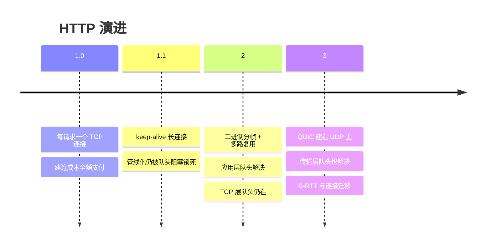

## 一条主线：把 RTT 和队头阻塞一路砍下去

HTTP 演进史就是**性能优化史**，抓手只有两个：减少建连/握手的 RTT、
消除"一个慢请求拖死全部"的队头阻塞（HOL blocking）：

## HTTP/1.1：长连接与小修补

- **keep-alive 默认开启**：一条 TCP 连接串行跑多个请求（对比 1.0
  的每请求一连接），建连成本只在首个请求支付。
- **管线化（pipelining）**想一口气排队发请求，但响应必须按序回——
  第一个慢了全部干等（队头阻塞），浏览器最终弃用。
- 附加件：`Host` 头（虚拟主机）、`Chunked` 分块传输、缓存协商
  （`ETag`/304，见[HTTP 基础](/network/basic/http/01-http-basics/)）。
- 生态位的 workaround：**域名分片 + 雪碧图 + 内联资源**——都是绕
  "同域连接数 6 个上限 + 队头阻塞"的民间偏方，HTTP/2 之后全部反模式。

## HTTP/2：二进制分帧 + 多路复用

三个核心改动：

1. **二进制分帧**：报文拆成带编号的帧，解析不再靠文本切行；
2. **多路复用**：一个连接上多个流（stream）交错传输、**响应不必
   按序**——应用层队头阻塞消失，域名分片/雪碧图立即过时；
3. **头部压缩 HPACK**：请求头高度重复（Cookie/UA），静态表 +
   动态表 + 哈夫曼压掉大半。
   （服务器推送实战价值低，已被社区边缘化。）

**但 TCP 层队头阻塞仍在**：所有流共享一条 TCP 字节流，任何一个
段丢了，TCP 必须等重传补齐才能交付后续——一个丢包堵死全部流。
高丢包率下 HTTP/2 甚至不如 1.1 的多连接。

## HTTP/3：QUIC 把底座换掉

HTTP/3 = HTTP/2 语义 + **QUIC 传输**（建在 UDP 上）：

| 问题 | QUIC 的答案 |
|---|---|
| TCP 队头阻塞 | 流之间独立重传，一丢不堵全部（[可靠层自建](/network/basic/tcp/03-tcp-vs-udp/)） |
| 建连慢（TCP+TLS 各握手） | 传输与 TLS 1.3 融合，**1-RTT 建连**、会话复用 **0-RTT** |
| 换网断连（IP 变了 TCP 就死） | **连接以 Connection ID 标识**，Wi-Fi 切 4G 不断线 |
| 中间设备僵化 | 加密整个传输头，运营商难再插手 |

部署代价：UDP 被企业防火墙限流的风险、CPU 开销（用户态实现）——
当前以 CDN/大厂客户端为主阵地，对内网服务影响不大。

## 答题与实战锚点

- 问"HTTP/2 解决了什么"：答**应用层队头阻塞 + 头部冗余 + 文本解析
  低效**；追问"还剩什么问题"：答 **TCP 层队头阻塞与建连 RTT**——
  这正是 HTTP/3 的存在理由。
- 服务端视角：Nginx/网关开 h2/h3 只是配置项（
  [Nginx HTTPS 篇](/nginx/intermediate/proxy/02-https-cache-ratelimit/)），
  客户端/CDN 支持度才是普及瓶颈。

## 小结

- 1.1 用长连接省建连；2 用分帧多路复用解决应用层队头 + HPACK 省
  头；3 用 QUIC 解决传输层队头与建连/迁移。
- 队头阻塞搬了三次家：管线化 → TCP 字节流 → QUIC 流隔离。
- 每一代的"民间 workaround"（域名分片/雪碧图）都是下一代被消化的
  痛点注脚。
