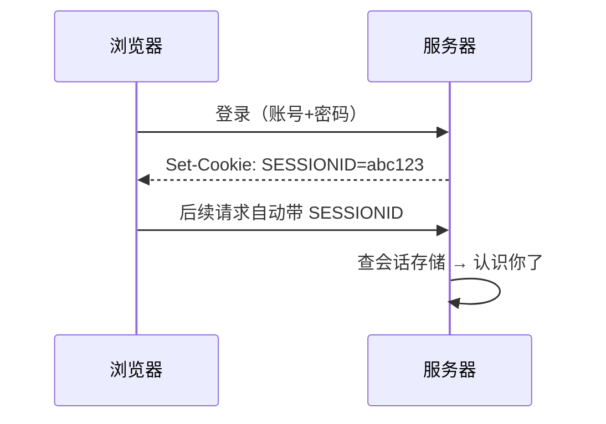

HTTP 本身无状态——上一秒登录、下一秒服务器就不认识你了。**登录态机制**
就是在无状态协议上重建"我认识你"的三种方案：Cookie、Session、JWT。
"Session 和 JWT 怎么选"是后端面试的标准必考题。

## Cookie：浏览器侧的随身凭证

Cookie 是**服务器让浏览器代为保管的小段键值数据**，之后每次同源请求自动
携带（`Cookie` 请求头）。它本身只是载体，关键在安全属性：

| 属性 | 作用 | 风险防护 |
| --- | --- | --- |
| HttpOnly | JS 不可读 | 防 XSS 偷凭证 |
| Secure | 仅 HTTPS 发送 | 防明文泄露 |
| SameSite=Lax/Strict | 跨站请求不带 | 防 CSRF |
| Domain / Path | 生效范围 | 最小化暴露 |

高频追问"HttpOnly 防什么"：**防 XSS 偷 Cookie，不防 CSRF**——CSRF 靠
SameSite 与 CSRF Token 防（攻击者拿不到但浏览器会自动带上 Cookie）。

## Session：状态存服务端

登录成功后服务端生成会话，**只把 SessionID 发给浏览器**（放 Cookie）：

- 优点：**可控**——服务端随时踢人、改权限、强制下线；
- 分布式的代价：Session 存在哪？单机会话复制已淘汰，主流是**集中存储
  （Redis）**：所有实例读同一份会话，机器无状态可水平扩展（见分布式篇
  的无状态服务原则）。

## JWT：状态存客户端

JSON Web Token 把会话数据**签名后发给客户端自己保管**：三段式
`Header.Payload.Signature`，前两段 Base64URL（可读但可篡改会被签名识破），
签名用服务端密钥（HMAC）或非对称对（RS256）。

- 优点：**服务端无状态**——请求带着 JWT 来，验签即认，天然适合分布式
  与跨服务传递；
- 代价也很硬：**签发后无法主动废止**（密钥不变就一直有效），注销/改密/
  踢人都要额外机制——短有效期 + Refresh Token 换发、黑名单（又回到
  服务端存态，退化为半 Session）。

## 怎么选

| | Session + Redis | JWT |
| --- | --- | --- |
| 状态位置 | 服务端 | 客户端 |
| 主动废止 | 天然支持 | 难（黑名单/短效+刷新） |
| 服务端成本 | 每请求查一次存储 | 只算签名，无 IO |
| 跨服务/跨端 | 需共享存储 | 自包含，天然可传递 |
| 典型场景 | 单体/集群后台管理 | 微服务间认证、开放 API |

面试标准句式："**要控制力选 Session，要无状态扩展选 JWT**；两者也能混合
——短效 JWT 做接入凭证，Refresh Token 的发放与吊销记录存 Redis。"

## OAuth2 一句话定位

OAuth2 是**授权框架**不是登录态方案：它解决"让第三方在不知道你密码的
情况下，拿到受限访问权"（微信扫码登录的本质是 OAuth2 授权码流程）。
拿到 access_token 之后的会话管理，仍然是 Session 或 JWT 的问题。

## 高频追问速答

- **JWT 被偷了怎么办？** 和 Cookie 被偷一样糟糕——用 HTTPS 传输、短有效期
  限损；真正的"注销"要么黑名单（服务端存态）要么等过期。
- **为什么 JWT 的 Payload 不能放敏感信息？** Base64 是编码不是加密，
  任何人解开就能读；签名只防篡改不防窥。
- **分布式 Session 一定要 Redis 吗？** 是主流（集中存态 + 实例无状态），
  另有粘性会话（负载均衡绑定实例，故障迁移难）与会话复制（广播开销大），
  均已边缘化。

## 小结

- Cookie 是载体（HttpOnly/Secure/SameSite 各管一摊安全），Session 状态在
  服务端（可控，分布式靠 Redis），JWT 状态在客户端（无状态可传递，注销难）。
- 选型一句话：要控制力选 Session，要扩展性选 JWT；混合方案是生产常态。
- OAuth2 管授权不管会话，别混为一谈。
