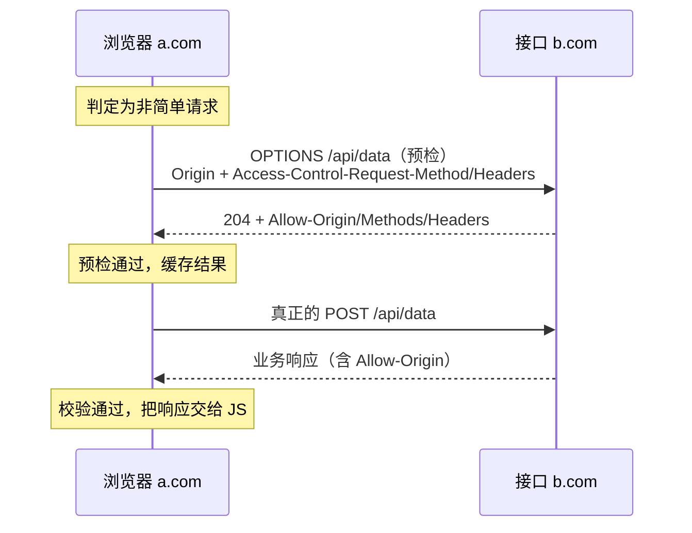

"接口在 Postman 里好好的，浏览器里就跨域报错"——每个工程师都撞过的墙。
本篇讲清两件事：**同源策略到底拦什么**、**CORS 如何合规地放行**，
以及那道必考题——**预检请求（OPTIONS）什么时候发**。

## 同源策略：浏览器的安全基石

"同源"= 协议、域名、端口三者完全一致（`http://a.com:80` 与
`https://a.com` 不同源，协议不同）。不同源时，浏览器默认：

- **Cookie/Storage 隔离**：A 站脚本读不到 B 站的 Cookie——没有它，
  登录态篇的 Cookie 机制就无从谈起（任何网站都能偷）；
- **DOM 隔离**：iframe 之间互不可读；
- **跨域响应拦截**：A 站用 fetch/XHR 请求 B 站接口，**请求发出去了、
  B 也返回了，浏览器把响应扣下不给 JS**。

第三条是最常见的误解来源：**跨域不是服务器拒绝了请求，是浏览器拒绝把
响应交给页面**。所以 Postman/curl 没有跨域问题（它们不是浏览器），
服务器日志里能看到请求正常到达。

## CORS：服务器授权的跨域白名单

跨源资源共享（CORS）的思路：**是否放行由目标服务器在响应头里声明**，
浏览器负责执行。核心响应头：

```
Access-Control-Allow-Origin: https://a.com   # 允许谁（或 *）
Access-Control-Allow-Methods: GET, POST, PUT
Access-Control-Allow-Headers: Content-Type, Authorization
Access-Control-Allow-Credentials: true       # 允许携带 Cookie
```

## 预检请求：先递条子再动手

不是所有请求都直接发。浏览器判定为"非简单请求"时，**先发一个 OPTIONS
探测（预检）**，服务器应答允许后，才发真正的请求：



**简单请求**（免预检）的门槛：GET/POST/HEAD 方法 + 常规头
（Accept/Content-Language 等）+ Content-Type 限于
`text/plain`、`multipart/form-data`、`application/x-www-form-urlencoded`。

带 `Authorization` 头、发 JSON（`application/json`）都会触发预检——
这就是"为什么我的请求多了一次 OPTIONS"的标准答案。

## 凭证跨域：最容易踩的组合坑

前端 `fetch(url, { credentials: 'include' })` 想带 Cookie 跨域时，服务器
**不能用通配符 `*`**，必须：

1. `Access-Control-Allow-Origin` 明确写出来源域名；
2. `Access-Control-Allow-Credentials: true`；
3. Cookie 本身的 SameSite/Secure 属性配合（见登录态篇）。

三者缺一个，浏览器照样扣下响应——"配了 CORS 还跨域"的九成是这里。

## 高频追问速答

- **怎么解决跨域？** 首选 CORS（服务端配置或网关统一配）；开发期用
  devServer 代理；生产经典方案是 **Nginx 反向代理让请求变同源**（浏览器
  只看到自己域名，根本不跨域）——JSONP 是历史方案（只支持 GET，靠
  script 标签绕过，了解即可）。
- **预检请求谁发的？能不发吗？** 浏览器自动发的，业务代码里根本看不到
  OPTIONS；把请求改造成"简单请求"（如改用 form 编码）可以免预检，
  但通常不值得牺牲接口设计。
- **CORS 防的是 CSRF 吗？** 不是——CORS 防的是**读**（响应不被恶意站点
  拿走），CSRF 防"写"（浏览器自动带 Cookie 发出请求），两者互补；
  CSRF 靠 SameSite + CSRF Token（见登录态篇）。

## 小结

- 同源 = 协议+域名+端口全等；跨域拦截发生在浏览器侧（响应被扣下），
  服务器照常收到请求。
- CORS 是服务器的白名单声明：Allow-Origin/Methods/Headers/Credentials
  四件套；带凭证时禁用 `*`。
- 非简单请求先发 OPTIONS 预检（自定义头/JSON/PUT DELETE 都触发），
  生产绕跨域最常用反代变同源。
