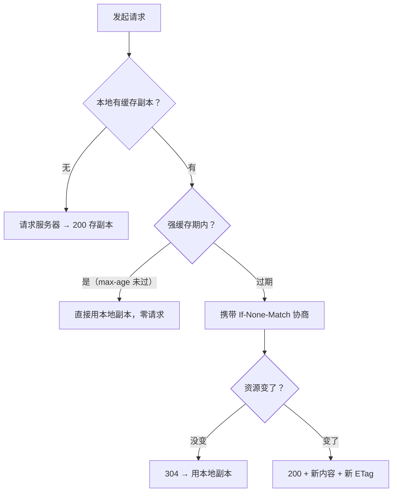

"强缓存和协商缓存什么区别？""no-cache 是不缓存吗？"——HTTP 缓存是
前端后端交界的必考题，也是性能优化的第一课：**最快的请求是不发请求**。

## 两级缓存，一个核心区别

| | 强缓存 | 协商缓存 |
| --- | --- | --- |
| 是否发请求 | **完全不发**，直接用本地副本 | 发请求到服务器"验一下" |
| 由谁决定 | 响应头里的缓存策略 | 服务器比对后回 200 或 304 |
| 相关头 | `Expires` / `Cache-Control` | `ETag`+`If-None-Match`、`Last-Modified`+`If-Modified-Since` |

## 强缓存：Cache-Control 接管

`Expires`（绝对时间）已被 `Cache-Control`（相对时间）取代——客户端时钟
不可信：

```
Cache-Control: max-age=31536000, immutable
```

- **max-age**：秒级新鲜期，期内浏览器**连服务器都不问**；
- **no-cache**：名字有误导——不是不缓存，是"**可以存但每次用前必须
  协商验证**"（走协商缓存）；
- **no-store**：才是不许存（敏感数据用）；
- **private / public**：仅浏览器可存 / 中间代理也可存（CDN 相关，见 CDN 篇）。

## 协商缓存：304 的来历

强缓存过期后，浏览器带着"凭证"去问服务器"东西变了吗"：

- **Last-Modified / If-Modified-Since**：文件最后修改时间，精度秒级——
  1 秒内多次修改识别不了；
- **ETag / If-None-Match**：内容指纹（hash 或版本号），精度更高，
  **优先级高于 Last-Modified**；
- 内容没变 → 服务器回 **304 Not Modified**（无 body），浏览器用本地副本；
  变了 → 回 200 + 新内容 + 新凭证。

## 决策流程



## 生产实践：HTML 与静态资源分治

- **HTML 入口**：`Cache-Control: no-cache`——每次走协商，保证用户拿到
  最新的资源清单；
- **JS/CSS/图片**：文件名带内容 hash（`app.a3f9c2.js`）+ 超长 max-age +
  `immutable`——内容一变文件名就变，**强缓存永不失效也永不脏**；
- 这套"HTML 协商 + 静态强缓存"组合是现代构建（Vite/webpack hash）的
  标配前提，nginx 篇的静态服务配置就是为它服务的。

## 高频追问速答

- **no-cache 和 no-store？** no-cache = 存但每次协商；no-store = 禁止存储。
  一字之差，语义两极。
- **ETag 和 Last-Modified 谁优先？** 同时存在时 ETag 优先（If-None-Match），
  精度高；但多机部署下 ETag 若由 mtime+size 生成，**各机器不一致会导致
  缓存命中率抖动**——要么统一生成规则，要么关掉自动 ETag 用内容 hash。
- **CDN 和浏览器缓存什么关系？** 同一套 HTTP 缓存语义分层生效：浏览器
  一层、CDN 边缘一层（public 头才允许）、源站一层——层级越多，"改了
  怎么还不生效"的排查越要逐层看（见 CDN 篇的调度与失效）。

## 小结

- 强缓存不发请求（Cache-Control 决定新鲜期），协商缓存验 304
  （ETag 优先于 Last-Modified）。
- no-cache 是"每次协商"不是"不缓存"，no-store 才禁存。
- 生产标配：HTML 走协商 + 静态资源 hash 长缓存 immutable。
