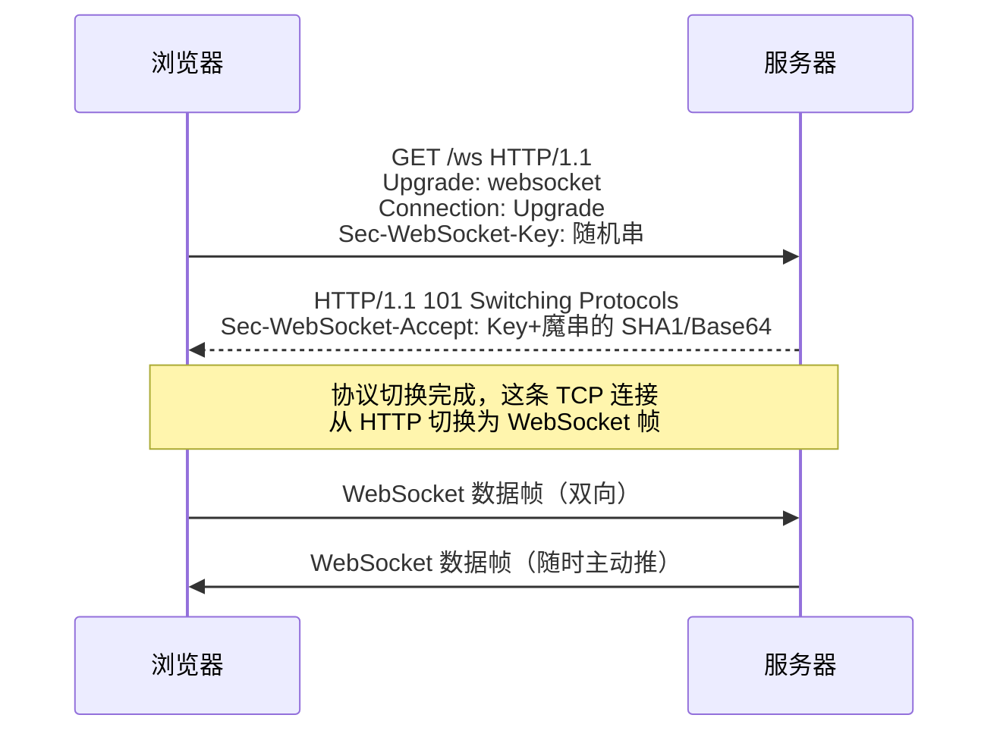

聊天室、行情推送、协同编辑、AI 回答的流式打字——这些场景的共同诉求是
**服务器主动往客户端推数据**。HTTP 的请求-响应模型天生做不到（服务器只能
被动应答），WebSocket 就是为这个缺口而生：**一条 TCP 连接升级成的全双工
通道**。

## 先看 HTTP 轮询为什么不行

- **短轮询**：前端定时发请求问"有新的吗"——大多数请求是空转，延迟 =
  轮询间隔，服务器被无意义请求打满；
- **长轮询**：请求挂住直到有数据才返回——省了空转，但每次返回都要重新
  建连+带全量头，频繁场景开销大；
- **SSE（Server-Sent Events）**：HTTP 长连接单向流，服务器→浏览器可推，
  反向还得再发 HTTP 请求——够用的场景（如 LLM 流式输出）很轻量，但
  双向场景（聊天）就不行了。

WebSocket 的答案：**握手一次，之后双向随便说**。

## 握手：借 HTTP 的门，走自己的路

WebSocket 借 HTTP 完成一次"升级"握手，之后切换到自己的帧协议：

- 握手是标准 HTTP 请求（Upgrade 头申请换协议），101 响应表示同意——
  **所以 WebSocket 能穿过只认识 HTTP 的中间设施**（前提是它们支持透传
  Upgrade，nginx 需显式配 `proxy_set_header Upgrade $http_upgrade`）；
- Sec-WebSocket-Key/Accept 是握手校验（防普通 HTTP 请求误撞），**不是加密**；
  加密靠 `wss://`（WS over TLS）。

## 心跳与重连：生产三件套

TCP 半死连接（拔网线/NAT 超时）不会主动通知——WebSocket 应用标配：

1. **心跳**：协议层 ping/pong 帧（或应用层自定义），间隔 20~30s 探活；
2. **超时判定**：连续 N 次无 pong 判死；
3. **指数退避重连**：重连风暴会打垮刚恢复的服务（与重试退避同一思想，
   见分布式超时重试篇）。

## 选型：WebSocket / SSE / HTTP/2

| | WebSocket | SSE | HTTP 轮询 |
| --- | --- | --- | --- |
| 方向 | 全双工 | 服务器→客户端单向 | 客户端拉 |
| 协议 | 独立帧协议（握手借 HTTP） | 纯 HTTP | 纯 HTTP |
| 数据 | 二进制+文本 | 文本（UTF-8） | 任意 |
| 典型场景 | 聊天、协同编辑、游戏 | LLM 流式输出、行情/通知 | 低频刷新 |

- LLM 的流式回答为什么用 SSE 而不是 WS？**需求是单向推送**，SSE 复用
  纯 HTTP 基础设施（代理/网关/重连语义现成），杀鸡不用牛刀——按需求
  选最轻的方案。

## 高频追问速答

- **WebSocket 基于 HTTP 吗？** 握手阶段是（Upgrade 借道），握手完成后是
  独立协议（帧格式、无 HTTP 头）——"基于/借道"的表述要精确。
- **WebSocket 有跨域限制吗？** 没有 CORS 那套响应头校验（不是 fetch/XHR），
  但浏览器仍会校验 Origin 头由服务器决定是否接受——安全要自己做
  （Origin 白名单 + wss + 认证）。
- **HTTP/2 能替代 WebSocket 吗？** HTTP/2 是服务器推送（资源预推）不是
  双向消息通道，语义不同；双向实时仍是 WS，HTTP/3 时代的替代方案
  （WebTransport）尚未全面普及。

## 小结

- 实时场景三方案：轮询（最土）、SSE（单向够用）、WebSocket（全双工）；
  按需求选最轻的。
- 握手借 HTTP（101 Switching Protocols），之后独立帧协议；wss 才加密，
  穿代理要透传 Upgrade。
- 生产三件套：心跳探活、超时判死、指数退避重连。
