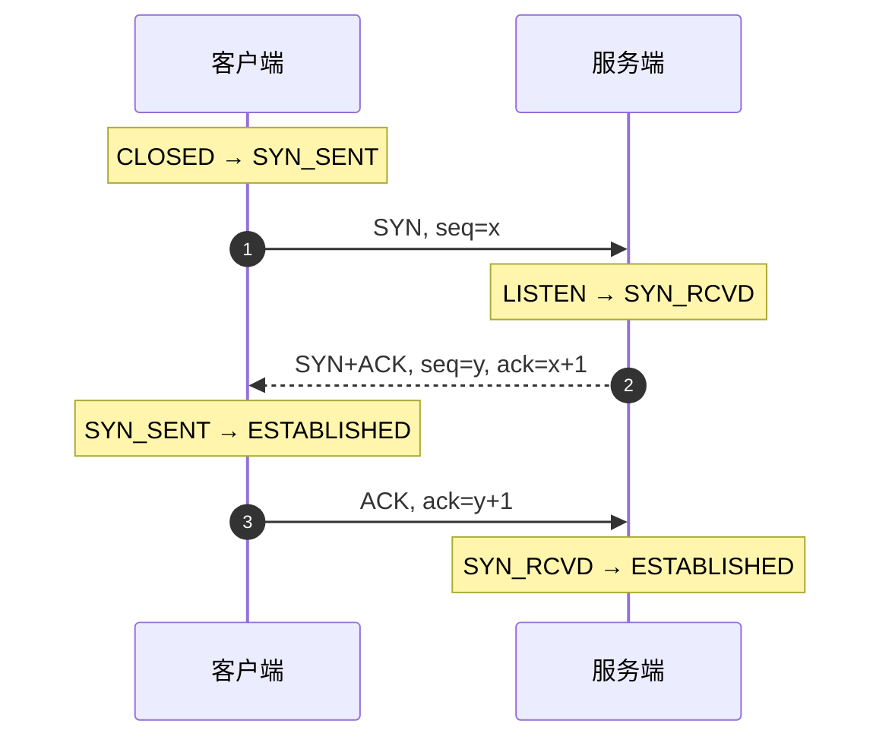
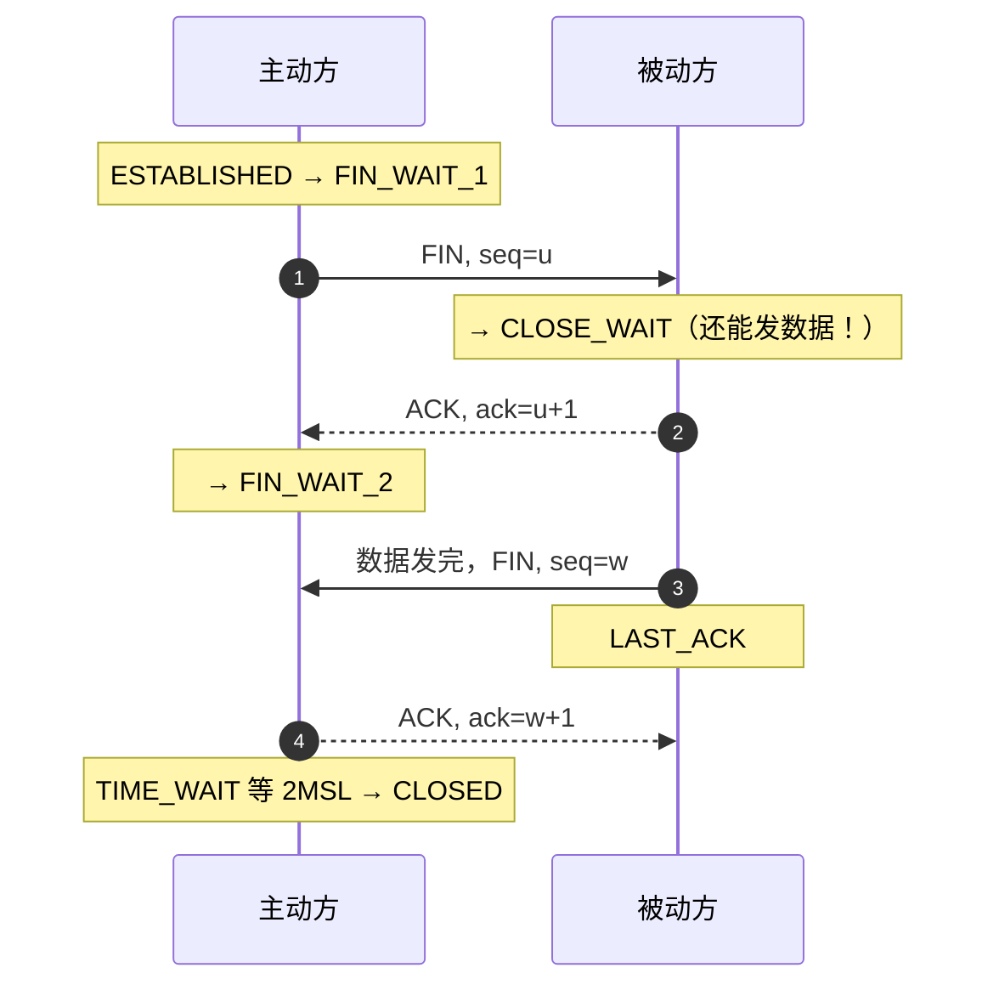

import AlgorithmVizIsland from '../../../../../components/viz/AlgorithmVizIsland.astro';

## 三次握手：同步双方的初始序号

握手报文与两端状态徽标按帧走一遍（为什么恰好三次，最后一帧揭晓）：

<AlgorithmVizIsland demo="tcp-handshake" />

每一步的使命：**同步彼此的初始序号（ISN）**——TCP 可靠传输的序号
坐标系必须双方确认对齐（可靠机制见[TCP 可靠传输](/network/basic/tcp/02-reliable-transfer/)）。

**为什么是三次，不是两次**：两次握手的致命场景是**历史连接**——
客户端发了个旧 SYN（网络滞留），服务端回了 ACK 就当连接建立并分配
资源，客户端根本不认这条连接。第三次 ACK 让客户端有机会说"我要的
不是这个"；同时三次是"双方都确认了'我和你的收发能力都正常'"的
最小次数。

## 四次挥手：半关闭决定次数

两侧状态徽标随报文逐帧迁移的动画版（可暂停单步，对照上面的状态注释）：

<AlgorithmVizIsland demo="tcp-close" />

**为什么四次**：TCP 全双工，两个方向要各自关。被动方收到 FIN 时
可能还有数据没发完，ACK 先回（"知道了"），数据发完再发自己的
FIN——ACK 与 FIN 拆成两次，四次由此而来。（`TCP_NODELAY` 类优化里
也有把 ACK 与数据合并的思想，四次在某些场景可"三次"折叠，但考试
答标准四次。）

## TIME_WAIT：谁主动关谁背

主动关闭方最后进入 **TIME_WAIT，停留 2MSL**（报文最大生存时间的
两倍），两个理由：

1. **兜底最后一个 ACK**：它若丢了，对端会重传 FIN，我还能补 ACK；
2. **让旧连接的报文自然消亡**，避免污染相同四元组的新连接。

生产含义（高频）：

- **大量 TIME_WAIT 出现在高压客户端/网关**（主动关的是它）——解决：
  连接复用（连接池/长连接）治本；`tcp_tw_reuse` 治标。
- **大量 CLOSE_WAIT 才是事故信号**：被动方收到 FIN 后回了 ACK 却
  没调 `close()`——**代码泄漏**（连接没关、响应流没关），与内核参数
  无关，查代码。

## 建连侧的两个参数

- **SYN 洪泛**：半连接队列（SYN_RCVD）被恶意 SYN 塞满 → `syncookies`
  用加密 cookie 免队列扛洪。
- **backlog**：`listen(backlog)` 控制全连接队列长度，业务秒级可接受
  新连接但队列小会掉建连（`accept` 不及时）。

## 小结

- 三次握手同步初始序号并防历史连接；四次挥手因半关闭（ACK 与 FIN
  分离）。
- TIME_WAIT 在主动方，2MSL = 兜底 ACK + 清洗旧报文；TIME_WAIT 多看
  复用，**CLOSE_WAIT 多查代码**。
- 半连接队列与 syncookies、全连接 backlog 是建连侧的两个容量旋钮。
