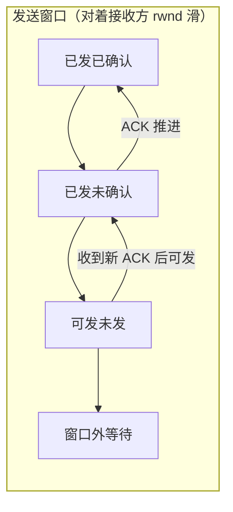

## 可靠 = 四个机制互相兜底

TCP 的"可靠"不是玄学，是四件事的组合：**确认应答、超时/快速重传、
滑动窗口（流量控制）、拥塞控制**。前两个保证"丢了能补"，后两个
保证"发多快看两边脸色"（接收方处理能力 + 网络承载力）。

## 确认与重传：丢了就补

- **确认应答**：每个字节都有序号，接收方回 `ack = 收到的连续末尾 + 1`
  （累积确认："这之前的都收到了"）。
- **超时重传**：发出后 RTO 内没等到 ACK 就重发；RTO 基于 RTT 动态
  加权计算，网络抖动时 RTO 跟着放大。
- **快速重传**：收到 **3 个重复 ACK** 就立刻重传，不等超时——丢得
  越早发现得越早（超时重传代价最大：RTO 通常上百 ms）。
- **SACK**（选择性确认）：重复 ACK 里附上"我收到了哪些不连续块"，
  发送方只补真正的洞。

## 滑动窗口：流量控制

接收方在每个 ACK 里通告**剩余缓冲区大小（rwnd）**，发送方的未确认
数据量不得超过它——**接收方限速器**：

- 窗口随 ACK 前滑，已确认的出去、新可发的进来。
- 接收方缓冲被应用读慢了 → rwnd 缩小 → **零窗口**时发送方停发，
  定时发**零窗口探测**防死锁。

## 拥塞控制：网络限速器

流量控制看接收方，拥塞控制看**网络**——发送方自持一个拥塞窗口
`cwnd`，实际发送量 = `min(cwnd, rwnd)`。四算法组成一条动态曲线：

| 阶段 | 触发 | cwnd 行为 |
|---|---|---|
| 慢启动 | 连接建立/超时后重启 | 每个 RTT **翻倍**（指数），到阈值 ssthresh 停 |
| 拥塞避免 | cwnd ≥ ssthresh | 每个 RTT **+1**（线性探测） |
| 快重传 | 3 个重复 ACK | 立即重传丢失段 |
| 快恢复 | 快重传之后 | ssthresh 和 cwnd **减半**重走线性（超时则重置为 1 慢启动） |

记忆锚点：**丢包 = 网络拥挤信号**。轻丢（3 dup ACK）减半continue；
重丢（超时）推倒重来。这就是"丢包率高的长肥管道 TCP 跑不快"的
原因，也是 QUIC/BBR 想绕开的假设（见[HTTP 演进](/network/basic/http/03-http-evolution/)）。

## 与上层优化的连线

- **长肥管道/高延迟链路吞吐差** → cwnd 线性爬升太慢 → 连接复用
  比频繁新建快得多（呼应[URL 到页面](/network/basic/foundation/03-from-url-to-page/)的减 RTT 主线）。
- **粘包拆包**发生在发送缓冲区按 MSS 切段——窗口机制正是来源之一
  （见[TCP 粘包拆包](/java/basic/io/03-tcp-sticky-packets/)）。

## 小结

- 确认应答（累积 ACK）+ 超时/快速重传 + SACK = 丢了能补；3 个重复
  ACK 是"快速"的分界线。
- 滑动窗口是接收方限速（rwnd），拥塞窗口是网络限速（cwnd），发送
  取两者最小。
- 四算法曲线：指数爬升 → 线性探测 → 轻丢减半、重丢归一。
