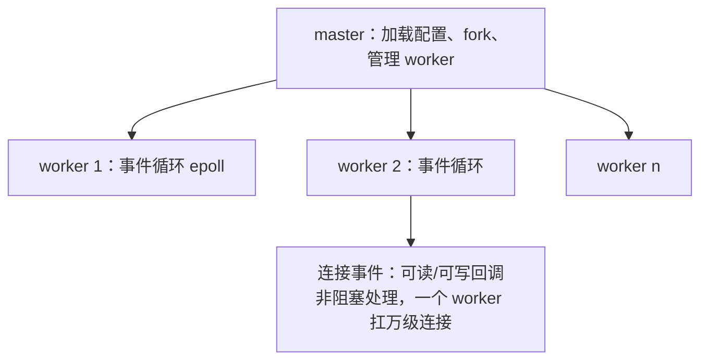

## 为什么它"快"：事件驱动 + 多 worker

Nginx 启动一个 **master** 进程，fork 出多个 **worker** 进程。每个 worker
是事件循环，用 **epoll** 监听海量连接，单线程即可扛成千上万并发——这正是
"APUSET扩展 - **C10K**" 时代 Nginx 胜出的根本原因（对比当年的进程/线程
每连接一进程模型）。



关键设计：**worker 数 = CPU 核数**，各事件满核并行；连接事件在回调里非阻塞
处理，不干等 IO。

## nginx.conf 的指令上下文

指令必须落在正确的**上下文**里，否则要么报错要么行为不对：

| 上下文 | 作用范围 | 常见指令 |
|---|---|---|
| `main`（顶层） | 全局 | `worker_processes`、`error_log` |
| `events` | 连接事件模型 | `worker_connections`、`epoll` |
| `http` | 所有虚拟主机 | `include`、`gzip`、`upstream`、`log_format` |
| `server` | 单个虚拟主机 | `listen`、`server_name`、`root` |
| `location` | URI 匹配块 | `proxy_pass`、`try_files` |

**放错层级是最隐蔽的坑**：比如把 `gzip` 写在 `server` 里通常还能生效，
但把 `limit_conn` 写在 `location` 却想让全站生效就做不到——先想清楚"这条
指令属于哪一级"。

## server 与 location 的匹配规则

- 一个请求按 `Host` 匹配 `server_name`（多个 server 里选最合适的）。
- 进入该 server 后，按 URI 匹配 `location`。匹配优先级：
  **精确 `=` → 前缀最长 → 正则（按出现顺序）→ 通用前缀**。

```nginx
location = /favicon.ico {      # 精确匹配，最高优先
    access_log off;
}
location /api/ {               # 前缀匹配，代理给后端
    proxy_pass http://backend;
}
location ~* \.(png|jpg)$ {     # 正则（加 ~* 忽略大小写）
    expires 30d;
}
```

## 重载与热升级

```bash
nginx -t        # 先测配置语法
nginx -s reload # 优雅重载：worker 平滑替换，连接不断
kill -USR2 pid  # 热升级二进制（平滑升级，保留连接）
```

`reload` 会关闭旧 worker 的连接但**把正在处理的请求跑完**，所以线上改配置
基本零抖动。养成"改完先 `nginx -t`"的习惯能省下大量返工。

## 小结

- 快 = 事件驱动（epoll）+ 多 worker 满核并行，`worker_processes = 核数`。
- 指令要放进对的上下文（main/events/http/server/location）。
- 改完 `nginx -t` 再 `reload`，平滑重载零抖动。