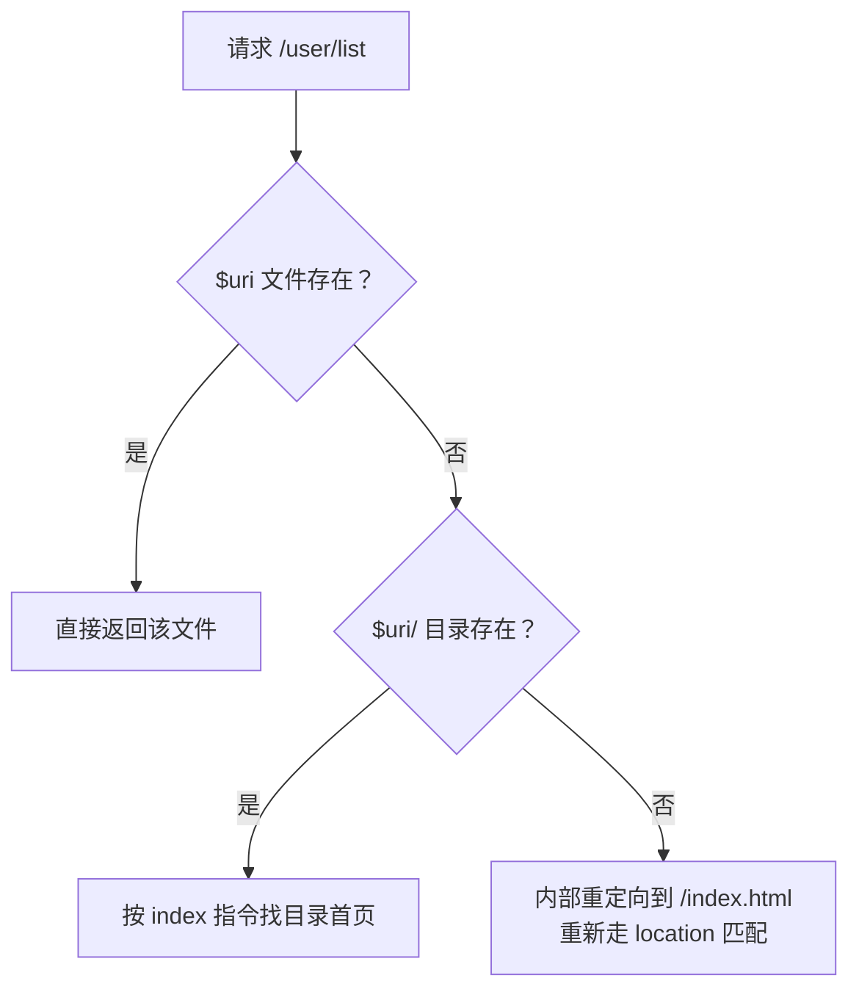

[工作模型](/nginx/basic/config/01-working-model/)篇管请求怎么进
location，[静态服务](/nginx/basic/config/02-static-server.md)篇管
location 怎么匹配——这一篇管**匹配之后文件从哪来、URI 怎么被改写**。
`root`/`alias`/`try_files`/`rewrite` 四个指令是 Nginx 配置错误的四大
高发区，也是 SPA 部署、灰度跳转这些日常操作的底层。

## root 与 alias：拼接还是替换

静态文件定位的两个指令，一字之差行为全变：

```nginx
location /img/ {
    root /data/www;     # 最终路径 = /data/www + /img/ + 文件名
}

location /img/ {
    alias /data/pics/;  # 最终路径 = /data/pics/ + 文件名（/img/ 被换掉）
}
```

- **`root`**：把 location 的 URI **拼**在 root 后面——`/img/a.png`
  → `/data/www/img/a.png`。
- **`alias`**：把 location 匹配到的部分**换**成 alias——`/img/a.png`
  → `/data/pics/a.png`。

高频坑两个：`alias` 末尾必须带 `/`（否则目录名拼在一起找不到文件）；
`alias` 只能用在 location 中，`root` 在 server/location 都行。记忆
口诀：**root 是追加，alias 是替换**。

## try_files：按序找文件，找不到走兜底

```nginx
location / {
    try_files $uri $uri/ /index.html;
}
```

语义是一行「短路求值」：**从左到右逐个检查文件/目录是否存在，第一个
存在的就用它；都不存在，跳到最后一个参数**。最后一段是兜底，两种
形态：

- 内部重定向：`/index.html`——重新走一遍 location 匹配（这就是 SPA
  fallback 的原理：任意路径都回 index.html，前端路由接管，呼应
  [前端路由篇](/js/intermediate/web/07-route/) 的刷新 404 问题）；
- 直接终判：`=404`——不再重定向，直接给状态码。

注意兜底段写 `$uri/index.html` 与 `/index.html` 的区别：带 `$uri/`
是「找同名目录下的 index」，不带是「固定回这个文件」。SPA 场景要的是
后者——不管请求什么路径，统一回应用入口。



## rewrite：改写 URI 的四种去向

`rewrite 正则 替换串 flag;` 用正则改写 URI，flag 决定改写之后干什么：

| flag | 行为 | 典型场景 |
| --- | --- | --- |
| （无） | 继续**本 location 后续**处理 | 拼接式改写 |
| `last` | 用新 URI **重新匹配 location** | 内部跳转到别的 location |
| `break` | 停止重写，**不再重新匹配** | 改写后直接找文件 |
| `redirect` | 返回 302，浏览器地址栏变 | 临时跳转 |
| `permanent` | 返回 301，浏览器缓存 | 域名/路径永久迁移 |

`last` 和 `break` 的区别是最高频追问，一句话：**last 是「重开一轮
location 匹配」，break 是「拿着当前结果直接办事」**。配套认知：rewrite
循环有 10 次上限，超过返回 500——所以无限互相改写的配置会以 500 收场；
server 级的 rewrite 先于 location 匹配执行。

`return` 与 `rewrite` 的分工：**只需要跳转或终止，用 return**——
`return 301 https://new.example.com$request_uri;` 不走正则引擎、立即
结束，性能和可读性都优于 rewrite；rewrite 留给「正则批量改写 URI 内部
结构」的真需求。

## 小结

- root 拼接、alias 替换；alias 末尾必须 `/` 且只能用在 location 里。
- try_files 从左到右短路查找，兜底段要么内部重定向（SPA fallback
  原理）要么 `=404` 终判。
- rewrite 四 flag：last 重开匹配、break 直接办事、redirect 302、
  permanent 301；改写循环 10 次上限。
- 纯跳转用 return，rewrite 留给正则改写。

## 延伸阅读

- [Nginx 官方：alias 与 root](https://nginx.org/en/docs/http/ngx_http_core_module.html#alias)
- [Nginx 官方：try_files](https://nginx.org/en/docs/http/ngx_http_core_module.html#try_files)
- [Nginx 官方：rewrite 模块](https://nginx.org/en/docs/http/ngx_http_rewrite_module.html)
