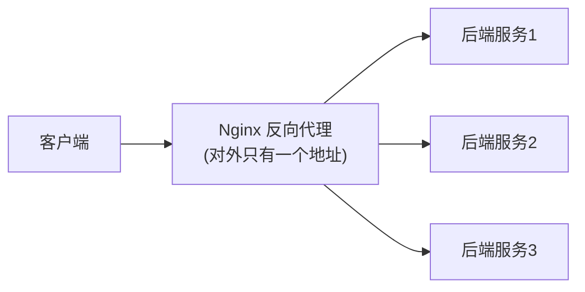

## 正向代理 vs 反向代理

- **正向代理**：代表"客户端"去访问外部（翻墙/缓存），客户端知道代理存在。
- **反向代理**：代表"服务器"接收请求，客户端以为自己在直达后端，常见 '一
  层网关'。



反向代理带来：负载均衡、隐藏真实后端、统一 HTTPS/TLS 终止、缓存与限流。

## proxy_pass：尾斜杠是第一道坎

```nginx
location /api/ {
    proxy_pass http://backend/;     # 带斜杠：URI 前缀被替换
}
# 请求 /api/users → http://backend/users

location /api/ {
    proxy_pass http://backend;      # 不带斜杠：完整 URI 原样转发
}
# 请求 /api/users → http://backend/api/users
```

**proxy_pass 的尾斜杠决定 URI 是否会丢前缀**，这是全网最高的 Nginx 配置坑
之一。改之前先在本地用 `curl` 验证转发路径。

## upstream 负载均衡

```nginx
upstream backend {
    least_conn;                  # 负载均衡算法
    server 10.0.0.1:8080 weight=3;
    server 10.0.0.2:8080;
    server 10.0.0.3:8080 backup; # 备用，没流量时不上
}
server {
    location / {
        proxy_pass http://backend;
        proxy_set_header Host $host;
        proxy_set_header X-Real-IP $remote_addr;
    }
}
```

| 算法 | 策略 | 适用 |
|---|---|---|
| `round_robin`（默认） | 轮流 | 通用 |
| `least_conn` | 发给连接数最少的 | 长连接/耗时不均 |
| `ip_hash` | 按来源 IP 哈希 | 需要会话粘滞 |
| `weight` | 权重比例 | 新/旧机器不等算力 |

还推荐用 **`health_check`**（商业版）/ 配合 `proxy_next_upstream` 在后端
挂掉时自动重试下一个。

## proxy_pass 尾斜杠：四种组合一张判定表（深入）

"尾斜杠是否丢前缀"是最常见事故。把 `location` 与 `proxy_pass` 的斜杠
四种组合一次列清，你就能对症设置而不用试错：

```nginx
# 假设后端真实接口：GET /api/detail (后端根路径直接是 detail)
location /a/ { proxy_pass http://backend; }        # 情况 1
location /a/ { proxy_pass http://backend/; }      # 情况 2
location /a  { proxy_pass http://backend; }        # 情况 3
location /a  { proxy_pass http://backend/; }      # 情况 4
```

| 情况 | 请求 `/a/x/y` 转发成 | 结论 |
|---|---|---|
| 1：location 带斜杠 + proxy 不带 | `http://backend/a/x/y` | **保留** location 前缀 |
| 2：location 带斜杠 + proxy 带斜杠 | `http://backend/x/y` | **去掉** location 前缀 |
| 3：location 不带斜杠 + proxy 不带 | `http://backend/a/x/y` | **保留**（同 1） |
| 4：location 不带斜杠 + proxy 带斜杠 | `http://backend/x/y` | **去掉**（同 2） |

**真正的决定因素只有一个：`proxy_pass` 里有没有**（`http://host:` 后的）**URI
部分或尾斜杠**。带 → 匹配到的 location 前缀被替换；不带 → 完整原始 URI
原样转发。

**两条排障铁律：**

1. **改配置前先用 `nginx -t`**，再 `curl http://localhost` 打出实际转发后的
   地址（可在后端临时打日志），确认没丢前缀。
2. `proxy_pass` 里目标 `host:port` 后面**跟了路径/斜杠**就要想清楚——最常见
   的"代理后 404"都是这里丢了个前缀忘了补。

## 小结

- 正向代理代表客户端、反向代理代表服务器；Nginx 是典型反向代理网关。
- proxy_pass 尾斜杠决定是否丢前缀，用前先 curl 验证。
- 负载均衡按场景选算法，粘滞需求用 ip_hash、长短不一用 least_conn。