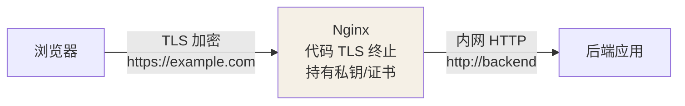
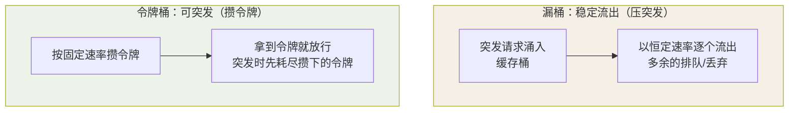

## 一句话讲清 Nginx 的 HTTPS

Nginx 做 **TLS 终止**：把浏览器与 Nginx 之间的连接加密，Nginx 与后端之间
可走 HTTP（内网）。证书用 Let's Encrypt 或私证书：

```nginx
server {
    listen 443 ssl;
    server_name example.com;
    ssl_certificate     /etc/letsencrypt/live/example.com/fullchain.pem;
    ssl_certificate_key /etc/letsencrypt/live/example.com/privkey.pem;
    ssl_protocols TLSv1.2 TLSv1.3;
    location / {
        proxy_pass http://backend;
    }
}
# 加一条 HTTP 跳转
server { listen 80; return 301 https://$host$request_uri; }
```

TLS 终止的位置决定了证书与加密边界——**浏览器到 Nginx 加密、Nginx 到后端
走内网 HTTP**：



这是 HTTPS 入口最常见的形态：证书只在 Nginx 一处维护，后端不用各自配 TLS。

## 代理缓存：把 Hot 资源挡在外面

```nginx
http {
    proxy_cache_path /var/cache/nginx levels=1:2 keys_zone=mycache:10m
                     max_size=1g inactive=60m;
    server {
        location /api/ {
            proxy_pass http://backend;
            proxy_cache mycache;
            proxy_cache_valid 200 5m;     # 200 响应缓存 5 分钟
            proxy_cache_key "$host$request_uri";
        }
    }
}
```

缓存能大幅给后端降压，但要注意 **cache_key 的鉴别维度**（带上影响结果的
头/参数），否则会串数据。

## 限流：防爆防击穿

```nginx
http {
    limit_req_zone $binary_remote_addr zone=api:10m rate=10r/s;
    server {
        location /api/ {
            limit_req zone=api burst=20 nodelay;   # 平均 10r/s，可瞬时突发 20
            proxy_pass http://backend;
        }
    }
}
```

- `limit_req`：**请求速率**限量（漏斗模型），`burst` 允许瞬时积攒的余量。
- `limit_conn`：**并发连接**限量（如每个 IP 最多 5 个连接）。
- 超出后返回 `503`——与后端的"过载保护"层级不同：Nginx 在入口就挡住。

## 动静分离

把 `静态资源（css/js/img）` 和 `动态接口（api/）` 用不同的 location 处理：
静态走磁盘 + 强缓存、动态走 proxy_pass——静态不挤占用后端，动态专注业务逻辑。
这是反向代理最常见的性能优化基线。

## 缓存分层与限流漏桶/令牌桶落地（深入）

"缓存 + 限流"要真正让它在你的系统里发挥价值，得懂两层算法语义 + 能看日志
判断命中/拦截。

**代理缓存的读路径（怎么判断命中）：**

```text
请求 → 算 cache_key（$scheme$host$uri + 指定参数/头）
   → 查 proxy_cache 里的 key：
        命中 && 未过期 → 直接回缓存（不再打后端）
        未命中/过期   → 回源打后端，回包按 cache_valid 缓存
```

排查"缓存为什么不生效/串数据"，先看**响应头**：

- 命中 → `X-Cache-Status: HIT`
- 回源 → `MISS`
- 端上检查 key 是否把会变的参数/头排除干净（脏 key 是串数据元凶）。

**限流两种模型，聊清后照抄：**

| 模型 | 形态 | 效果 | Nginx 对应 |
|---|---|---|---|
| 漏桶 | 请求流入、恒定速率流出 | 绝对平滑，**压突发** | `limit_req`（默认积压后按速率慢慢放） |
| 令牌桶 | 攒令牌、拿到就放行 | 允许突发 | 需把 `burst nodelay` 理解为"先用完攒的令牌" |

两种模型的差别在"来了一波突发请求"时怎么处理：



给一个能直接用的 QPS + 瞬发配置：

```nginx
limit_req_zone $binary_remote_addr zone=api_limit:10m rate=20r/m; # 每 IP 20 次/分
location /api/ {
    limit_req zone=api_limit burst=10 nodelay;  # 允许 10 次瞬间，其余 503
    proxy_pass http://backend;
}
```

- `nodelay` 表示**积压也立刻放**（消耗 burst 配额），不进入"排队";去掉
  `nodelay` 则多出的请求被**缓存排队**而是严格限速流出（漏桶形态）。
- 超限统一回 **503**，日志里能按 IP 聚合——这就是"哪个来源在打爆你"的排查依据。

### 缓存+限流的组合味道

普通接口：限流挡毛刺 → 缓存扛热点 → 少量真实请求打到后端。三层叠加后
后端实际负载会大幅下降，但**别忘了缓存也有"击穿"**：热点 key 过期瞬间，
缓存全miss、请求全打后端——配合"短 TTL + 分布式锁重建"（见缓存三兄弟）一起做。

## 小结

- TLS 终止在 Nginx 收敛证书，浏览器到代理加密、代理到后端内网直连。
- 缓存注意 cache_key 鉴别维度；限流用 limit_req（速率）+ limit_conn（并发）。
- 动静分离：静态磁盘强缓存、动态 proxy_pass，是最省事的性能基线。