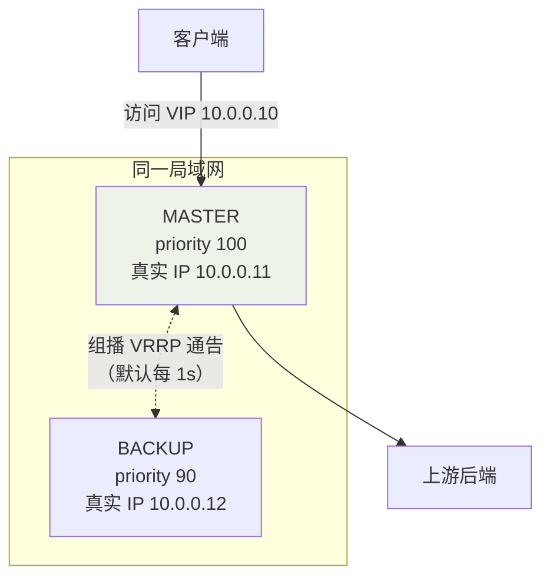

## 问题：网关自身是单点

[反向代理与负载均衡](/nginx/intermediate/proxy/01-reverse-proxy-lb/)让
Nginx 成为流量唯一入口——它一挂，后面所有后端跟着不可达。后端可以做
多实例，**但 VIP 只有一个指向谁的问题**必须解决。keepalived 就是干
这个的：让"谁是主"这件事自动选举、秒级接管。

## VRRP：虚拟路由冗余协议

keepalived 的核心是 VRRP（Virtual Router Redundancy Protocol）：



- N 台机器组成一个**虚拟路由器组**，共享一个 **VIP**（对外服务的 IP）；
- MASTER 持有 VIP 并周期组播 VRRP 通告（宣告自己活着）；
- BACKUP 收不到通告（默认超过 3 个周期）→ 按 **priority** 选出新
  MASTER，**VIP 漂移**过去——接管最快 <1s；
- 客户端全程只认 VIP，对切换无感。

keepalived 三大模块：**core**（主进程与配置解析）、**check**（健康
检查）、**vrrp**（协议实现）。

## 配置：nginx 主备双机

```nginx
# /etc/keepalived/keepalived.conf —— 主机
vrrp_script chk_nginx {
    script "/etc/keepalived/check_nginx.sh"   # 探活脚本：curl 本机 nginx
    interval 2
    weight -20                                # 失败则 priority -20 → 让位
    fall 2
}
vrrp_instance VI_1 {
    state MASTER                              # 初始角色（非最终裁决，看 priority）
    interface eth0
    virtual_router_id 51                      # 同组必须一致
    priority 100
    advert_int 1                              # 通告间隔 1s
    virtual_ipaddress {
        10.0.0.10/24                          # VIP
    }
    track_script { chk_nginx }                # nginx 活着才配当 MASTER
}
```

备机只改 `state BACKUP` + `priority 90`。关键点：

- **track_script 探的是 nginx 进程而不是主机**——主机活着但 nginx
  死了，同样要触发切换（weight 减到低于备机优先级）；
- 检查脚本常见写法：`curl -sf http://127.0.0.1/health || exit 1`，
  exit 1 即判失败。

## 应用拓扑：给集群加高可用前置

同一套"VRRP + 探活"可套给任何需要 VIP 的场景，例如 EMQ MQTT 集群：

```text
客户端(MQTT)
   │ 连接 1883 → VIP
   ▼
┌────────────┐     ┌────────────┐
│ Nginx 主   │     │ Nginx 备   │   ← keepalived 管 VIP 漂移
│ (MASTER)   │     │ (BACKUP)   │      nginx 层做 TCP/负载分流
└─────┬──────┘     └─────┬──────┘
      │ stream 转发        │
      ▼                   ▼
  EMQ 节点 1    EMQ 节点 2    EMQ 节点 3   ← 集群自身对等
```

两层分工：**keepalived 保入口不死，nginx 做负载均衡，后端集群扛
容量**。MQTT 走 TCP，nginx 需用 `stream` 模块（四层）转发而不是
`http proxy_pass`。

## 脑裂：最危险的故障模式

**脑裂（split-brain）**：主备之间链路断（交换机故障/防火墙误拦组播），
但各自与客户端都通——两边都认为对方死了，都升 MASTER、都绑 VIP。

```text
后果：同 IP 两个 MAC → ARP 抖动 → 连接随机落到两台机器，
      会话/状态不一致（比宕机更难排查）。
```

防护手段（叠加使用）：

1. **quorum 仲裁**：奇数节点 + `nopreempt` 慎用；更稳的是引入第三台
   低配仲裁机或 `vrrp_garp` 相关内核参数调优；
2. **独立心跳链路**：主备间拉一根直连网线专跑 VRRP 通告；
3. **fencing 强隔离**：探测到脑裂时主动 iptables 对端/关对机电源——
   见[容灾与多活](/distributed/advanced/availability/01-dr-multi-active/)
   的"切换安全前提是隔离旧主"。

## keepalived vs ZooKeeper/哨兵

| | keepalived | ZooKeeper / Redis 哨兵 |
|---|---|---|
| 层级 | 网络层（IP 漂移） | 应用层（选举 + 通知） |
| 侵入 | **零侵入**，业务无感知 | 客户端要感知主备切换逻辑 |
| 能力 | 只有主备/ vip，无状态同步 | 可承载元数据、分布式锁 |
| 适合 | 无状态入口（nginx/LVS/网关） | 有状态服务（DB 主从、注册中心） |

入口层用 keepalived 的简单，**应用层的复杂决策交给哨兵/ZK**——别用
VRRP 去管 MySQL 主从，它不懂复制。

## 小结

- VRRP：组播通告 + priority 选举 + VIP 漂移，接管秒级、业务零改造。
- track_script 探**服务**而非主机；nginx 高可用的正确姿势是
  keepalived（保入口）+ 探活脚本（保进程）。
- 脑裂比宕机危险：独立心跳 + 仲裁 + fencing 三件套防护。
- 无状态入口用 keepalived，有状态主从交给哨兵/ZK——各管一层。

## 延伸阅读

- [keepalived 实现 nginx 高可用（博客园）](https://www.cnblogs.com/cxbhakim/p/9068833.html)——本篇母本，含 VRRP 原理与 keepalived/ZK 对比
- [nginx+keepalived 实现 EMQ 集群负载均衡高可用（CSDN）](https://blog.csdn.net/qq_40384985/article/details/89810757)——stream 四层转发 + 集群拓扑实战
