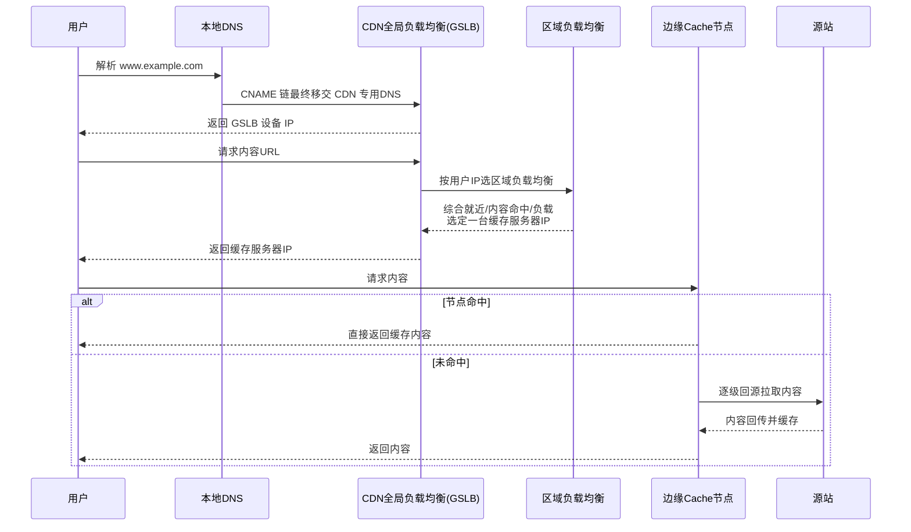

## 先想清楚：为什么网络快还需要 CDN

哪怕网络传输逼近光速，物理距离依然是硬约束：东京到硅谷约 1 万
公里，单程理论值至少 30ms+。现实更糟——跨地域、跨运营商、拥塞、
抖动层层叠加，延迟成倍放大甚至访问失败。

CDN（Content Delivery Network，内容分发网络）的思路朴素而有效：
**既然用户到源站的距离改不了，就把内容搬到离用户近的地方**。
把那张图片预先分发缓存在美国的边缘节点，美国用户就近取，源站
带宽和延迟双双解放。

几个核心术语先扫盲：

| 术语 | 含义 |
|---|---|
| Origin Server 源站 | 接入 CDN 前客户真正的服务器 |
| 边缘节点 / Cache 节点 | 靠近最终用户、缓存热点内容的节点，"中间环节最少" |
| Last Mile 最后一公里 | 用户到他所命中的 CDN 节点之间的路径 |
| CNAME 记录 | 别名记录：查询时转向目标域名继续解析，直至 A 记录 |
| CNAME 域名 | 接入 CDN 后获得的加速域名（如 `xxx.kunlun.com`），将自己的域名 CNAME 指向它，解析权即移交 CDN |

## 工作原理：一次请求的七步旅程

最简单的 CDN = 一个专用 DNS 服务器 + 若干层缓存服务器：

调度选择的三个依据（区域负载均衡为用户挑节点时综合权衡）：

1. **就近**：按用户 IP 判断哪台服务器物理/网络距离最近；
2. **命中**：按请求 URL 判断哪台节点已有用户所需内容；
3. **负载**：查询各节点当前服务能力，避开过载节点。

未命中的节点向上一级缓存请求，直至追溯到源站把内容拉到本地
（回源链）——命中率是 CDN 的生命线。

## 三大关键技术组件

庞大的 CDN 系统可以拆成三块：

**1. 调度（重中之重）**——流量接入、牵引、节点选择全在调度环节
完成。DNS 调度（本文主流程）之外，还有 HTTP 302 调度、HTTPDNS
（绕过运营商 LocalDNS 劫持，客户端直接向 CDN 的 HTTP 接口要
解析结果）等手段。

**2. 缓存**——静态内容（图片、html、css/js、点播视频、大文件）
缓存到边缘，用户不必回源。单台 Cache 机器每天请求量惊人、盘上
内容以 TB 计，"请求到来时快速检索磁盘文件并吐给用户"本身就是
系统工程——这也解释了为什么 nginx 的 `proxy_cache`、内存/磁盘
多级缓存、热点淘汰算法是 CDN Cache 的同源技术。

**3. 安全**——三层防护：
- **隐藏源站**：接入后源站 IP 被隔离，攻击者无法直接打源站；
- **分布式架构**：个别节点被打垮时异常被察觉、流量智能调度到
  正常节点（天然 DDoS 缓冲）；
- **边缘防护**：XSS/SQL 注入等技巧型攻击在边缘节点前置拦截，
  与中心策略联动。

## 典型应用场景

- **网站/应用加速**：静态资源边缘缓存；动态内容（.jsp/.php 等）
  无法缓存，靠智能选路 + 传输协议优化找最快回源路径，实现动静态
  混合加速；
- **视频点播与大文件下载**：搭配对象存储（OSS）提升回源速度，
  可省约 2/3 回源带宽成本；
- **直播**：突发流量 + 高并发下行，主播流推到数千边缘节点，观众
  就近拉流，减少抖动；
- **移动应用**：APP 安装包分发、图片/短视频优化；HTTPDNS 防
  DNS 劫持。

与 nginx 的关系一句话：**边缘节点的 Cache 本质上就是"分布式部署
+ 全局调度版"的反向代理缓存**——单机 `proxy_cache` 解决一台机器
的就近取用，CDN 把这件事做成了覆盖全球的基础设施。

## 小结

- CDN 用"内容搬家"替代"缩短距离"：CNAME 把解析权移交 CDN，
  DNS 两级负载均衡（全局选区域 → 区域综合就近/命中/负载选节点）
  把用户导向最合适的边缘节点。
- 三大组件：调度（DNS/302/HTTPDNS）、缓存（命中率是生命线，
  回源是兜底代价）、安全（隐藏源站 + 分布式抗打 + 边缘拦截）。
- 静态内容靠缓存，动态内容靠选路；直播/下载/APP 分发都是这套
  基建的应用变体。

## 延伸阅读

- [CDN百科第七期：CDN的原理、术语和应用场景——阿里云开发者社区](https://developer.aliyun.com/article/768621)——本篇母本
- [《CDN 之我见》系列一：原理篇（由来、调度）——阿里云白金](https://developer.aliyun.com/article/577708)
- [《CDN 之我见》系列二：原理篇（缓存、安全）——阿里云白金](https://developer.aliyun.com/article/599253)
