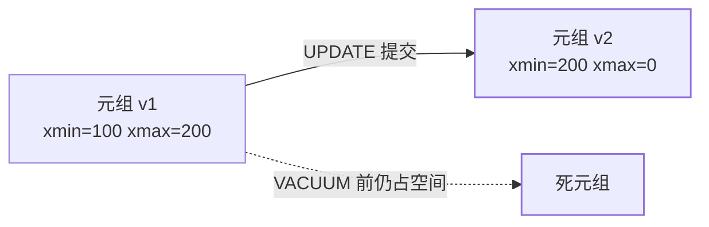

import AlgorithmVizIsland from '../../../../../components/viz/AlgorithmVizIsland.astro';

[差异地图](/postgresql/basic/core/01-pg-vs-mysql/)用一句话对比过：
**PG 的 UPDATE 是写新元组、旧元组留在表内**。本篇把这句话展开成
可推导的机制——隐藏字段、快照规则、隔离级别默认值，以及为什么
VACUUM 和事务 ID 回卷会变成运维事故。InnoDB 对照见
[MySQL 事务与 MVCC](/mysql/intermediate/transaction-lock/01-transaction-mvcc/)。

## 元组上的版本：xmin / xmax

堆里每一行（tuple）带着几个隐藏字段：

| 字段 | 含义 |
|---|---|
| **xmin** | 插入这条元组的事务 ID |
| **xmax** | 删除或更新这条元组的事务 ID；0 表示还活着 |
| cmin / cmax | 同一事务内的命令序号（一条事务多条 SQL 时区分） |

`UPDATE` 并不改原行：原行打上 `xmax = 当前 xid`，再插入一条
`xmin = 当前 xid` 的新元组。`DELETE` 只打 xmax。读的时候按快照
判断「这条元组对我可见吗」——**旧版本物理上还在页里**，这就是
和 InnoDB「旧版本进 undo log」的分界。

## 快照可见性（需要能手推）

事务开始（或语句开始，见下节）拍一张快照：`xmin`（小于它的 xid
都已结束）、`xmax`（大于等于它的 xid 快照时还没分配）、`xip`
（当时仍活跃的 xid 列表）。一条元组对当前事务可见，当且仅当：

1. `xmin` 对应事务**已提交**，且不在 `xip` 里，且 `xmin < 快照 xmax`；
2. 自己插入的行自己可见（即便尚未提交）；
3. `xmax` 为 0，或 xmax 对应事务尚未提交 / 已中止 / 在 `xip` 里
   （删除者对我来说「还没删成」）。

口诀：**插入者对我已成定局，删除者对我尚未定局**。推一道题比背
定义有用：RR 下事务 A 开了快照之后，事务 B 改同一行并提交——A
再读仍走 v1，因为 v2 的 xmin 对 A 的快照太新。

版本链与 RC/RR 的判定分野按帧放一遍：

<AlgorithmVizIsland demo="pg-mvcc" />

## 隔离级别：默认是 RC，不是 RR

| 级别 | 快照何时拍 | 幻读 / 不可重复读 | PG 实现要点 |
|---|---|---|---|
| Read Uncommitted | 与 RC 相同 | PG **不提供脏读** | 文档明确：RU 在 PG 里等同 RC |
| **Read Committed（默认）** | **每条 SQL** 一张新快照 | 语句间可见别人已提交的改 | 同一事务两次 `SELECT` 可能不同 |
| Repeatable Read | 事务第一条语句拍一次 | 快照读下不可重复读/幻读都没有 | 写冲突可能报 `serialization failure` 要重试 |
| Serializable | 事务级快照 + SSI 谓词冲突检测 | 真正可串行 | 冲突时同样抛 serialization failure |

这和 MySQL 默认 RR 正好反着，是迁库后「同样的事务代码行为变了」
的第一现场。PG 的 RR **不用 gap lock 防幻读**，靠的是整张快照；
但 `SELECT FOR UPDATE` 是当前读，会看到已提交的最新版本并加行锁。
SSI（Serializable Snapshot Isolation）用写-写/读-写冲突检测近似
串行，失败即回滚——不是真的把事务排队。

`count(*)` 慢也落在这套模型：没有「表级行数」可直接用，必须扫
对当前快照可见的元组，[差异地图](/postgresql/basic/core/01-pg-vs-mysql/)
那条速答的根因在这里。

## HOT：更新不一定会炸索引

若 UPDATE **不改任何索引列**，且页内有空位，PG 可以做
**Heap-Only Tuple（HOT）**：新元组留在同一页，旧元组指向它，
索引仍指向页，不必给每棵 B-tree 追加一项。改了索引列、或页满
了，就退化成「新元组 + 新索引项」，死元组和索引膨胀一起出现。

实践：频繁被 UPDATE 的列尽量别建进索引；`fillfactor` 给页留一点
更新空间，HOT 成功率会高很多。这是 VACUUM 之前就能减少膨胀的
手段，和[调优篇](/postgresql/advanced/performance/01-tuning/)的
autovacuum 参数是两条线。

## 事务 ID 回卷：比表膨胀更硬的墙

xid 是 32 位。差 22 亿个事务之后，旧元组的 xmin 会从「很久以前
已提交」变成「看起来在未来」——可见性判断翻转，数据看起来像
消失。防御是 **VACUUM FREEZE**：把足够老的 xmin 改成 FrozenXid，
不再参与年龄比较。

autovacuum 会做 freeze，但被**长事务 / 废弃复制槽**挡住时，
`xid age` 会一路涨到 `wraparound` 保护模式：**数据库拒绝新写**。
这和[etcd 配额打满只读](/etcd/intermediate/ops/01-quota-compaction-defrag/)
同类——不是磁盘满，是机制闸。监控 `xid_age`、杀掉长事务、删掉
不用的 slot，比把 `vacuum_freeze_min_age` 调到极端更要紧。

## 小结

- 堆内多版本：xmin 插入、xmax 删除；UPDATE = 新元组 + 旧元组打
  xmax，空间交给 VACUUM。
- 默认 RC：每条语句新快照；RR/Serializable 才是事务级快照，写冲突
  以 serialization failure 重试收场。
- HOT 减少「不改索引列的更新」带来的膨胀；xid freeze 失败会让整个
  库拒绝写入。

## 延伸阅读

- [PostgreSQL 官方：MVCC 与事务隔离](https://www.postgresql.org/docs/current/mvcc.html)
- [MySQL InnoDB MVCC（undo 版本链对照）](/mysql/intermediate/transaction-lock/01-transaction-mvcc/)
- [VACUUM 与表膨胀（调优篇）](/postgresql/advanced/performance/01-tuning/)
