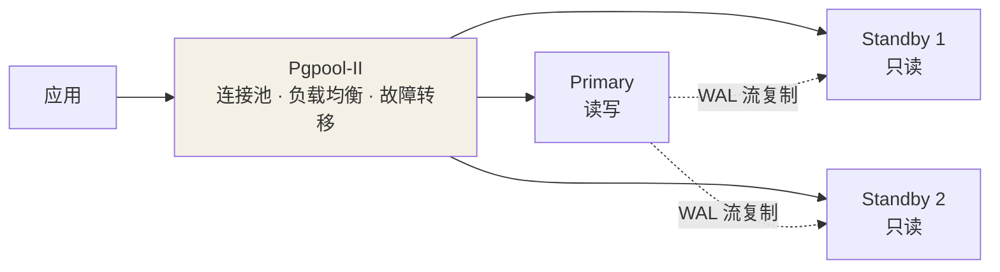
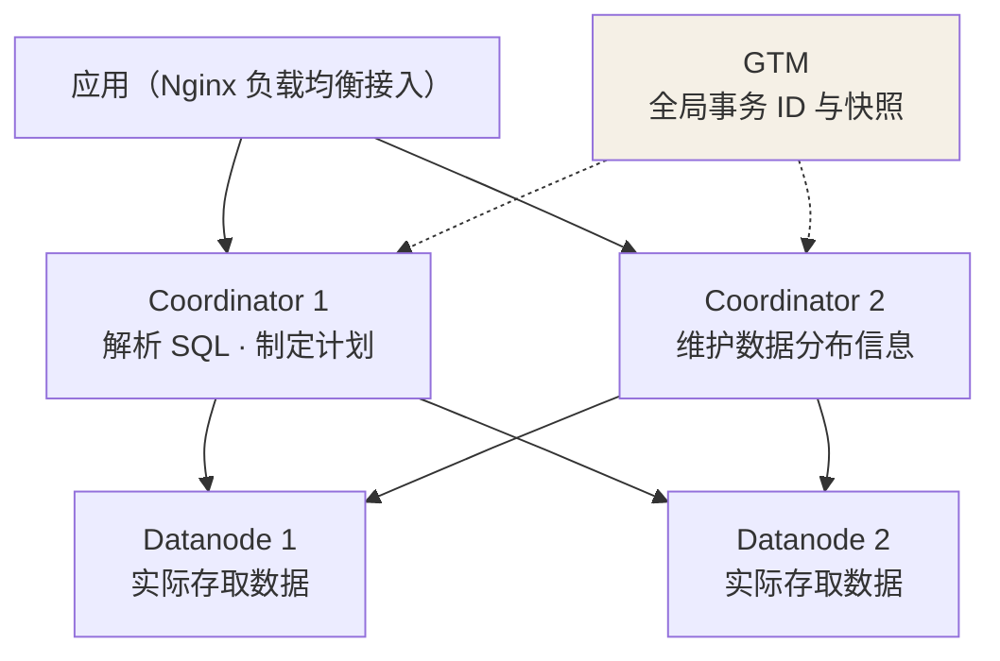

## 它解决什么问题

单机 PostgreSQL 跑得再稳，也逃不开两个问题：**主库会宕机**、**读写压力
会涨**。PG 9.x 之后原生的**流复制（Streaming Replication）**已经能把
主从搭起来：备库持续从主库同步 WAL 记录并逐条回放，保证主从数据一致。
但裸的主从结构只解决"数据有副本"——不提供连接池、读负载均衡和自动
故障切换，应用还得自己感知谁主谁备。要把它变成对应用透明的集群，开源
路线上有两个代表方案：**Pgpool-II** 与 **Postgres-XL**。名字像孪生
兄弟，定位完全不同。

## Pgpool-II：架在 PG 之上的中间件

Pgpool-II 位于应用与 PG 之间：对应用来说它是 PG 服务端，对 PG 来说它
只是普通客户端。**与 PG 解耦**是这个方案的灵魂——它可以搭在任意版本、
任意方式（流复制、slony 等）搭好的主从结构之上，主从复制本身与
Pgpool-II 无关。

它补上的正是裸主从缺的三件事：

- **连接池（Connection Pooling）**：复用后端连接，砍掉 PG"每连接一个
  进程"的 fork 与内存开销；
- **复制负载均衡**：SELECT 按权重分发到备库，写操作只走主库——负载
  均衡**只对读有效**；
- **自动故障转移**：主库挂掉时按策略把某个备库提升为新主，应用无感。

Pgpool-II 也支持"多主"的复制模式：节点对等，写操作在所有节点上重复
执行。这种模式写代价很大、性能不及主从模式，实践中主流形态是**流复制
主从 + Pgpool-II 代理**。Pgpool-II 自身可能成为单点，因此生产部署通常
让多个 Pgpool-II 互为主备、对外提供一个虚拟 IP。

## Postgres-XL：改造源码的真分布式

Postgres-XL（前身 Postgres-XC）不是外挂中间件，而是**在 PG 源码基础上
改造出来的分布式数据库**。它把单实例 PG 的 SQL 解析层与数据存取层拆到
两类节点上，并引入全局事务管理：

- **GTM（Global Transaction Manager）**：提供全局事务 ID 与快照，保证
  分布式 MVCC 与事务的正确性，是集群的"大脑"，需配 slave 防单点；
- **Coordinator**：数据访问入口，可配多个（上层再用 Nginx 等做负载
  均衡）。维护数据的存储位置信息但**不存数据本身**：收到 SQL 后解析、
  制定执行计划并分发到相关 Datanode，汇总各节点结果后返回客户端；
- **Datanode**：真正存取数据。表的分布方式在建表时用 `CREATE TABLE`
  指定，也可 `ALTER TABLE` 更改：
  - **复制模式**：一张表的数据在指定节点上存多副本；
  - **分片模式**：数据按规则打散到多个节点，共同保存一份完整数据。

## 选型对比

| 维度 | Pgpool-II | Postgres-XL |
|---|---|---|
| 定位 | PG 外部中间件（代理） | PG 源码改造的分布式数据库 |
| 读写扩展 | 只扩展读（负载均衡），写仍单主 | 读写都可水平扩展（分片到 Datanode） |
| 对应用透明 | 高：代理 PG 协议，零改造 | 高：标准 SQL 入口 |
| 侵入性 | 零侵入，任意 PG 版本可搭 | 绑定 XL 发行版，PG 版本升级受限 |
| 部署复杂度 | 主从之上加代理即可 | GTM/Coordinator/Datanode 全套组件 |
| 适用场景 | 容灾 HA + 读扩展为主 | 大数据量、需要写扩展的 OLAP/HTAP |

原作者的基准测试也印证了定位差异：pgbench（TPS 型负载）下 Pgpool-II
集群约为单机 PG 的 **84%**（代理转发有开销），Postgres-XL 约为 **137%**
（并行执行有收益）；而小数据量的 TPC-C（benchmarksql）测试中两者与
单机几乎持平——**XL 针对大数据处理的优化，要数据量够大才发挥出来**。

## 小结

- Pgpool-II 是与 PG 解耦的中间件：连接池 + 读负载均衡 + 自动故障转移，
  搭在既有流复制主从之上，零侵入，但写能力仍受限于单主。
- Postgres-XL 是改造源码的真分布式：GTM 管全局事务、Coordinator 接入
  并规划、Datanode 分片存数据，读写都能扩展，代价是组件多、版本绑定。
- 选型直觉：**要容灾与读扩展选 Pgpool-II；要写扩展与大数据量选
  Postgres-XL**。

## 延伸阅读

- [PG 的两种集群技术：Pgpool-II 与 Postgres-XL（CSDN）](https://blog.csdn.net/zhq651/article/details/91347407)（本文来源，含 pgbench/benchmarksql 完整测试过程）
- [Pgpool-II 官方文档](https://www.pgpool.net/docs/latest/en/html/)
- [Postgres-XL 官网](https://www.postgres-xl.org/)
