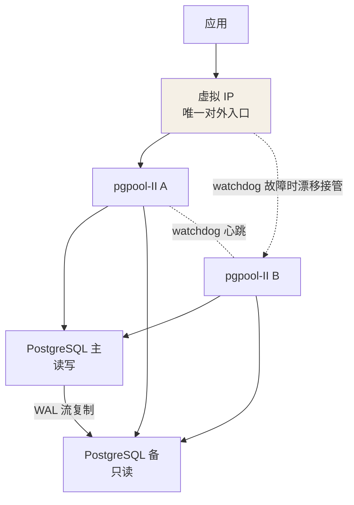

## 目标：三种宕机都要扛住

一套 postgresql + pgpool-II 的容灾高可用方案，要同时解决三类故障：

1. **某个 PG 实例挂掉**：主库（primary）故障时，集群按策略把某台备库
   （standby）提升为新主继续服务，原主恢复后降级为新备库、追平数据再
   入集群；备库故障对集群无可见影响，恢复后同步完数据正常加入；
2. **某台机器上的 pgpool-II 进程挂掉**：多个 pgpool-II 互相监测，及时
   把**虚拟 IP（VIP）**漂移到存活机器（有人叫 IP 漂移），对外始终提供
   一个唯一、可用的访问地址；
3. **某台主机整机宕机**：以上两件事同时发生——数据库角色切换 + IP
   切换两个操作一起做。

分工很清晰：数据同步交给 PG 原生的**流复制**，主备角色切换与 VIP
维护交给 pgpool-II，应用只认虚拟 IP，屏蔽掉背后谁是主库的细节。

## 流复制：数据同步的地基

流复制自 PG 9 起引入：事务提交后 WAL 日志先写主库，日志传输进程把 WAL
记录流式传给备库，备库接收后回放（apply），保证主从一致。**同步的
"紧"与"松"**由 `synchronous_commit` 决定：

| 级别 | 提交时等待什么 | 数据安全 |
|---|---|---|
| `off` | 本地写 WAL buffer 即返回 | 可能丢最近事务 |
| `local` | 本地 WAL 已持久化 | 主库故障不丢 |
| `remote_write` | 备库已写到 OS（未 fsync） | 备库掉电仍可能丢 |
| `on` | 备库 WAL 已持久化 | 主备同时坏才丢 |
| `remote_apply` | 备库已回放完成 | 备库可立即对外查询 |

延迟随安全等级递增，`on`/`remote_apply` 就是"同步复制"，其余算
"异步复制"。PG 12 还有几个关键变化：`recovery.conf` 被移除（数据目录
里存在它则起不来），参数并入 `postgresql.conf`；改用 `standby.signal`
标识文件标记备库身份；主备切换新增 `pg_promote()` 函数。`wal_level`
需设为 `replica` 及以上才支持复制。

搭建要点：主库建复制角色 `repuser`，`pg_hba.conf` 放行 `replication`；
备库用 `pg_basebackup -R` 做基础备份并自动生成 `standby.signal`；
启动后在主库查 `pg_stat_replication`，看到 `state = streaming`、
`sync_state = sync`（或 `async`）即复制链路就绪。

## pgpool-II：健康检查、failover 与降级

pgpool-II 周期性对后端节点做两类探测：

- **health check**：进程级存活探测（`health_check_period`）；
- **流复制检查**：`sr_check_period` 判断备库复制延迟是否过大。

确认主库故障后的动作链：

1. **failover**：执行 `failover_command` 脚本，内部对最合适的备库执行
   `pg_ctl promote`（PG 12+ 可用 `select pg_promote(true, 60)`），把它
   提升为新主，接管读写；
2. **degenerate（降级摘除）**：把故障节点从集群节点列表中摘除，查询
   不再向它分发；
3. **follow / 重入集群**：其余备库通过 `follow_master_command` 指向
   新主继续流复制；老主修复后重建数据目录、`pg_basebackup -R` 从新主
   拉全量，再用 `pcp_attach_node` 重新加入集群。

## watchdog：多 pgpool 防脑裂

单个 pgpool-II 自己就是单点，所以至少部署两个、互为 watchdog：

- watchdog 通过心跳（`wd_lifecheck_method = heartbeat`）互相探测存活；
- 持有 VIP 的 pgpool 挂掉后，其余节点仲裁接管 VIP（`if_up_cmd` 拉起），
   对外地址不变，即**IP 漂移**；
- 多个 pgpool 之间用 quorum（多数派）机制决策，**只有拿到多数票的
   pgpool 才持有 VIP 并执行 failover**——避免"两个 pgpool 都认为
   自己活着、各自切出一套主库"的**脑裂**。

## 部署拓扑

以两台机器的最小部署为例（多台同理扩展）：

## 关键配置参数

| 参数 | 作用 |
|---|---|
| `health_check_period` / `health_check_timeout` | 后端健康检查周期与超时（秒），0 为关闭 |
| `sr_check_period` | 流复制延迟检查周期，延迟过大的备库摘除读流量 |
| `failover_command` | 主库故障时执行的切换脚本（内部 `pg_ctl promote` / `pg_promote()`） |
| `follow_master_command` | 切换后备库跟随新主，重建复制链路 |
| `delegate_IP` | 对外的虚拟 IP，应用只连这个地址 |
| `if_up_cmd` / `if_down_cmd` | VIP 拉起/摘除命令（配合 arping 通告） |
| `wd_lifecheck_method` | watchdog 存活探测方式（heartbeat / query） |
| `load_balance_mode` | 读负载均衡开关，SELECT 分发到备库 |
| `num_init_children` / `max_pool` | 连接池进程数 / 每进程缓存的连接数，决定并发上限 |

## 切换演练要点

- 演练前用 `pg_controldata` 确认角色：主库 `in production`，备库
  `in archive recovery`；
- 手动切换：备库执行 `pg_ctl promote -D $PGDATA` 或
  `select pg_promote(true, 60)`——自动切换就是 `failover_command`
  替你执行这条命令；
- 老主恢复三步：重建数据目录 → 以 postgres 用户执行
  `pg_basebackup -R` 从新主拉全量（属主不对起不来）→
  `pcp_attach_node` 入集群；
- 验证复制：主库查 `pg_stat_replication` 看 `state = streaming` 与
  `sync_state`，再在主库写、备库查核对数据；
- PG 12+ 检查数据目录里没有遗留 `recovery.conf`，备库必须存在
  `standby.signal`。

## 小结

- 数据同步靠 PG 原生流复制，`synchronous_commit` 决定安全与延迟的
  平衡：异步扛性能、同步保不丢。
- pgpool-II 负责探测（health check / sr check）、切换（failover 脚本
  + promote）、摘除（degenerate）与重入（`pcp_attach_node`）。
- 多 pgpool + watchdog + VIP 漂移解决代理层单点，quorum 多数派防脑裂。
- 演练三条命令记牢：promote、`pg_basebackup -R`、`pcp_attach_node`。

## 延伸阅读

- [postgresql + pgpool 构建容灾高可用集群（cnblogs）](https://www.cnblogs.com/applerosa/p/13160566.html)（本文来源，含 PG12 安装与流复制完整配置）
- [pgpool-II 4.1.2 高可用集群主备切换配置（cnblogs）](https://www.cnblogs.com/applerosa/p/13176051.html)（姊妹篇，pgpool 侧完整配置）
- [Pgpool-II 官方文档 · Watchdog](https://www.pgpool.net/docs/latest/en/html/watchdog.html)
