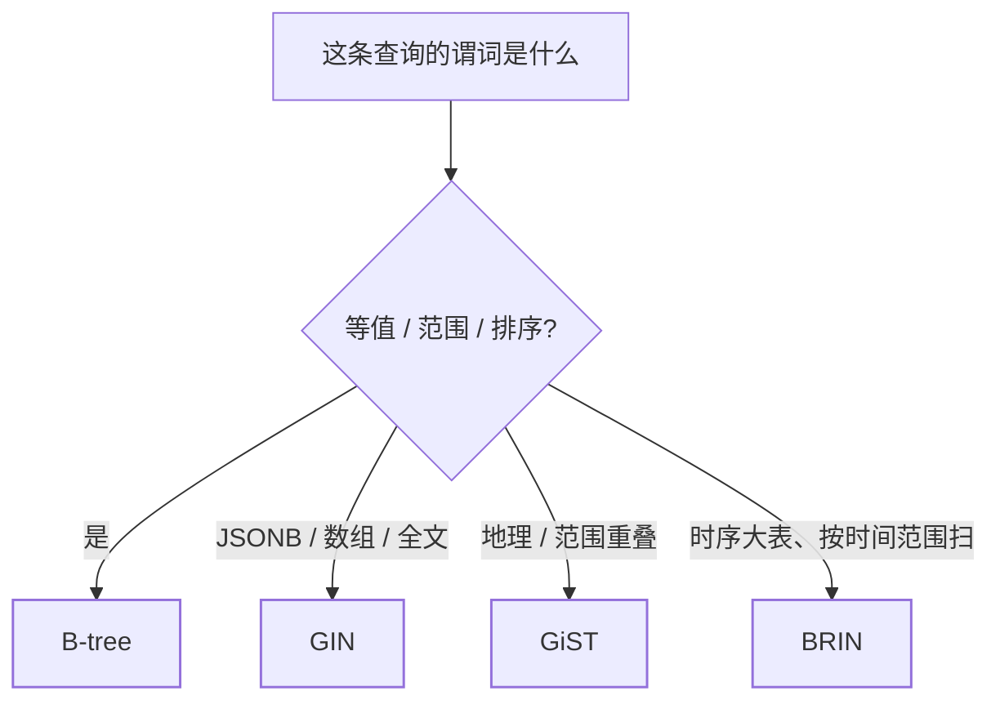

[差异地图](/postgresql/basic/core/01-pg-vs-mysql/)把 GIN/GiST/BRIN
列为碾压项，[调优篇](/postgresql/advanced/performance/01-tuning/)
讲何时该走索引、统计信息过期会怎样。本篇补中间层：**类型怎么选**，
以及 EXPLAIN 里那几个 Scan 节点分别意味着什么。调 `random_page_cost`
之前，先确认没建错索引。

## 类型按谓词选，不按「高级」选

| 类型 | 擅长的谓词 | 典型字段 | 不要用来 |
|---|---|---|---|
| **B-tree**（默认） | `=`、`<`、`>`、`BETWEEN`、`ORDER BY`、`LIKE 'foo%'` | 主键、外键、时间、状态码 | `LIKE '%foo'`、全文、数组包含 |
| **Hash** | 仅 `=` | 超长键的等值点查 | 范围、排序（不能） |
| **GIN** | 包含 / 存在 / 全文匹配 | `jsonb`、`array`、`tsvector` | 高频率单值等值（写放大远大于 B-tree） |
| **GiST** | 重叠、距离、最近邻 | 几何、范围、`ltree`、部分全文 | 纯等值主键 |
| **BRIN** | 「页级」范围重叠 | **物理顺序与列值相关** 的时序 / 日志 | 随机插入的 UUID、经常 UPDATE 打乱堆 |



补充三种「同一类型上的变体」，面试经常当独立功能问：

- **部分索引**：`CREATE INDEX ... WHERE status = 'open'`——索引只
  覆盖热数据，体积小、缓存好。适合「未完成订单」这种长尾冷热分明。
- **表达式索引**：`CREATE INDEX ON t ((lower(email)))`，查询必须
  写成 `lower(email) = ...` 才能命中。对列做函数却不建表达式索引，
  是隐性全表扫描的第一名。
- **INCLUDE**（11+）：`CREATE INDEX ON t (a) INCLUDE (b)`——等值走
  a，b 只存放不排序，换 **Index Only Scan** 还不让复合索引键膨胀。

GIN 的写放大要单独记账：一条 JSON 文档的每个键/每个分词都是倒排
项，UPDATE 整篇文档 ≈ 删旧倒排 + 写新倒排。文档型字段频繁改，GIN
会把 WAL 和索引体积一起推高；读多写少才划算。

BRIN 极小（每段页存 min/max），前提是**堆的物理顺序大致有序**。
按 `created_at` 追加的日志表完美；按 UUID 随机插入或频繁 UPDATE
导致行迁移后，BRIN 区间变宽，过滤失效，计划会退回 Seq Scan。

## EXPLAIN：先看节点类型，再看行数

`EXPLAIN` 是估计，`EXPLAIN ANALYZE` 才跑真正执行。读计划按这个
顺序：

1. **最内层 Scan 是什么**；
2. **估计 rows 和实际 rows 差几个数量级**（差了就是统计信息过期，
   先 `ANALYZE`，别先加 hint）；
3. 再看 Join 类型（Hash / Nested Loop / Merge）——调优篇有表。

| Scan 节点 | 含义 | 何时正常 |
|---|---|---|
| **Seq Scan** | 全表按页扫 | 结果集很大、或没有能用的索引；小表 Seq Scan 是优点 |
| **Index Scan** | 索引找出 tid，再随机读堆 | 点查、高选择性范围 |
| **Index Only Scan** | 索引里已经有所需列，且可见性位图说「页全可见」 | 覆盖索引 / INCLUDE；频繁 UPDATE 的表可见性位图失效会退化 |
| **Bitmap Index Scan → Bitmap Heap Scan** | 先把命中 tid 在内存里排成位图，再**按页顺序**回表 | 中等选择性、或多个索引条件 OR/AND 组合 |

Bitmap 路径是 PG 相对 MySQL 的加分项：两个单列索引
`WHERE a = 1 OR b = 2` 可以各自 Bitmap 再 OR，不必硬上
`(a,b)` 复合索引。代价是位图占 `work_mem`；不够会改成 lossy
（按页不按行），回表变多。

```text
EXPLAIN ANALYZE
SELECT * FROM orders WHERE user_id = 42 AND created_at > now() - interval '7 days';

-- 健康例子（数字会变，结构是重点）：
-- Bitmap Heap Scan on orders
--   Recheck Cond: ...
--   -> Bitmap Index Scan on idx_orders_user_created
--         Index Cond: (user_id = 42) AND (created_at > ...)
-- 实际 rows ≈ 估计 rows
```

`Filter` 出现在 Scan 上且剔除了大量行：索引条件没覆盖这个谓词
（函数包住列、类型不匹配隐式转换）。`Heap Fetches` 在 Index Only
Scan 里很大：页的可见性信息过期，实际在回表——`VACUUM` 会刷新
可见性位图。

复合索引最左前缀与 MySQL 同构：`(user_id, created_at)` 能服务
`user_id =` 和 `user_id = AND created_at >`，不能服务「只按
created_at」。选择性低的列（布尔、状态枚举）放最左，B-tree 几乎
滤不掉行，Bitmap/Seq Scan 往往更便宜。

## 小结

- 等值范围用 B-tree；JSONB/数组/全文用 GIN；GIS/范围用 GiST；
  物理有序的大时序表用 BRIN。部分索引和表达式索引是漏写最多的两种。
- 读 EXPLAIN 先看 Scan 类型和估计/实际行数；Bitmap Heap Scan 是
  中等选择性的正常计划，不是「没走索引」。
- Index Only Scan 依赖可见性位图，膨胀的表会悄悄退化成回表。

## 延伸阅读

- [PostgreSQL 官方：索引类型](https://www.postgresql.org/docs/current/indexes-types.html)
- [Using EXPLAIN](https://www.postgresql.org/docs/current/using-explain.html)
- [性能调优：统计信息与连接方式](/postgresql/advanced/performance/01-tuning/)
