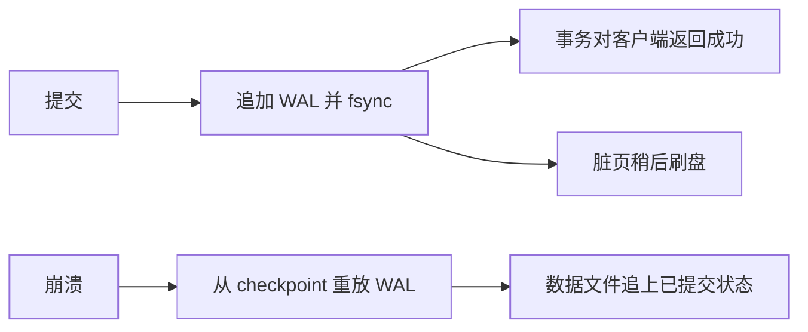

[差异地图](/postgresql/basic/core/01-pg-vs-mysql/)把 WAL 定义成
「物理日志，记录哪个页哪个字节改了」。[调优篇](/postgresql/advanced/performance/01-tuning/)
从写放大角度拧 checkpoint。本篇讲机制本身：**为什么必须先写 WAL、
崩溃后怎么重放、备份如何接到任意时间点**——流复制只是同一条日志
的另一名消费者。

## WAL：先记日志，再改数据页

崩溃时内存脏页会丢。PG 的契约是：

1. 修改数据页之前，把「这一改」的物理描述追加进 WAL，并
   `fsync`（由 `synchronous_commit` 决定等到哪一步，见
   [容灾篇](/postgresql/intermediate/ha/02-pgpool-dr/)）；
2. 数据页可以晚一点再刷盘；
3. 崩溃后：从**最后一个 checkpoint** 起重放 WAL，把数据文件
   补到「已提交事务对应的页状态」。



这和 MySQL redo 同构、和 binlog 不同：binlog 是逻辑变更（给复制
和闪回用），InnoDB 崩溃恢复靠 redo；PG **一条 WAL 同时服务崩溃
恢复和物理复制**。逻辑复制是后来叠加的解码槽，不是 WAL 的本职。

## full_page_writes：防的是半页写

磁盘按页（常见 8KB）写，操作系统或硬件可能在写到一半时断电，
页变成「前半新后半旧」。WAL 里若只记「第 17 字节改成 X」，重放
时基线页已经烂了，越重放越错。

所以 checkpoint 之后，每个页的**第一次**修改会把**整页镜像**
写进 WAL（`full_page_writes=on`，默认）。代价是 checkpoint 后
一段 WAL 暴涨，也就是调优篇说的写放大来源之一。关它只在有
原子页写入保证的文件系统/云盘上才考虑，默认集群不要关。

## checkpoint：重放的起点，不是「刷不刷 WAL」

checkpoint 做三件事：刷一批评脏页、记下「重放从这里开始」、
让更旧的 WAL 可以回收（或交给归档）。

| 调太勤 | 调太稀 |
|---|---|
| 脏页集中刷盘，IO 尖峰（checkpoint 抖动） | 崩溃后要重放的 WAL 很长，RTO 变差 |
| WAL 回收快、盘占用稳 | 数据目录里积累大量 WAL 文件 |

`checkpoint_timeout` 与 `max_wal_size` 谁先到谁触发。监控
`checkpoint_timed` vs `checkpoint_req`：经常 `req` 说明 WAL 产量
把超时门槛打穿了，该加 max_wal_size 或查是不是突然的批量写入。

注意：checkpoint **不是** `synchronous_commit` 的替代。客户端
收到提交成功，靠的是 WAL fsync；checkpoint 只影响「崩溃后要
重放多久」和「磁盘上留多少 WAL」。

## 归档与 PITR：备份不是单份数据文件

只拷 `PGDATA` 只能恢复到拷那一瞬间，且必须停写或用
`pg_basebackup`。时间点恢复（PITR）要两样东西：

1. **基础备份**：`pg_basebackup` 或 `pg_backup_start` 流程下的
   数据目录快照；
2. **从备份点之后连续的 WAL 归档**（`archive_command` /
   `pg_receivewal` / 复制槽）。

恢复时设 `recovery_target_time`（或 xid / LSN），PG 从备份出发
重放归档 WAL，在目标点停——误 DROP 表可以回到「删之前那一秒」。
缺一段 WAL，PITR 只能走到缺口为止，所以归档失败要当 P0 告警。

复制槽（replication slot）会阻止回收「副本还没消费的 WAL」。
**废弃槽** = WAL 把盘写满 = 主库挂。这和
[MVCC 长事务挡住 VACUUM](/postgresql/basic/core/02-mvcc-isolation/)
是同一类「有人夹着旧位点不放」。

```text
# 最小心智模型
base backup  --(WAL 一段段接上)-->  现在
                  ↑
            缺任意一段就断链
```

## 小结

- WAL 是物理预写日志：提交成功 = 日志落盘；数据页可以晚刷；
  崩溃从 checkpoint 重放。
- `full_page_writes` 用整页镜像对抗半页写，checkpoint 后 WAL 变大
  是机制不是故障。
- PITR = 基础备份 + 连续 WAL 归档；复制槽和长事务一样会夹住位点，
  废弃即事故。

## 延伸阅读

- [PostgreSQL 官方：WAL 可靠性](https://www.postgresql.org/docs/current/wal-reliability.html)
- [Backup and Restore / PITR](https://www.postgresql.org/docs/current/continuous-archiving.html)
- [pgpool 流复制与 synchronous_commit](/postgresql/intermediate/ha/02-pgpool-dr/)
