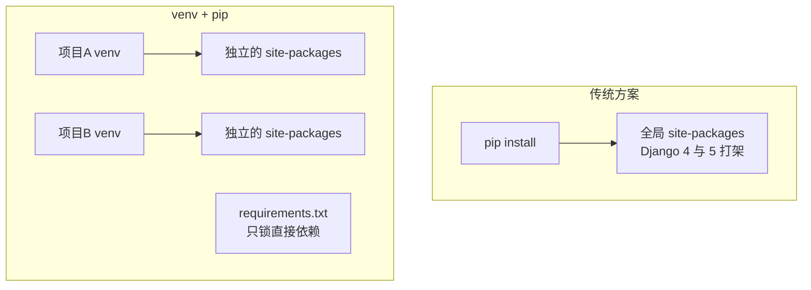

## 先理解要解决的问题

全局装包 = 所有项目共享一套依赖版本——A 项目要 Django 4，B 项目要
Django 5，必死。**虚拟环境（venv）** 的答案：每个项目一个隔离的
site-packages + 一份独立的解释器视图：



pip 的两块历史短板：解析依赖慢，`requirements.txt` 只记结果不锁传递
依赖（"在我机器上是好的"的温床）。

## uv：Rust 重写的全家桶

uv 一个二进制替换 pip + venv + pip-tools + virtualenv + pyenv：

```bash
# 项目模式：进入目录即项目
uv init myapp                  # 生成 pyproject.toml
uv add requests pydantic       # 加依赖：秒装 + 自动写入声明
uv add --dev pytest ruff       # 开发依赖单独分组
uv remove requests

uv sync                        # 按 uv.lock 精确还原环境——新机器/CI 一步到位
uv run python main.py          # 自动激活环境再跑，不污染 shell
```

**pyproject.toml 是单一事实源**：声明"我要什么"，uv.lock 锁定"实际装了
什么"（含全部传递依赖的精确版本与哈希）。协作者 clone 后一句 `uv sync`
就能得到逐字节一致的环境——这是 pip 时代 requirements.txt 做不到的。

```toml
# pyproject.toml 骨架
[project]
name = "myapp"
requires-python = ">=3.12"
dependencies = [
    "requests>=2.32",
    "pydantic>=2.9",
]

[dependency-groups]
dev = ["pytest>=8", "ruff>=0.6"]
```

依赖版本约束写法：`>=2.32` 下限、`~=2.32` 兼容版本段（>=2.32, <3）、
`==1.4.2` 精确。**应用锁死（uv.lock），库宽松（只写下限）**——库的
用户还要和别人的依赖做交集。

## uvx：工具不落地

```bash
uvx ruff check .            # 临时环境运行 ruff，不装进任何项目
uvx httpie                 # 换句话说：全局工具就该这么用
```

替代 `pip install --user` 和 pipx，脚本声明式依赖（PEP 723）也支持：

```python
# run_demo.py
# /// script
# requires-python = ">=3.12"
# dependencies = ["rich"]
# ///
uv run run_demo.py          # uv 读内联声明自动备环境
```

## 小结

- 隔离靠 venv，声明在 pyproject.toml，锁定在 uv.lock：`uv sync` 一步
  复现环境。
- `uv add/remove` 管依赖，`uv run` 跑命令，`uvx` 一次性运行工具。
- 应用锁版本（lock 文件提交），库只声明宽松下限。
