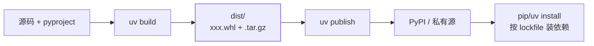

Java 用 `mvn deploy` 把构件发到 Nexus；Python 的对应物是构建 **sdist +
wheel** 发到 PyPI（或私有源）。与 fat jar 最大的差异：**wheel 不打包依赖**
——依赖由安装环境按 lockfile 解决，构件本身只描述"我需要什么"。

## pyproject：一处声明

[包与项目布局](/python/basic/modules/02-packages-layout/)里的
pyproject.toml 补上构建配置就是完整的打包声明：

```toml
[build-system]
requires = ["hatchling"]
build-backend = "hatchling.build"

[project]
name = "myapp"
version = "0.1.0"
requires-python = ">=3.12"
dependencies = ["httpx>=0.27"]

[project.scripts]
mycli = "myapp.cli:main"      # 安装后得到 mycli 命令
```

`[build-system]` 选构建后端（hatchling/setuptools/flit，对应 Maven 的
打包插件），`[project]` 是元数据——名称、版本、Python 下限、依赖。
`[project.scripts]` 生成可执行入口，等价于 executable jar 的 main-class：
`mycli` 命令直接调 `myapp.cli` 模块的 `main()`。

## 构建产物：sdist 与 wheel

```bash
uv build        # 产出 dist/ 目录
```



- **sdist**（`.tar.gz`）：源码分发包，安装时要在用户机器上走一遍构建；
- **wheel**（`.whl`）：预构建产物，安装即解压——**现代标准，永远优先**。
  文件名自带元数据：`myapp-0.1.0-py3-none-any` 表示纯 Python、跨平台；
  含 C 扩展时会有平台标记（对应 Maven 的 classifier）。

## 发布：uv publish

```bash
uv publish                       # 发到 PyPI（token 或 trusted publishing）
uv publish --index private       # 发到私有源（对应 Nexus）
```

两条纪律：

1. **版本语义化 + 不可覆盖**：PyPI 上传后同版本号不能重发（连 Maven
   release 都不如的严格度），改代码必须升版本；
2. **单一代码源（version 单点）**：版本号只写在 pyproject，别在代码里
   再写一份——要读用 `importlib.metadata.version("myapp")`。

## Docker 化

服务部署的终点是容器镜像，要点是**分层缓存 + 冻结依赖**：

```dockerfile
FROM python:3.13-slim
COPY --from=ghcr.io/astral-sh/uv:latest /uv /usr/local/bin/uv

WORKDIR /app
COPY pyproject.toml uv.lock ./          # 先拷依赖清单
RUN uv sync --frozen --no-dev           # 只装运行依赖，锁版本
COPY src ./src                          # 源码变动不破坏依赖层缓存

CMD [".venv/bin/python", "-m", "myapp"]
```

- **`--frozen`**：严格按 uv.lock 安装，不碰网络解析——对应 Maven 的
  确定性构建，保证任何机器上装出同一环境；
- **分层顺序**：依赖清单在前、源码在后，改代码不触发重装依赖；
- **`.venv/bin/python`** 直接用虚拟环境解释器，绕开 PATH 问题。

镜像瘦身走 `python:X-slim` 基础 + `--no-dev`；多阶段构建在需要编译
C 扩展时再上（构建阶段装编译器，运行阶段只拷产物）。

## 小结

- pyproject 一处声明构建后端、元数据与入口；构建产物永远优先 wheel。
- uv build + uv publish 发 PyPI/私有源；版本语义化且不可覆盖。
- Docker 三要点：依赖层前置、--frozen 锁定、slim 基础镜像。
