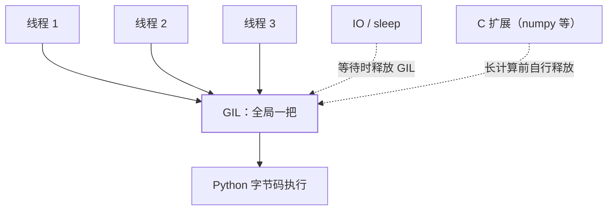

GIL（Global Interpreter Lock，全局解释器锁）是 CPython 最著名的设计约束：
**同一时刻至多一个线程执行 Python 字节码**。多线程因此无法利用多核——
但 GIL 不是语言规范的一部分，而是 CPython 的实现选择，而且正在被移除。

## GIL 为什么存在

CPython 的内存管理靠**引用计数**（详见
[内存管理与垃圾回收](/python/advanced/internals/02-memory-gc/)）：

```python
a = [1, 2]     # ob_refcnt: 1
b = a          # ob_refcnt: 2
del a          # ob_refcnt: 1 —— 计数归零立即释放
```

计数归零立即回收，时机确定、没有 GC 停顿。但有个致命弱点：**计数器本身
是共享可变状态**。两个线程同时 `b = a` 就是并发写 `ob_refcnt += 1`，
竞争会写坏计数 → 内存泄漏或提前释放 → 段错误。

给每个对象配锁像 Java 那样？细粒度同步的全局开销不小。1990 年代的实现
选择了更简单的方案：**一把全局大锁锁住整个解释器**——单线程零额外开销，
线程安全有了保底。这是典型的工程权衡：GIL 换来了简单高效的解释器和大量
C 扩展的免锁开发。

## 它锁的是什么



GIL 只锁**字节码执行**，不锁 IO 和 C 扩展：

- 线程做 IO 时主动释放 GIL——多线程处理网络请求依然有效（见
  [多线程与 GIL](/python/intermediate/concurrency/01-threading/)）；
- numpy、hashlib 等 C 扩展进入长计算前自行释放 GIL——重计算可以部分并行。

线程切换机制：解释器每执行一段时间（`sys.getswitchinterval()`，默认
5ms）检查一次，到点把 GIL 让给别的线程。

## 对语义的三个影响

1. **组合操作仍不原子**：GIL 只保证单条字节码原子，`counter += 1` 依然是
   多步，锁照加。
2. **CPU 密集多线程负优化**：多线程抢 GIL 反而增加切换开销，比单线程更慢。
3. **没有 GC 停顿的心智负担**：引用计数即时释放，配合 GIL 免除了 Java
   那种 STW 停顿的顾虑（代价是循环引用交给分代 GC 兜底）。

## free-threaded Python：GIL 正在退场

PEP 703（Python 3.13 起）提供**关闭 GIL 的构建**（free-threaded）：引用
计数改为分片计数 + 延迟回收，配套清理了大量对 GIL 的隐式依赖。3.13 标记
为实验性，此后版本持续成熟。

| 构建 | 多线程 CPU 并行 | 单线程开销 | 生态兼容 |
| ---- | ---- | ---- | ---- |
| 默认（有 GIL） | ✗ | 无额外开销 | 全兼容 |
| free-threaded | ✓ | 略增（原子计数） | C 扩展需适配 |

对使用者的意义：**今天写的多线程代码不需要为 free-threading 改写**——
锁、队列的纪律本来就正确；依赖 C 扩展的项目要等生态跟进。在它成熟之前，
多核正路仍是[多进程](/python/intermediate/concurrency/03-multiprocessing/)。

## 小结

- GIL 是引用计数线程安全的工程解法：一把全局锁，换单线程零开销。
- 只锁字节码：IO 与优秀扩展会释放——IO 密集多线程有效，CPU 密集无效。
- free-threaded 构建正在移除 GIL；现有并发纪律不用改，多核暂靠多进程。
