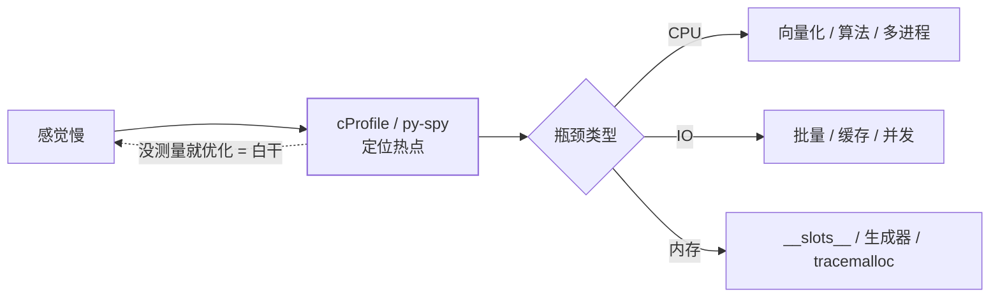

Java 有 JFR/async-profiler，Python 的对应物是 cProfile/py-spy。优化铁律
也一致：**先测量，再动手**——直觉指认的热点十有八九是错的。

## cProfile：函数级热点

```python
import cProfile

cProfile.run("main()", sort="cumulative")
# 或命令行：python -m cProfile -s cumulative app.py
```

两列关键指标：`tottime`（函数自身耗时，不含子调用）找**计算热点**，
`cumtime`（含子调用）找**调用链条**：

```text
   ncalls  tottime  cumtime  filename:lineno(function)
    51234    12.3s    12.3s  parser.py:24(tokenize)    ← tottime 大：自身慢
      101     0.1s    18.7s  app.py:12(handle)         ← cumtime 大：链条上游
```

注意 cProfile 有探针开销（30%+），只用来找**相对热点**，不测绝对耗时。
`pstats` 可脚本化分析，`snakeviz` 可视化成火焰图。

## py-spy：不停机的采样剖析

```bash
py-spy top --pid 12345                      # 对运行中进程实时采样
py-spy record -o profile.svg --pid 12345    # 采样输出火焰图
py-spy dump --pid 12345                     # 打印当前所有线程栈
```

cProfile 要改代码重跑，py-spy **采样不侵入、直接对线上进程**——等价于
Java 的 async-profiler。生产环境"接口偶尔卡死"先用 `py-spy dump` 看线程
栈，十秒定位卡在哪一行。

## timeit：微基准的正确姿势

```python
import timeit

timeit.timeit("'-'.join(str(n) for n in range(100))", number=10_000)
timeit.repeat(stmt, number=10_000, repeat=5)   # 多次取最小值
```

对比两种写法用 timeit，别用 time.time 手表——系统调度会骗过肉眼计时。
**repeat 取 min**：最小值最接近真实开销，均值会被偶发毛刺抬高。

## 常见优化手法（按收益排序）

1. **换数据结构**：`x in list` → `x in set`（[dict/set](/python/basic/data-structures/02-dict-set/)
   的 O(1)），Python 提速第一名。
2. **向量化**：循环逐元素算 → numpy 整数组算，C 循环还释放 GIL，常见
   10~100 倍：

```python
total = sum(x * 1.08 for x in prices)      # 慢：纯 Python 循环

import numpy as np
total = float((np.asarray(prices) * 1.08).sum())   # 快：向量化
```

3. **缓存**：纯函数 `@functools.lru_cache`（见
   [functools 与 itertools](/python/intermediate/stdlib/02-functools-itertools/)），
   幂等请求加 HTTP 缓存。
4. **批量 IO**：逐行 insert → executemany；逐条 GET → pipeline——IO
   往返次数才是瓶颈本体。
5. **生成器流式处理**：大文件别 `read()` 进内存，逐行/分块处理（见
   [迭代器与生成器](/python/basic/functions/02-iterators-generators/)）。
6. **真正的并行**：剖析确认 CPU 密集后上
   [多进程](/python/intermediate/concurrency/03-multiprocessing/)。



## 内存维度

CPU 之外，内存常是隐性瓶颈：`tracemalloc` 快照对比定位增长点，海量小对象
用 `__slots__`，大列表换生成器——工具与原理详见
[内存管理与垃圾回收](/python/advanced/internals/02-memory-gc/)。

## 小结

- cProfile 找热点（tottime 自身 / cumtime 链条），py-spy 免侵入看线上，timeit 测微基准。
- 优化顺序：数据结构 → 向量化 → 缓存 → 批量 IO → 并行，每步用数据验证。
- 内存问题用 tracemalloc 定位，__slots__/生成器减负。
