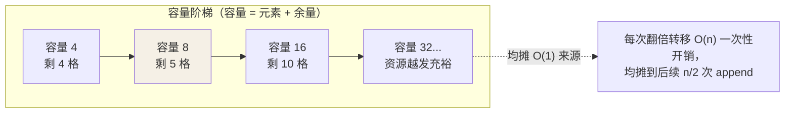

## list：过度分配的动态数组

list 底层是一块**连续的 PyObject\* 指针数组**（类似 ArrayList）。append 时
若容量不够，按"新的容量 ≈ 1.125 × 旧容量 + 6"扩容（CPython 3.11+ 的
growth pattern），搬旧指针到新数组：

```python
import sys
lst = []
for i in range(6):
    lst.append(i)
    print(len(lst), sys.getsizeof(lst))
# 容量阶梯式增长：56 → 88 → 120 → 152 ...
```

"过度分配 + 翻倍增长"是 append 均摊 O(1) 的来源——**扩容搬移的代价被
摊到负载率一半的多次 append 上**。用图看它如何阶梯式长大：



关键后果：

- `append` 是**均摊 O(1)**（偶尔触发扩容的搬移被摊平）。
- `lst[i]` 是 O(1)——指针数组的偏移量寻址。
- `insert(0, x)` / `pop(0)` 是 O(n)——后面所有元素都要平移。
  **头部进出的队列请用 `collections.deque`**（双端链表）。

| 操作 | 复杂度 | 备注 |
| ---- | ---- | ---- |
| `lst[i]` 索引 | O(1) | 连续内存直接偏移 |
| `append` / `pop()` | 均摊 O(1) | 偶尔扩容 |
| `insert(0, x)` | O(n) | 全员平移 |
| `x in lst` | O(n) | 线性扫描——频繁成员判断换 set |
| `lst[a:b]` 切片 | O(k) | 浅拷贝 k 个元素 |

## tuple：不可变不是它唯一的卖点

tuple 两个被低估的特性：

1. **省内存、创建快**：不像 list 维护"容量"字段，且 CPython 会对小 tuple
   缓存复用。
2. **可哈希**（元素也可哈希时）——能当 dict 的 key、能进 set：

```python
seen = {(x, y) for x, y in points}      # tuple 可以
seen = {[x, y] for x, y in points}      # TypeError: list 不可哈希
```

选型一句话：**长度和内容会变 → list；结构固定的记录（坐标、返回值
多联包）→ tuple**。

## 一处必须小心的坑：单元素

```python
(1)     # 不是 tuple！就是数字 1 加了括号
(1,)    # 这才是单元素 tuple
```

## 小结

- list = 过度分配的指针数组：索引 O(1)，append 均摊 O(1)，头部操作 O(n)。
- 频繁 `in` 判断换 set；频繁头插头删换 deque。
- tuple 是"结构固定的记录"：省内存、可哈希、可作 dict key。
- 单元素 tuple 必须带逗号：`(1,)`。
