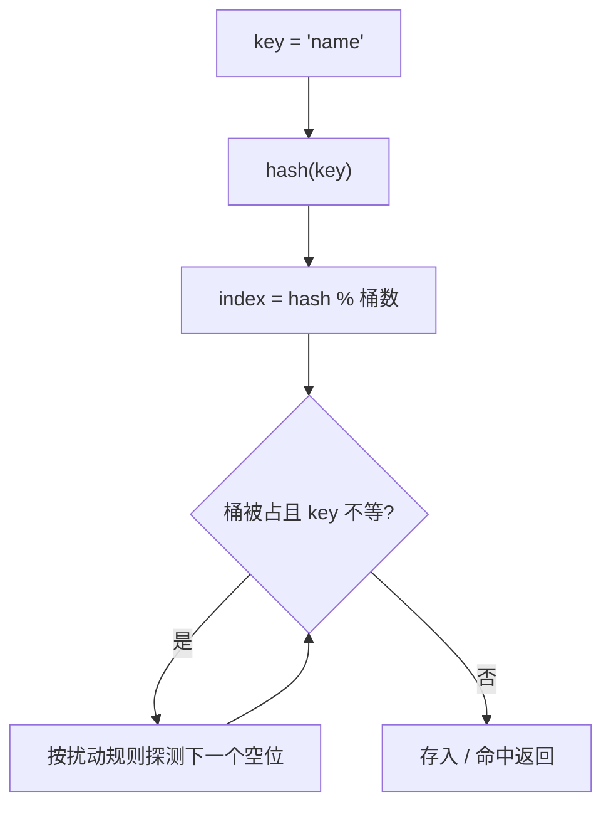

## dict：开放寻址哈希表

Java HashMap 用拉链法，CPython dict 用**开放寻址**：冲突的 key 不挂链表，
而是按探测序列（基于哈希值的伪随机探测）找下一个空位。



扩容规则：**装载因子（元素数/桶数）超过 2/3 就 resize**，新桶数约为
已用容量的 2~4 倍，所有元素按新桶数重新分布。这也解释了复杂度：

| 操作 | 平均 | 最坏 |
| ---- | ---- | ---- |
| `d[k]` / `d[k] = v` / `del d[k]` | O(1) | O(n) 全体哈希碰撞 |
| `k in d` | O(1) | O(n) |
| 遍历 | O(n) | — |

## 紧凑 dict：3.6 起有序

3.6+ 的 dict 实现改为**两段式**：稀疏的索引数组 + 稠密的 entry 数组。
entry 按插入顺序追加，遍历时按稠密数组走——**dict 保持插入顺序成为
语言保证**（3.7 起写入规范）。`OrderedDict` 只在需要 `move_to_end()`
或显式表达顺序语义时才用。

内存上这是大赢：稀疏区只存小整数索引，一个空 dict 从 ~232 字节降到
~64 字节。

## set：只有 key 的 dict

set 复用同一套哈希表机制，只是不存 value。**存在意义就是 O(1) 的成员
判断和集合代数**：

```python
seen = set()
for x in stream:
    if x in seen: ...          # O(1)，list 是 O(n)
    seen.add(x)

a & b    # 交集     a | b    # 并集
a - b    # 差集     a ^ b    # 对称差
```

## 可哈希：进哈希表的门票

一个对象可哈希 ⇔ 它有不变的 `__hash__` 且 `a == b` ⇒ `hash(a) == hash(b)`。
默认自定义对象按 id 哈希；**重写 `__eq__` 会把 `__hash__` 置为 None**
（对象变不可哈希），必须成对重写：

```python
class Point:
    def __init__(self, x, y):
        self.x, self.y = x, y
    def __eq__(self, other):
        return (self.x, self.y) == (other.x, other.y)
    def __hash__(self):
        return hash((self.x, self.y))   # 复用 tuple 的哈希
```

哈希碰撞不会导致错误（探测序列会找空位），只会退化性能——所以
`hash("abc")` 撒盐是正常现象（PYTHONHASHSEED 每次启动随机化，防哈希
碰撞攻击）。

## 小结

- dict/set 是开放寻址哈希表，装载因子超 2/3 扩容，平均 O(1)。
- dict 3.7+ 保证插入有序；set 的价值是 O(1) 成员判断 + 集合代数。
- 哈希表门票是"可哈希"：重写 `__eq__` 必须同时重写 `__hash__`。
