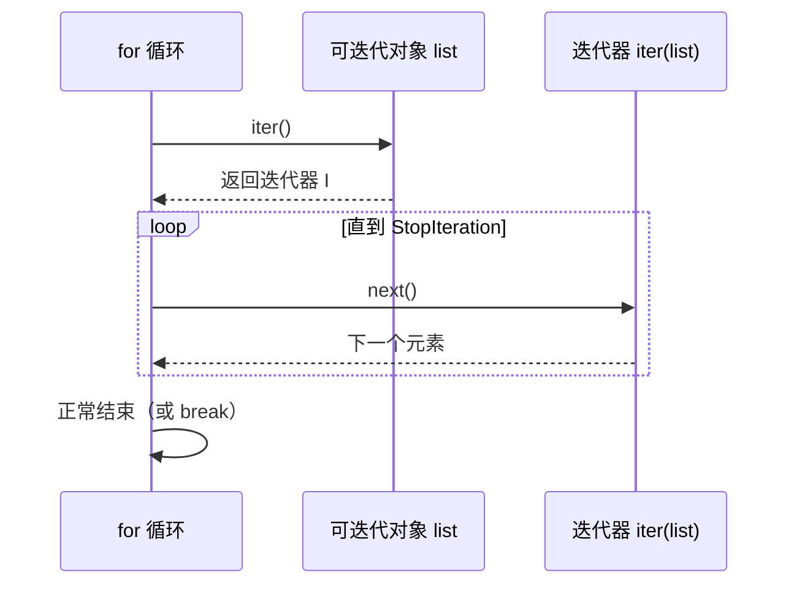

## for 循环的真面目

`for x in obj:` 不碰下标，只认**迭代协议**：`iter(obj)` 拿迭代器，
反复 `next()` 直到 `StopIteration`：



```python
it = iter([1, 2, 3])
next(it)   # 1
next(it)   # 2
next(it)   # 3
next(it)   # StopIteration 异常——协议到此为止
```

可迭代（`__iter__`）≠ 迭代器（`__iter__` + `__next__`）。list 是前者；
`iter(list)` 返回的才是后者。迭代器是一次性的，`for` 之外基本不需要手写
`next()`，但必须懂协议——它是生成器、推导式、解包、`zip`/`enumerate` 的
公共地基。

## 生成器：能暂停的函数

函数体里出现 `yield`，调用它**不执行任何代码**，只返回生成器对象。
每次 `next()` 执行到 `yield` 处**暂停并吐出值**，局部变量原样保留，
下次从暂停点继续：

```python
def countdown(n):
    print("start")
    while n > 0:
        yield n          # 暂停点：值从这里出去
        n -= 1           # 下次 next() 从这里继续

g = countdown(3)         # 什么都没打印——函数还没开始跑
next(g)                  # 打印 start，返回 3
next(g)                  # 2
```

本质：**普通函数一次性返回所有结果，生成器按需一个一个给**。处理超大
文件时差距巨大：

```python
def read_large(path):
    with open(path) as f:
        for line in f:       # 文件对象本身就是惰性迭代器
            yield line.strip()

total = sum(1 for line in read_large("10GB.log"))   # 内存 O(1)
```

## yield from：委托给子生成器

```python
def flatten(nested):
    for item in nested:
        if isinstance(item, list):
            yield from flatten(item)   # 委托递归，不用 for 循环转手
        else:
            yield item

list(flatten([1, [2, [3, 4]], 5]))     # [1, 2, 3, 4, 5]
```

## 惰性管道：生成器组合

生成器最优雅的用法是搭"流式管道"——每一级只占 O(1) 内存，数据像水流过：

```python
lines = read_large("app.log")            # 生成器
errors = (l for l in lines if "ERROR" in l)   # 生成器表达式
first_ten = itertools.islice(errors, 10)      # 还是惰性的
for l in first_ten:
    print(l)
```

注意：生成器是**单次消费**的，遍历完就空了；要反复遍历就用 list
物化。另外惰性管道里抛出的异常在消费端才触发——排查堆栈时要看消费处。

## 小结

- for 只认迭代协议：`iter()` + `next()` + `StopIteration`。
- `yield` 让函数可暂停续跑：按需产出、内存 O(1)，大文件流式处理标配。
- `yield from` 委托子生成器；生成器单次消费，重用请物化成 list。
