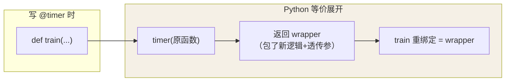
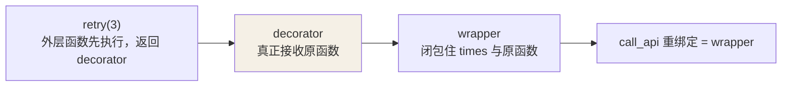

## @ 只是语法糖

```python
@timer
def train():
    ...

# 完全等价于：
def train():
    ...
train = timer(train)
```

装饰器 = **接收函数、返回新函数的高阶函数**。理解了这一点，所有装饰器
都能手撕出来。前提是闭包（见[函数与闭包](/python/basic/functions/01-functions-closures/)）。

用一张图看 `@f` 到底发生了什么——**它不是魔法，就是一次函数调用，把结果
重新绑定到原名字**：



这正是"装饰后 train.__name__ 会变成 wrapper"的根源——除非用
`functools.wraps` 把它复制回来。

## 无参装饰器

```python
import functools, time

def timer(func):
    @functools.wraps(func)          # 保住原函数的名字/文档/签名
    def wrapper(*args, **kwargs):    # *args/**kwargs 才能包住任意签名
        start = time.perf_counter()
        result = func(*args, **kwargs)
        print(f"{func.__name__}: {time.perf_counter() - start:.3f}s")
        return result
    return wrapper

@timer
def train(epochs):
    ...
```

两个必备件：`functools.wraps`（不写则 `train.__name__` 变成 `wrapper`，
文档、调试器、序列化全会被骗）和 `wrapper(*args, **kwargs)`（透传任意
参数）。

## 带参装饰器：再包一层

`@retry(3)` 的形式意味着 `retry(3)` 先执行、返回的东西才是真装饰器——
所以要多一层嵌套，**三层结构**：

```python
def retry(times):
    def decorator(func):
        @functools.wraps(func)
        def wrapper(*args, **kwargs):
            for attempt in range(1, times + 1):
                try:
                    return func(*args, **kwargs)
                except Exception:
                    if attempt == times:
                        raise
        return wrapper
    return decorator

@retry(3)
def call_api(): ...
```

记忆法：**看到 `@xxx(参数)`，装饰器就得多一层**。原因是调用顺序被拉长了
一层——`retry(3)` 先跑，返回的才是那个真正接收函数的东西：



每一层只负责一件事：**外层收参数、中层收函数、内层收调用**——这就是
"三明治"结构的由来。

## 注册表模式：装饰器最优雅的实战

装饰器不一定包逻辑，也可以只**登记**然后原样返回——路由表、插件系统、
协议处理器都靠它：

```python
HANDLERS = {}

def register(name):
    def deco(func):
        HANDLERS[name] = func    # 登记
        return func               # 原样返回，不改行为
    return deco

@register("ping")
def handle_ping(msg): return "pong"

@register("echo")
def handle_echo(msg): return msg
```

对比 Java 的注解 + 反射扫描（运行时才知道谁标注了什么），注册表模式
在 import 时就完成了注册，**零反射成本**——FastAPI 的路由注册就是这个
思路（见 [FastAPI](/python/intermediate/libs/03-fastapi/)）。

## 小结

- `@f` 等价于 `f = f(原函数)`；无参装饰器两层、带参装饰器三层。
- 永远加 `functools.wraps`、wrapper 永远 `*args, **kwargs`。
- 注册表模式用装饰器登记函数并原样返回，是路由/插件的零反射实现。
