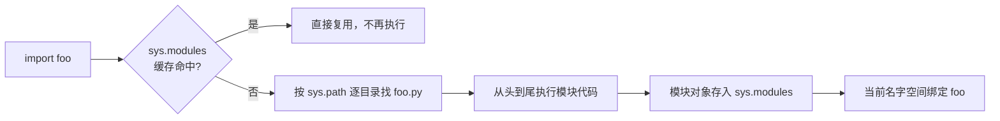

## import 的三种姿势

Java 用 package + classpath 组织代码；Python 的对应物是**模块（module）**：
一个 `.py` 文件就是一个模块。import 有三种写法：

```python
import json                        # 导入模块，用 json.dumps(...)
import json as j                   # 起别名
from json import dumps, loads      # 只导入名字，直接 dumps(...)
from json import dumps as jdumps   # 导入并改名
```

与 Java 的本质区别：Java 的 `import` 只是**编译期省字**，类永远用全限定名；
Python 的 `from x import y` 是**运行时把名字绑定进当前命名空间**。因此
`from module import *` 是反模式——名字来源不可追溯，还会悄悄覆盖同名变量。

## import 时发生了什么

`import foo` 不是声明，是**执行**：



两个要点：

1. **模块只执行一次**。第二次 import 命中 `sys.modules` 缓存——模块级的
   初始化代码（连接池、注册表）天然是单例的。
2. **sys.path 决定去哪找**。它是一个目录列表，首个元素通常是脚本所在目录，
   第三方包装在其中的 site-packages：

```python
import sys
print(sys.path)   # ['...', '.../site-packages']
```

Java 的 classpath 启动时固定；Python 的 `sys.path` 运行时可改——
`sys.path.insert(0, ...)` 是常见的"土法包管理"，能用但不体面，
规范做法见[包与项目布局](/python/basic/modules/02-packages-layout/)。

## `__name__ == "__main__"`

每个模块都有 `__name__`：被 import 时它是模块名，**作为脚本直接运行时
它是 `"__main__"`**：

```python
# converter.py
def c_to_f(c):
    return c * 9 / 5 + 32

if __name__ == "__main__":
    # 只有 python converter.py 会执行；被 import 时跳过
    print(c_to_f(100))    # 212.0
```

相当于 Java 里把 `main` 和库代码分离的纪律，但更灵活：**同一个文件既可
当库被复用，又可当脚本直接跑**。

## 循环导入与延迟导入

A import B、B import A：因为 import 是执行，先执行的那方在对方看来还是
**部分初始化**的状态，名字可能尚不存在，于是 `ImportError`。解法按优先级：

1. **重构**：把公共依赖抽到第三个模块（首选）；
2. **延迟导入**：把 import 挪进函数体，调用时才执行。

```python
# b.py
def render():
    from a import to_html    # 函数体内 import：运行到这行才解析
    return to_html(...)
```

import 是运行时语句，也带来一条纪律：**模块顶层只放定义和常量，不放
有副作用的长逻辑**——否则 import 一个模块会执行一堆意想不到的代码。

## 小结

- import 是运行时执行：模块只执行一次（sys.modules 缓存），sys.path 决定搜索位置。
- `__name__ == "__main__"` 让一个文件兼任库与脚本。
- 循环导入优先抽公共模块，其次函数内延迟导入；模块顶层避免副作用。
