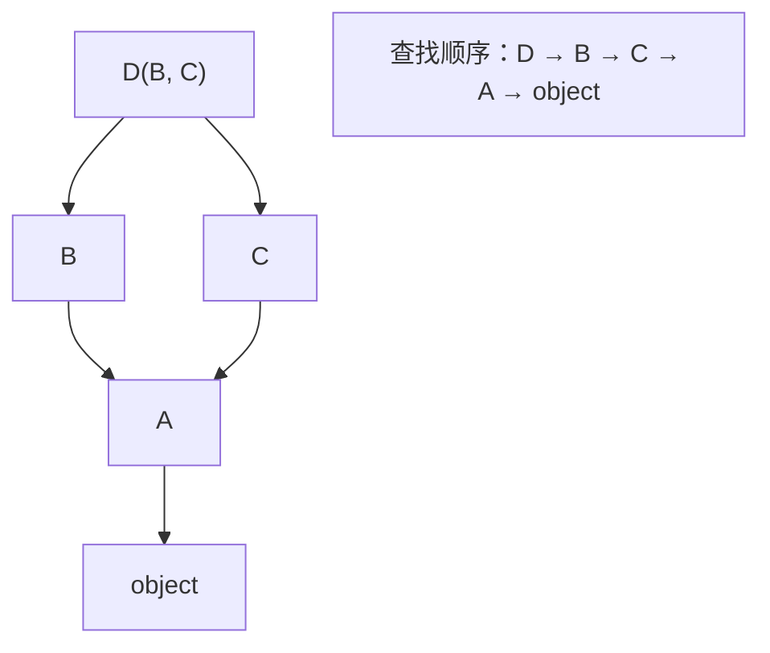

## MRO：方法解析顺序

Python 支持多继承，方法查找沿 **MRO（Method Resolution Order）**——
C3 线性化算法算出的唯一序列，保证子类在父类前、声明顺序保留、公共父类
最后：

```python
class A: ...
class B(A): ...
class C(A): ...
class D(B, C): ...

D.__mro__
# (D, B, C, A, object) —— 不是"深度优先"：A 只出现一次且排在 B、C 之后
```



菱形问题（D 同时继承 B、C，而 B、C 都继承 A）在 Java 里靠接口默认方法
冲突规则解决，Python 靠 MRO + 协作式 super。

## super()：MRO 的下一站，不是"父类"

最大的误解是把 `super()` 当成 Java 的 `super`。**它跳到的是 MRO 里
的下一个类**，与血缘无关：

```python
class B(A):
    def __init__(self):
        super().__init__()       # 通常到 A，但在 D 的 MRO 上下文里可能是 C！
```

于是多继承的正确姿势是**协作式调用**——每个类都 super()，让链条自己
按 MRO 传下去，A 只会被执行一次：

```python
class Loggable:
    def __init__(self, **kwargs):
        super().__init__(**kwargs)      # 不吃参数，原样下传
        self.log = []

class Serializable:
    def __init__(self, **kwargs):
        super().__init__(**kwargs)
        self._dirty = False

class Config(Loggable, Serializable):   # 多重能力 = mixin 组合
    def __init__(self, **kwargs):
        super().__init__(**kwargs)     # 沿 MRO：Loggable → Serializable
        ...
```

**约定：mixin 之间统一 `**kwargs` 传递**，谁消费谁取，剩余的传给
下一站。参数签名对不上是多继承崩溃的头号原因。

## 实用边界

- 多继承主要价值是 **mixin**：小的、正交的能力单元（Loggable、
  ComparableMixin），不是"is-a"。
- 真正的 is-a 继承链保持单线；混入的能力类放在左边（`class Config(Loggable, Base)`）。
- 不确定顺序时看 `cls.__mro__`，别猜。

## 小结

- 方法查找沿 C3 线性化的 MRO：`D.__mro__` 可直接打印。
- `super()` 沿 MRO 前进一站而非固定父类；协作式 super 是多继承不塌的前提。
- 多继承写法 = 声明顺序（mixin 在前）+ `**kwargs` 全链透传。
