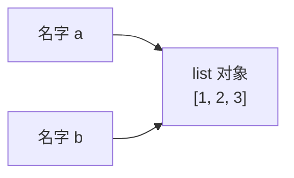
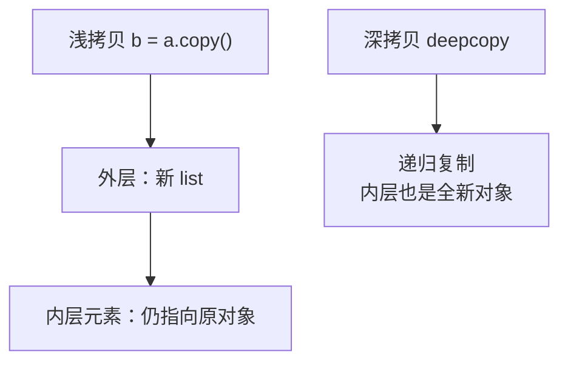

## 变量是名字，不是盒子

Java 的变量是"装值的盒子"；Python 的变量是**贴在对象上的名字标签**。
赋值 `a = b` 从来不拷贝数据，只是让两个名字指向同一个对象：

```python
a = [1, 2, 3]
b = a           # b 和 a 指向同一个 list
b.append(4)
print(a)        # [1, 2, 3, 4] —— a 也"变了"
```



判断标准：**`id()` 相同 ⇔ 同一个对象**。`is` 比较身份（id），`==` 比较
值（调用 `__eq__`）：

```python
a = [1, 2]
b = [1, 2]
a == b    # True  —— 值相等
a is b    # False —— 两个不同对象
```

一个易错点：小整数（-5~256）和短字符串有缓存/驻留，`is` 碰巧返回 True——
**永远不要用 `is` 比较值**，只有 `x is None` 是惯例例外。

## 一切皆对象

int、函数、类、模块本身都是对象，都有 `id`、`type`，都能赋值给变量、
塞进 list、当参数传递：

```python
def shout(s): return s.upper()
funcs = [shout, str.lower]     # 函数是一等公民
[f("hi") for f in funcs]       # ['HI', 'hi']
```

这就是装饰器、回调、鸭子类型的共同根基。

## 可变 vs 不可变

| 类型 | 可变性 | 后果 |
| ---- | ---- | ---- |
| list / dict / set / bytearray | 可变 | 传参后函数内修改会影响调用方 |
| int / float / str / tuple / frozenset / bytes | 不可变 | "修改"实为创建新对象 |

```python
def add_item(lst):
    lst.append(1)          # 修改调用方的列表

x = []
add_item(x)
print(x)                    # [1] —— 原列表被改了
```

这不是 bug 是特性，但要求一个纪律：**可变默认值绝不能做函数参数默认值**
（详见[函数与闭包](/python/basic/func/01-functions-closures/)）。

不可变对象的价值：可以安全地在多线程间共享、可以做 dict 的 key
（前提：可哈希）。

## 深浅拷贝

"拷贝"分两档。浅拷贝 `copy()` 只复制第一层容器，嵌套的可变对象仍然共享：

```python
import copy
a = [[1, 2], [3, 4]]
b = a.copy()          # 浅拷贝
b[0].append(99)
print(a)              # [[1, 2, 99], [3, 4]] —— 内层共享！

c = copy.deepcopy(a)  # 深拷贝：递归复制所有层
```



## 小结

- 变量是名字标签，赋值是绑定；`is` 比身份、`==` 比值，只有 `is None` 用 `is`。
- 可变对象传参是"传引用"，函数内修改会影响调用方；不可变对象的"修改"是换新对象。
- 浅拷贝只复制第一层，嵌套结构要 `copy.deepcopy`。
