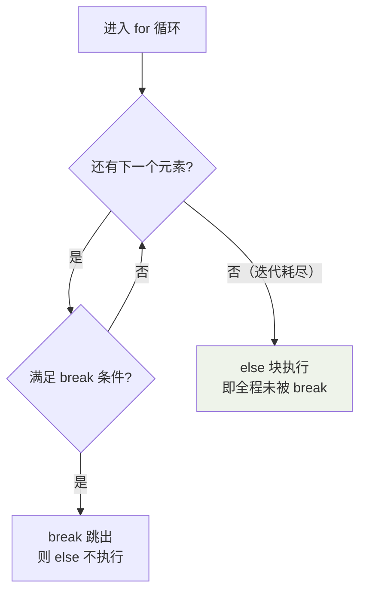

## for-else：搜索失败的兜底

`else` 在循环**没有被 break 打断、正常跑完**时执行——最适合"找没找到"
的语义：

```python
for user in users:
    if user.name == "admin":
        print("found")
        break
else:
    print("not found")   # 循环结束都没 break 才走到这
```

对比 Java 的做法（循环外定义 flag 变量），for-else 把"找没找到"压缩成
一个结构，不需要额外的哨兵变量。

`else` 的执行条件用一个流程图看清——**只有"正常耗尽迭代"才进 else，
被 break 打断就不进**：



这正是 for-else 的实现原理：Python 在迭代器耗尽时才转去执行 else，一旦
break 就跳过 else 直接离开循环。

## 解包：星号表达式

```python
first, *rest = [1, 2, 3, 4]      # 1, [2, 3, 4]
*init, last = [1, 2, 3, 4]       # [1, 2, 3], 4
a, _, b = (1, 2, 3)             # _ 惯例表示"丢弃这个"

for i, (k, v) in enumerate(pairs):   # 嵌套解包
    ...
```

函数调用侧：`f(*args, **kwargs)` 把序列/字典展开成参数。定义侧则相反
（收集成 tuple/dict）。同一对星号，**调用处是"拆"，定义处是"收"**。

## 推导式：循环的语法糖

```python
squares = [x * x for x in range(10) if x % 2 == 0]
# 等价于
squares = []
for x in range(10):
    if x % 2 == 0:
        squares.append(x * x)
```

四类推导式：`list`、`dict`（`{k: v for ...}`）、`set`（`{x for ...}`）、
**生成器表达式**（`(x * x for ...)`，惰性，不占内存）。

生成器表达式是关键取舍：数据量小、要反复用 → list；数据量大、只遍历一次
→ 生成器：

```python
total = sum(x * x for x in range(10_000_000))   # 不必先建一个巨型 list
```

超过一个 for 或两个 if 的推导式就该换回普通循环——**糖吃多了齁**。

## match-case：结构化分支

3.10 引入，本质是**按结构解包再匹配**，不是简单值比较：

```python
def handle(cmd):
    match cmd.split():
        case ["go", direction]:
            return f"向 {direction} 移动"
        case ["drop", *items]:        # 剩余项收集
            return f"丢下 {items}"
        case _:                       # 兜底
            return "未知指令"
```

值比较用它不如 if-elif 简洁；match 的主场是**解构嵌套数据结构**
（JSON、AST）。

## 小结

- for-else 处理"没找到"，省掉 flag 变量。
- 星号解包：`first, *rest` 拆序列；调用 `f(*args)` 展开、定义收集。
- 推导式覆盖 90% 的"过滤+变形"循环；大数据量用生成器表达式省内存。
- match-case 用于解构匹配，简单值比较仍用 if-elif。
