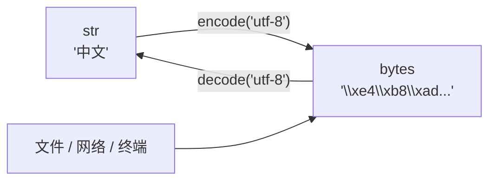

## str 与 bytes：一条清晰的楚河汉界

Python 3 的字符串是 **Unicode 码点序列**，`bytes` 是**原始字节序列**。
两者边界就是"内存中"和"进出程序"的边界：



```python
"中文".encode("utf-8")       # b'\xe4\xb8\xad\xe6\x96\x87'
b"\xe4\xb8\xad".decode("utf-8")   # '中'
```

乱码九成来自：**decode 用了和 encode 不同的编码**。老代码里的 GBK、
Windows 文件的 cp936 是高频事故点。文件 IO 永远显式传 `encoding="utf-8"`，
别赌平台默认值。

## f-string：格式化的终点

```python
name, pi = "python", 3.14159
f"hello {name}"           # 插值
f"{pi:.2f}"               # '3.14'   保留两位
f"{1234567:,}"            # '1,234,567' 千分位
f"{0.85:.1%}"             # '85.0%'   百分比
f"{name=}"                # 'name=python'  调试利器
f"{value!r}"              # 走 repr()，字符串带引号
f"{'-':>20}"              # 右对齐填充
```

`%` 和 `.format()` 是历史遗留，新代码一律 f-string。

## 不可变与拼接的性能账

str 不可变 ⇒ 每次 `+` 都创建新对象并整体拷贝，循环拼接是 O(n²)：

```python
# 反面：n 次拼接 = n 次全量拷贝
s = ""
for w in words:
    s += w

# 正面：join 一次分配
"".join(words)

# 常量折叠例外：全是字面量时编译器会合并，+= 也可以
```

判断标准：**循环里拼字符串 → join；少量几次 → += 无所谓**。

## 高频方法清单

```python
"  hi  ".strip()               # 去首尾空白
"a,b,c".split(",")             # ['a', 'b', 'c']
",".join(["a", "b"])           # 'a,b'
"abc".startswith("ab")         # 前缀判断（比切片比较可读）
"ab" in "abc"                  # 子串判断
"hello".replace("l", "L", 1)   # 'heLlo'，第三个参数限次数
"9".zfill(3)                   # '009'
```

## 小结

- str 是 Unicode 码点，bytes 是字节；进出程序必须显式 encode/decode，并指定 utf-8。
- f-string 一统格式化；`{name=}` 与 `!r` 是调试两板斧。
- 循环内拼接字符串用 `join`，不可变对象的拼接是 O(n²) 陷阱。
